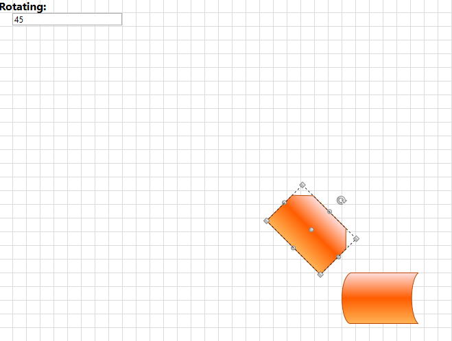
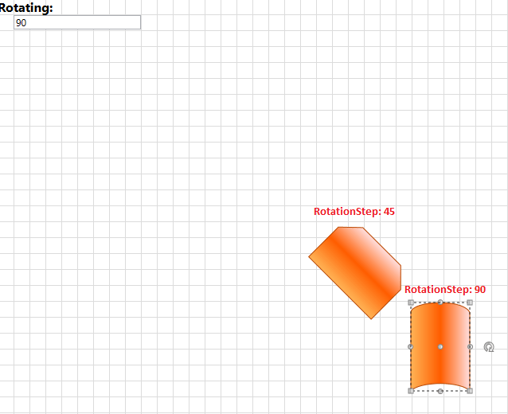

# Customize the Rotation Step

In __RadDiagram__ each __RadDiagramItem__ can be rotated. This operation is implemented by a __RotationService__.			

>In order to learn more about the different Diagramming Services, you can examine the [Services]() article.				

In this tutorial we will examine a solution that takes a user-defined value and uses it to define the step of a rotation operation in a __RadDiagram__ instance.

First, let's create a sample __RadDiagram__ definition that has two __RadDiagramShape__ objects.				


```XAML
	<telerik:RadDiagram x:Name="diagram" IsSnapToGridEnabled="False">
		<telerik:RadDiagramShape Geometry="{telerik:FlowChartShape ShapeType=BeginLoopShape}"
								 Position="400 300" />
		<telerik:RadDiagramShape Geometry="{telerik:FlowChartShape ShapeType=ExternalDataShape}"
								 Position="500 400" />
	</telerik:RadDiagram>
```

>tip Please note that in the __RadDiagram__ definition, the __SnapToGrid__ feature is disabled. If you enable it, you don't have to create a new __RotationService__ to customize the rotation step. Instead you can take advantage of the __RotationAngleSnap__ constant. It allows you to set the snapping angle when rotating items in a grid-snapping enabled __RadDiagram__. The default value of this constant is 5 degrees. And it can be easily changed by setting DiagramConstants.RotationAngleSnap = 55, but you will have to add a using statement for the __Telerik.Windows.Diagrams.Core__ namespace.					

Next we can add a __TextBox__ control to let the user define the rotation step:				


```XAML
	<StackPanel Width="200" HorizontalAlignment="Left">
		<TextBlock FontSize="16"
				   FontWeight="Bold"
				   Text="Rotating: " />
		<TextBox x:Name="rotationStep"
				 MaxWidth="160"
				 Text="" />
	</StackPanel>
```

Now that our view is ready, we can configure the default rotation mechanism to take into account the rotation step defined by a user. In order to do so, we will have to create a custom __RotationService__ and use it within our diagramming instance. 

The first step is to define a new class, let's call it __MyRotation__, that derives from the __RotationService__. As the __RotationService__ has a virtual method that calculates the angle of each rotation operation, we will override this method and implement logic that takes a user-defined value and uses it to calculate the rotation angle. This means that we need to define an __int__ property and use it in the __CalculateRotationAngle__ method implementation:


```C#
	public class MyRotation : RotationService
	{
	    private int rotationStep;
	
	    public MyRotation(RadDiagram owner)
	        : base(owner as IGraphInternal)
	    {
	        //initialize the RotationStep property
	        this.RotationStep = 1;
	    }
	
	    public int RotationStep
	    {
	        get
	        {
	            return this.rotationStep;
	        }
	        set
	        {
	            this.rotationStep = value;
	        }
	    }
	
	    protected override double CalculateRotationAngle(Point newPoint)
	    {
	        //take the angle calculated by the default rotation mechanism
	        var angle = base.CalculateRotationAngle(newPoint);
	        //change that angle based on the user-defined value of the RotationStep property
	        return angle = Math.Floor(angle / this.RotationStep) * this.RotationStep;
	    }
	}
```
```VB.NET
	Public Class MyRotation
	    Inherits RotationService
	
	    Private rStep As Integer
	
	    Public Sub New(ByVal owner As RadDiagram)
	        MyBase.New(TryCast(owner, IGraphInternal))
	        Me.RotationStep = 1
	    End Sub
	
	    Public Property RotationStep() As Integer
	        Get
	            Return Me.rStep
	        End Get
	        Set(ByVal value As Integer)
	            Me.rStep = value
	        End Set
	    End Property
	
	    Protected Overrides Function CalculateRotationAngle(ByVal newPoint As Point) As Double
	        Dim angle = MyBase.CalculateRotationAngle(newPoint)
	        angle = Math.Floor(angle / Me.RotationStep) * Me.RotationStep
	        Return angle
	    End Function
	End Class
```

Finally, we need to configure the diagram to use our custom rotation implementation instead of the default __RotationService__. This is why we need to create a new instance of the __MyRotation__ class in the code-behind file of our view. Then we need to make sure that the __RotationStep__ property is used as a binding path for the __Text__ property of the __rotationStep__:


```C#
	private MyRotation newRotationService;
	private void InitializeNewServices()
	{
	    //initialize the newRotationService and define a default RotationStep
	    this.newRotationService = new MyRotation(this.diagram) { RotationStep = 45 };
	    //create a binding with Path=RotationStep
	    Binding binding = new Binding("RotationStep");
	    //use the newRotationService as a source of the binding
	    binding.Source = this.newRotationService;
	    binding.Mode = BindingMode.TwoWay;
	    //apply the binding on the rotationStep TextBox
	    this.rotationStep.SetBinding(TextBox.TextProperty, binding);
	}
```
```VB.NET
	Private newRotationService As MyRotation
	Private Sub InitializeNewServices()
	
	    'initialize the newRotationService and define a default RotationStep'
	    Me.newRotationService = New MyRotation(Me.diagram) With {
	        .RotationStep = 45
	    }
	    'create a binding with Path=RotationStep'
	    Dim binding As New Binding("RotationStep")
	    'use the newRotationService as a source of the binding'
	    binding.Source = Me.newRotationService
	    binding.Mode = BindingMode.TwoWay
	    'apply the binding on the rotationStep TextBox'
	    Me.rotationStep.SetBinding(TextBox.TextProperty, binding)
	End Sub
```

And now we can use the __newRotationService__ instance and register it through the __ServiceLocator__:


```C#
	private MyRotation newRotationService;
	public Example()
	{
		InitializeComponent();
	
		this.InitializeNewServices();
	    this.diagram.ServiceLocator.Register<IRotationService>(this.newRotationService);
	}
```
```VB.NET
	Private newRotationService As MyRotation
	
	Public Sub New()
	    InitializeComponent()
	
	    Me.InitializeNewServices()
	    Me.diagram.ServiceLocator.Register(Of IRotationService)(Me.newRotationService)
	End Sub
```

If you run the solution now, the __rotationStep__ will display a value of __45__. This is why you will be able to rotate the __RadDiagramShapes__ with __45°__ on every step.



And if you enter a __RotationStep__ of __90__, you will be able to rotate the __RadDiagramShapes__ with __90°__ on every step.


>tip Find a runnable project of the previous example in the [WPF Samples GitHub repository](https://github.com/telerik/xaml-sdk/tree/master/Diagram/CustomServices).

## See Also
 * [Shapes]()
 * [Rotation]()
 * [Services]()
 * [Disable Horizontal or Vertical Shape Resizing]()