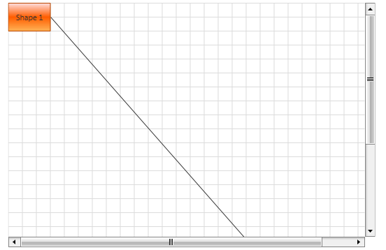

# Display ScrollViewer Inside the Diagram

This tutorial describes how to display the RadDiagram built-in ScrollViewer.

For the purpose of this tutorial we'll examine the following simple Diagramming structure:

<snippet id='raddiagram-howto-display-scroll-block_1-xaml' />

As the __Grid__ hosting our __RadDiagram__ has a limited size, we can't see the second shape in the viewport:

In such scenarios it's useful to use the __RadDiagram__ built-in __ScrollViewer__, which you can display to get a better view of the area described by the position and size of your __RadDiagramItems__. 

In order to enable the horizontal and/or vertical __ScrollBar__ you need to add the following attribute(s) to the __RadDiagram__ declaration:		

<snippet id='raddiagram-howto-display-scroll-block_2-xaml' />

The same operation can be done in code-behind as well:

<snippet id='raddiagram-howto-display-scroll-block_3-cs' />

<snippet id='raddiagram-howto-display-scroll-block_3-vb' />

## See Also
 * [Getting Started]()
 * [Create Custom Shape]()
 * [Overview]()
 * [Use MVVM in RadDiagram]()