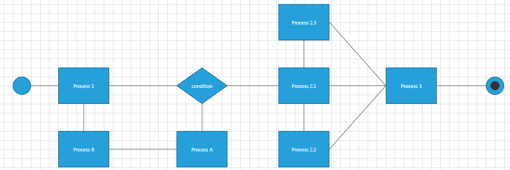
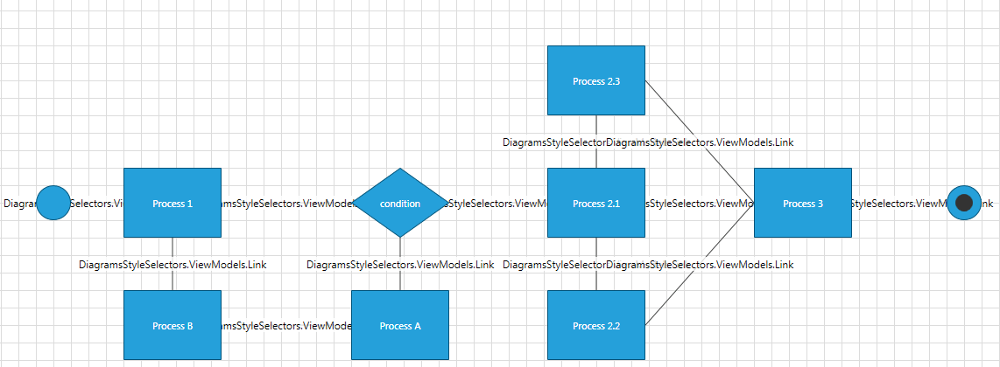
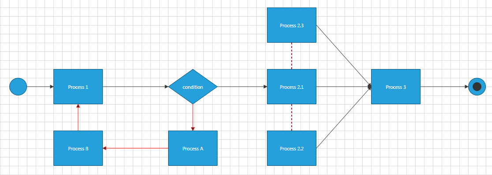

# Use StyleSelectors in an MVVM Diagramming Application

This article describes how to use StyleSelectors in an MVVM application to apply different styles on the RadDiagram shapes and connections based on business logic.

For the purpose of this tutorial, we will populate the __RadDiagram__ control with three different node types and a custom link implementation.		

>Please note that the examples in this tutorial are showcasing Telerik Windows8 theme. In the [Implicit Styles](http://www.telerik.com/help/silverlight/styling-apperance-implicit-styles-overview.html#Applying_Theme_Globally)[Implicit Styles](http://www.telerik.com/help/wpf/styling-apperance-implicit-styles-overview.html#Applying_Theme_Globally) article you can find more information on how to set an application-wide theme.		  

Let's start by creating __RectangleNode, EllipseNode__ and __DecisionNode__ classes to describe the __RadDiagramShapes__:		

#### __C#__
```C#
	using Telerik.Windows.Controls.Diagrams.Extensions;
	
	public class EllipseNode : NodeViewModelBase
	{
	    public EllipseNodeType Type { get; set; }
	}
	
	public enum EllipseNodeType
	{
	    Start,
	    End
	}
	
	public class RectangleNode : NodeViewModelBase
	{
	    public string Description { get; set; }
	}
	
	public class DecisionNode : NodeViewModelBase
	{
	    public string Content { get; set; }
	}
```

#### __VB.NET__
```VB.NET
	Imports Telerik.Windows.Controls.Diagrams.Extensions.ViewModels
	
	Public Class EllipseNode
		Inherits NodeViewModelBase
		Public Property Type() As EllipseNodeType
	End Class
	
	Public Enum EllipseNodeType
		Start
		[End]
	End Enum
	
	Public Class RectangleNode
		Inherits NodeViewModelBase
		Public Property Description() As String
	End Class
	
	Public Class DecisionNode
		Inherits NodeViewModelBase
		Public Overloads Property Content() As String
	End Class
```

>Please note that all three classes derive from the __NodeViewModelBase__ class. You can find the implementation of this class in the __Telerik.Windows.Controls.Diagrams.Extensions.ViewModels__ namespace as it is one of the ViewModels provided out-of-the-box in the __Telerik.Windows.Controls.Diagrams.Extensions__ assembly.		  

Next, we need to define the ViewModel that will represent the __RadDiagramConnections__ in our diagramming solution. For simplicity, we will create only one class but we will define a __Type__ property to describe each link.		

#### __C#__
```C#
	using Telerik.Windows.Controls.Diagrams.Extensions.ViewModels;
	
	public class Link : LinkViewModelBase<NodeViewModelBase>
	{
	    public LinkType Type { get; set; }
	
	    public Link()
	        : base()
	    { }
	
	    public Link(NodeViewModelBase source, NodeViewModelBase target)
	        : base(source, target)
	    {
	    }
	}
	
	public enum LinkType
	{
	    RightToLeft,
	    LeftToRight,
	    Normal
	}
```

#### __VB.NET__
```VB.NET
	Imports Telerik.Windows.Controls.Diagrams.Extensions.ViewModels
	
	Public Class Link
		Inherits LinkViewModelBase(Of NodeViewModelBase)
		Public Property Type() As LinkType
	
		Public Sub New()
			MyBase.New()
		End Sub
	
		Public Sub New(ByVal source As NodeViewModelBase, ByVal target As NodeViewModelBase)
			MyBase.New(source, target)
		End Sub
	End Class
	
	Public Enum LinkType
		RightToLeft
		LeftToRight
		Normal
	End Enum
```

>Please note that the *__Link__* class also derives from one of the __ViewModels__ provided by the Diagramming Framework. The __LinkViewModelBase<TNode>__ class implementation can be found in the __Telerik.Windows.Controls.Diagrams.Extensions.ViewModels__ namespace in the __Telerik.Windows.Controls.Diagrams.Extensions__ assembly. 

Now that our items' ViewModels are defined, we have to create a collection of items to pass to the __RadDiagram.GraphSource__. Telerik Diagramming Framework provides a few built-in ViewModels that can be used out-of-the-box when creating a collection of diagramming items. You can examine the following list of tutorials to get a better understanding of the different scenarios and collections you can use in an MVVM diagramming solution:		

* [DataBinding Overview]()
* [Use MVVM in RadDiagram]()
* [Serialize a Databound Diagram]()

In this example we will use the __ObservableGraphSourceBase<TNode,TLink>__ class to create a custom __GraphSource__ implementation as this will allow us to take advantage of the predefined __AddNode(), AddLink(), CreateNode(), CreateLink(), RemoveNode()__ and __RemoveLink()__ methods. This way we won't have to explicitly define a custom add/create/remove logic for our business items.		

#### __C#__
```C#
    public class GraphSource : ObservableGraphSourceBase<NodeViewModelBase, Link>
    {
    }	
```

#### __VB.NET__
```VB.NET
	Public Class GraphSource
		Inherits ObservableGraphSourceBase(Of NodeViewModelBase, Link)
	End Class	  
```

Let's define the items in the __GraphSource__ to describe the following process workflow:


#### __C#__
```C#
	public class GraphSource : ObservableGraphSourceBase<NodeViewModelBase, Link>
	{
		public void PopulateGraphSource()
		{
			//Add Nodes
			RectangleNode processNode1 = new RectangleNode()
			{
				Position = new Point(160, 280),
				Description = "Process 1"
			};
			this.AddNode(processNode1);
			RectangleNode processNode2 = new RectangleNode()
			{
				Position = new Point(644, 280),
				Description = "Process 2.1"
			};
			this.AddNode(processNode2);
			RectangleNode processNode3 = new RectangleNode()
			{
				Position = new Point(644, 420),
				Description = "Process 2.2"
			};
			this.AddNode(processNode3);
			RectangleNode processNode4 = new RectangleNode()
			{
				Position = new Point(644, 140),
				Description = "Process 2.3"
			};
			this.AddNode(processNode4);
			RectangleNode processNode5 = new RectangleNode()
			{
				Position = new Point(880, 280),
				Description = "Process 3"
			};
			this.AddNode(processNode5);
			RectangleNode processNode6 = new RectangleNode()
			{
				Position = new Point(420, 420),
				Description = "Process A"
			};
			this.AddNode(processNode6);
			RectangleNode processNode7 = new RectangleNode()
			{
				Position = new Point(160, 420),
				Description = "Process B"
			};
			this.AddNode(processNode7);

			DecisionNode decisionNode = new DecisionNode()
			{
				Position = new Point(420, 280),
				Content = "condition"
			};
			this.AddNode(decisionNode);
			EllipseNode endNode = new EllipseNode()
			{
				Position = new Point(1100, 300),
				Type = EllipseNodeType.End
			};
			this.AddNode(endNode);
			EllipseNode startNode = new EllipseNode()
		   {
			   Position = new Point(60, 300),
			   Type = EllipseNodeType.Start,
			   Content = "Start"
		   };
			this.AddNode(startNode);

			//Add Links
			this.AddLink(new Link(startNode, processNode1) { Type = LinkType.LeftToRight });
			this.AddLink(new Link(processNode1, decisionNode) { Type = LinkType.LeftToRight });
			this.AddLink(new Link(decisionNode, processNode2) { Type = LinkType.LeftToRight });
			this.AddLink(new Link(processNode2, processNode3) { Type = LinkType.Normal });
			this.AddLink(new Link(processNode2, processNode4) { Type = LinkType.Normal });
			this.AddLink(new Link(processNode2, processNode5) { Type = LinkType.LeftToRight });
			this.AddLink(new Link(processNode3, processNode5) { Type = LinkType.LeftToRight });
			this.AddLink(new Link(processNode4, processNode5) { Type = LinkType.LeftToRight });
			this.AddLink(new Link(processNode5, endNode) { Type = LinkType.LeftToRight });
			this.AddLink(new Link(processNode6, decisionNode) { Type = LinkType.RightToLeft });
			this.AddLink(new Link(processNode7, processNode6) { Type = LinkType.RightToLeft });
			this.AddLink(new Link(processNode1, processNode7) { Type = LinkType.RightToLeft });
		}
	}
```

#### __VB.NET__
```VB.NET
	Public Class GraphSource
		Inherits ObservableGraphSourceBase(Of NodeViewModelBase, Link)
		Public Sub PopulateGraphSource()
			'Add Nodes'
			Dim processNode1 As New RectangleNode() With {.Position = New Point(160, 280), .Description = "Process 1"}
			Me.AddNode(processNode1)
			Dim processNode2 As New RectangleNode() With {.Position = New Point(644, 280), .Description = "Process 2.1"}
			Me.AddNode(processNode2)
			Dim processNode3 As New RectangleNode() With {.Position = New Point(644, 420), .Description = "Process 2.2"}
			Me.AddNode(processNode3)
			Dim processNode4 As New RectangleNode() With {.Position = New Point(644, 140), .Description = "Process 2.3"}
			Me.AddNode(processNode4)
			Dim processNode5 As New RectangleNode() With {.Position = New Point(880, 280), .Description = "Process 3"}
			Me.AddNode(processNode5)
			Dim processNode6 As New RectangleNode() With {.Position = New Point(420, 420), .Description = "Process A"}
			Me.AddNode(processNode6)
			Dim processNode7 As New RectangleNode() With {.Position = New Point(160, 420), .Description = "Process B"}
			Me.AddNode(processNode7)
	
			Dim decisionNode_Renamed As New DecisionNode() With {.Position = New Point(420, 280), .Content = "condition"}
			Me.AddNode(decisionNode_Renamed)
			Dim endNode As New EllipseNode() With {.Position = New Point(1100, 300), .Type = EllipseNodeType.End}
			Me.AddNode(endNode)
			Dim startNode As New EllipseNode() With {.Position = New Point(60, 300), .Type = EllipseNodeType.Start, .Content = "Start"}
			Me.AddNode(startNode)
	
			'Add Links'
			Me.AddLink(New Link(startNode, processNode1) With {.Type = LinkType.LeftToRight})
			Me.AddLink(New Link(processNode1, decisionNode_Renamed) With {.Type = LinkType.LeftToRight})
			Me.AddLink(New Link(decisionNode_Renamed, processNode2) With {.Type = LinkType.LeftToRight})
			Me.AddLink(New Link(processNode2, processNode3) With {.Type = LinkType.Normal})
			Me.AddLink(New Link(processNode2, processNode4) With {.Type = LinkType.Normal})
			Me.AddLink(New Link(processNode2, processNode5) With {.Type = LinkType.LeftToRight})
			Me.AddLink(New Link(processNode3, processNode5) With {.Type = LinkType.LeftToRight})
			Me.AddLink(New Link(processNode4, processNode5) With {.Type = LinkType.LeftToRight})
			Me.AddLink(New Link(processNode5, endNode) With {.Type = LinkType.LeftToRight})
			Me.AddLink(New Link(processNode6, decisionNode_Renamed) With {.Type = LinkType.RightToLeft})
			Me.AddLink(New Link(processNode7, processNode6) With {.Type = LinkType.RightToLeft})
			Me.AddLink(New Link(processNode1, processNode7) With {.Type = LinkType.RightToLeft})
	
		End Sub
	End Class
```

Now we can set-up our __RadDiagram__ control to display these items. For that purpose we can define a __RadDiagram__ instance in our view and set its __GraphSource__ property in the code-behind file:		

#### __XAML__
```XAML
	<Grid>
		<telerik:RadDiagram x:Name="xDiagram" />
	</Grid>
```

#### __C#__
```C#
	public MainView()
	{
	    InitializeComponent();
	
	    GraphSource DiagramSource = new GraphSource();
	    DiagramSource.PopulateGraphSource();
	    this.xDiagram.GraphSource = DiagramSource;
	}
```

#### __VB.NET__
```VB.NET
	Partial Public Class MainWindow
		Inherits Window
		Public Sub New()
			InitializeComponent()
	
			Dim DiagramSource As New GraphSource()
			DiagramSource.PopulateGraphSource()
			Me.xDiagram.GraphSource = DiagramSource
		End Sub
	End Class
```

This operation will place all __DiagramItems__ at a position of __(0,0)__ on top of each other. This is why we will need to apply a custom style to bind the __Position__ of the items to the business values we defined in the __GraphSource__ collection. However, as our process workflow uses different types of shapes, we will have to apply different styles for each node type. This is where we can take advantage of the __RadDiagram.ShapeStyleSelector__ property and create a custom __StyleSelector__ for our nodes.	  

As our example defines three different business nodes, we can create a __StyleSelector__ that applies a style based on the type of the business class. Moreover, as the __EllipseNode__ class exposes a *Type* property, we can also use its value to apply different styles for the start and end points of our process workflow.	  

#### __C#__
```C#
	public class NodeStyleSelector : StyleSelector
	{
	    public Style DecisionNodeStyle { get; set; }
	    public Style StartNodeStyle { get; set; }
	    public Style EndNodeStyle { get; set; }
	    public Style RectangleNodeStyle { get; set; }
	
	    public override Style SelectStyle(object item, DependencyObject container)
	    {
	        if (item is DecisionNode)
	            return DecisionNodeStyle;
	        else if (item is RectangleNode)
	            return RectangleNodeStyle;
	        else if (item is EllipseNode)
	        {
	            switch (((EllipseNode)item).Type)
	            {
	                case EllipseNodeType.Start:
	                    return StartNodeStyle;
	                case EllipseNodeType.End:
	                    return EndNodeStyle;
	                default:
	                    return base.SelectStyle(item, container);
	            }
	        }
	        else return base.SelectStyle(item, container);
	    }
	}
```

#### __VB.NET__
```VB.NET
	Public Class NodeStyleSelector
		Inherits StyleSelector
		Public Property DecisionNodeStyle() As Style
		Public Property StartNodeStyle() As Style
		Public Property EndNodeStyle() As Style
		Public Property RectangleNodeStyle() As Style
	
		Public Overrides Function SelectStyle(ByVal item As Object, ByVal container As DependencyObject) As Style
			If TypeOf item Is DecisionNode Then
				Return DecisionNodeStyle
			ElseIf TypeOf item Is RectangleNode Then
				Return RectangleNodeStyle
			ElseIf TypeOf item Is EllipseNode Then
				Select Case (CType(item, EllipseNode)).Type
					Case EllipseNodeType.Start
						Return StartNodeStyle
					Case EllipseNodeType.End
						Return EndNodeStyle
					Case Else
						Return MyBase.SelectStyle(item, container)
				End Select
			Else
				Return MyBase.SelectStyle(item, container)
			End If
		End Function
	End Class
```

Now, let's declare this selector in the resources of our view and prepare the custom styles for each node type: 

#### __XAML__
```XAML
	    <Grid>
	        <Grid.Resources>
	            <Style x:Key="DecisionShapeStyle" TargetType="telerik:RadDiagramShape">
	                <Setter Property="Position" Value="{Binding Position}" />
	                <Setter Property="Height" Value="80" />
	                <Setter Property="Geometry" Value="{telerik:FlowChartShape ShapeType=DecisionShape}" />
	                <Setter Property="ContentTemplate">
	                    <Setter.Value>
	                        <DataTemplate>
	                            <TextBlock Text="{Binding Content}" />
	                        </DataTemplate>
	                    </Setter.Value>
	                </Setter>
	            </Style>
	            <Style x:Key="RectangleShapeStyle" TargetType="telerik:RadDiagramShape">
	                <Setter Property="Position" Value="{Binding Position}" />
	                <Setter Property="Height" Value="80" />
	                <Setter Property="Geometry" Value="{telerik:CommonShape ShapeType=RectangleShape}" />
	                <Setter Property="ContentTemplate">
	                    <Setter.Value>
	                        <DataTemplate>
	                            <TextBlock Text="{Binding Description}" />
	                        </DataTemplate>
	                    </Setter.Value>
	                </Setter>
	            </Style>
	            <Style x:Key="StartShapeStyle" TargetType="telerik:RadDiagramShape">
	                <Setter Property="Position" Value="{Binding Position}" />
	                <Setter Property="Width" Value="40" />
	                <Setter Property="Height" Value="40" />
	                <Setter Property="Geometry" Value="{telerik:CommonShape ShapeType=EllipseShape}" />
	                <Setter Property="ContentTemplate">
	                    <Setter.Value>
	                        <DataTemplate>
	                            <Grid />
	                        </DataTemplate>
	                    </Setter.Value>
	                </Setter>
	            </Style>
	            <Style x:Key="EndShapeStyle" TargetType="telerik:RadDiagramShape">
	                <Setter Property="Position" Value="{Binding Position}" />
	                <Setter Property="Width" Value="40" />
	                <Setter Property="Height" Value="40" />
	                <Setter Property="Geometry" Value="{telerik:CommonShape ShapeType=EllipseShape}" />
	                <Setter Property="ContentTemplate">
	                    <Setter.Value>
	                        <DataTemplate>
	                            <Ellipse Width="20" Height="20" Fill="#FF333333" />
	                        </DataTemplate>
	                    </Setter.Value>
	                </Setter>
	            </Style>
	            <styleselectors:NodeStyleSelector x:Key="CustomShapeStyleSelector"
	                    DecisionNodeStyle="{StaticResource DecisionShapeStyle}"
	                    EndNodeStyle="{StaticResource EndShapeStyle}"
	                    RectangleNodeStyle="{StaticResource RectangleShapeStyle}"
	                    StartNodeStyle="{StaticResource StartShapeStyle}" />
	        </Grid.Resources>
	        <telerik:RadDiagram x:Name="xDiagram"
	                ShapeStyleSelector="{StaticResource CustomShapeStyleSelector}"/>
	    </Grid>
```

If we run the solution at this point, we should get the following result:

Now the __RadDiagramShapes__ are properly styled and arranged, but the connections don't look all that good. This is due to the fact that they try to display their content and as we haven't declared a __ConnectionTemplate__, the *Link* class __ToSting()__ method is used to display it. In this example we won't need to visualize any labels or descriptions near the connections, so we can define an empty __Grid__ as a __ContentTemplate__ of each __RadDiagramConnection__. Also, as we created a *Type* property in the __Link__ class implementation and we added different types of links in the __GraphSource__ collection, we can apply different styles for the connections based on their type. For that purpose, we will need another custom __StyleSelector__ - this time we will use it with the __RadDiagram.ConnectionStyleSelector__ property.	  

#### __C#__
```C#
	public class LinkStyleSelector : StyleSelector
	{
		public Style NormalLinkStyle { get; set; }
		public Style RightCapLinkStyle { get; set; }
		public Style LeftCapLinkStyle { get; set; }

		public override Style SelectStyle(object item, DependencyObject container)
		{
			Link link = item as Link;
			if (link == null)
				return base.SelectStyle(item, container);
			else switch (link.Type)
				{
					case LinkType.RightToLeft:
						return LeftCapLinkStyle;
					case LinkType.LeftToRight:
						return RightCapLinkStyle;
					case LinkType.Normal:
						return NormalLinkStyle;
					default:
						return base.SelectStyle(item, container);
				}
		}
	}
```

#### __VB.NET__
```VB.NET
	Public Class LinkStyleSelector
		Inherits StyleSelector
		Public Property NormalLinkStyle() As Style
		Public Property RightCapLinkStyle() As Style
		Public Property LeftCapLinkStyle() As Style
	
		Public Overrides Function SelectStyle(ByVal item As Object, ByVal container As DependencyObject) As Style
			Dim link_Renamed As Link = TryCast(item, Link)
			If link_Renamed Is Nothing Then
				Return MyBase.SelectStyle(item, container)
			Else
				Select Case link_Renamed.Type
					Case LinkType.RightToLeft
						Return LeftCapLinkStyle
					Case LinkType.LeftToRight
						Return RightCapLinkStyle
					Case LinkType.Normal
						Return NormalLinkStyle
					Case Else
						Return MyBase.SelectStyle(item, container)
				End Select
			End If
		End Function
	End Class
```

And finally we need to define the connection styles and the *LinkStyleSelector* in the resources of our view:

#### __XAML__
```XAML
	<Grid>
		<Grid.Resources>
			<Style TargetType="telerik:RadDiagramConnection" x:Key="NormalConnectionStyle">
				<Setter Property="Stroke" Value="Brown" />
				<Setter Property="StrokeThickness" Value="2" />
				<Setter Property="StrokeDashArray" Value="2 2" />
				<Setter Property="ContentTemplate">
					<Setter.Value>
						<DataTemplate>
							<Grid />
						</DataTemplate>
					</Setter.Value>
				</Setter>
			</Style>
			<Style TargetType="telerik:RadDiagramConnection" x:Key="TargetCapConnectionStyle">
				<Setter Property="TargetCapType" Value="Arrow1Filled" />
				<Setter Property="ContentTemplate">
					<Setter.Value>
						<DataTemplate>
							<Grid />
						</DataTemplate>
					</Setter.Value>
				</Setter>
			</Style>
			<Style TargetType="telerik:RadDiagramConnection" x:Key="SourceCapConnectionStyle">
				<Setter Property="Stroke" Value="Red" />
				<Setter Property="SourceCapType" Value="Arrow1Filled" />
				<Setter Property="ContentTemplate">
					<Setter.Value>
						<DataTemplate>
							<Grid />
						</DataTemplate>
					</Setter.Value>
				</Setter>
			</Style>
			<styleselectors:LinkStyleSelector x:Key="CustomConnectionStyleSelector"
					NormalLinkStyle="{StaticResource NormalConnectionStyle}"
					RightCapLinkStyle="{StaticResource TargetCapConnectionStyle}"
					LeftCapLinkStyle="{StaticResource SourceCapConnectionStyle}" />
		 ...
		</Grid.Resources>
		<telerik:RadDiagram x:Name="xDiagram"
				ConnectionStyleSelector="{StaticResource CustomConnectionStyleSelector}"
				ShapeStyleSelector="{StaticResource CustomShapeStyleSelector}"/>
	</Grid>
```

The final result of the solution we build should look like this:

## See Also
 * [Styling and Style Selectors]()
 * [DataBinding]()
 * [Use MVVM in RadDiagram]()
 * [Shapes]()
 * [Connections]()