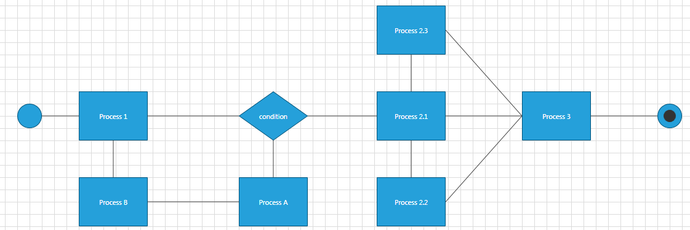
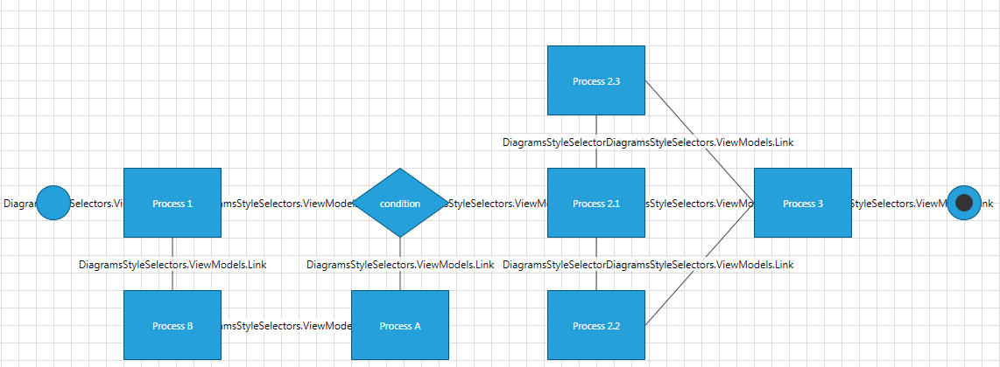
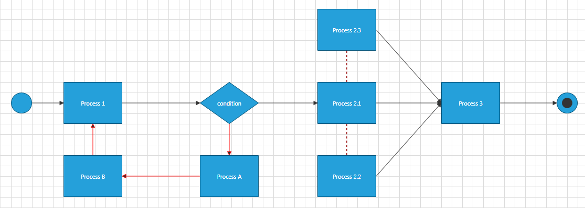

# Use StyleSelectors in an MVVM Diagramming Application

This article describes how to use StyleSelectors in an MVVM application to apply different styles on the RadDiagram shapes and connections based on business logic.

For the purpose of this tutorial, we will populate the __RadDiagram__ control with three different node types and a custom link implementation.		

>Please note that the examples in this tutorial are showcasing Telerik Windows8 theme. In the [Implicit Styles](http://www.telerik.com/help/silverlight/styling-apperance-implicit-styles-overview.html#Applying_Theme_Globally)[Implicit Styles](http://www.telerik.com/help/wpf/styling-apperance-implicit-styles-overview.html#Applying_Theme_Globally) article you can find more information on how to set an application-wide theme.		  

Let's start by creating __RectangleNode, EllipseNode__ and __DecisionNode__ classes to describe the __RadDiagramShapes__:		

<snippet id='raddiagram-howto-mvvm-style-selectors-block_1-cs' />

<snippet id='raddiagram-howto-mvvm-style-selectors-block_1-vb' />

>Please note that all three classes derive from the __NodeViewModelBase__ class. You can find the implementation of this class in the __Telerik.Windows.Controls.Diagrams.Extensions.ViewModels__ namespace as it is one of the ViewModels provided out-of-the-box in the __Telerik.Windows.Controls.Diagrams.Extensions__ assembly.		  

Next, we need to define the ViewModel that will represent the __RadDiagramConnections__ in our diagramming solution. For simplicity, we will create only one class but we will define a __Type__ property to describe each link.		

<snippet id='raddiagram-howto-mvvm-style-selectors-block_2-cs' />

<snippet id='raddiagram-howto-mvvm-style-selectors-block_2-vb' />

>Please note that the *__Link__* class also derives from one of the __ViewModels__ provided by the Diagramming Framework. The __LinkViewModelBase<TNode>__ class implementation can be found in the __Telerik.Windows.Controls.Diagrams.Extensions.ViewModels__ namespace in the __Telerik.Windows.Controls.Diagrams.Extensions__ assembly. 

Now that our items' ViewModels are defined, we have to create a collection of items to pass to the __RadDiagram.GraphSource__. Telerik Diagramming Framework provides a few built-in ViewModels that can be used out-of-the-box when creating a collection of diagramming items. You can examine the following list of tutorials to get a better understanding of the different scenarios and collections you can use in an MVVM diagramming solution:		

* [DataBinding Overview]()
* [Use MVVM in RadDiagram]()
* [Serialize a Databound Diagram]()

In this example we will use the __ObservableGraphSourceBase<TNode,TLink>__ class to create a custom __GraphSource__ implementation as this will allow us to take advantage of the predefined __AddNode(), AddLink(), CreateNode(), CreateLink(), RemoveNode()__ and __RemoveLink()__ methods. This way we won't have to explicitly define a custom add/create/remove logic for our business items.		

<snippet id='raddiagram-howto-mvvm-style-selectors-block_3-cs' />

<snippet id='raddiagram-howto-mvvm-style-selectors-block_3-vb' />

Let's define the items in the __GraphSource__ to describe the following process workflow:

<snippet id='raddiagram-howto-mvvm-style-selectors-block_4-cs' />

<snippet id='raddiagram-howto-mvvm-style-selectors-block_4-vb' />

Now we can set-up our __RadDiagram__ control to display these items. For that purpose we can define a __RadDiagram__ instance in our view and set its __GraphSource__ property in the code-behind file:		

<snippet id='raddiagram-howto-mvvm-style-selectors-block_5-xaml' />

<snippet id='raddiagram-howto-mvvm-style-selectors-block_6-cs' />

<snippet id='raddiagram-howto-mvvm-style-selectors-block_6-vb' />

This operation will place all __DiagramItems__ at a position of __(0,0)__ on top of each other. This is why we will need to apply a custom style to bind the __Position__ of the items to the business values we defined in the __GraphSource__ collection. However, as our process workflow uses different types of shapes, we will have to apply different styles for each node type. This is where we can take advantage of the __RadDiagram.ShapeStyleSelector__ property and create a custom __StyleSelector__ for our nodes.	  

As our example defines three different business nodes, we can create a __StyleSelector__ that applies a style based on the type of the business class. Moreover, as the __EllipseNode__ class exposes a *Type* property, we can also use its value to apply different styles for the start and end points of our process workflow.	  

<snippet id='raddiagram-howto-mvvm-style-selectors-block_7-cs' />

<snippet id='raddiagram-howto-mvvm-style-selectors-block_7-vb' />

Now, let's declare this selector in the resources of our view and prepare the custom styles for each node type: 

<snippet id='raddiagram-howto-mvvm-style-selectors-block_8-xaml' />

If we run the solution at this point, we should get the following result:

Now the __RadDiagramShapes__ are properly styled and arranged, but the connections don't look all that good. This is due to the fact that they try to display their content and as we haven't declared a __ConnectionTemplate__, the *Link* class __ToSting()__ method is used to display it. In this example we won't need to visualize any labels or descriptions near the connections, so we can define an empty __Grid__ as a __ContentTemplate__ of each __RadDiagramConnection__. Also, as we created a *Type* property in the __Link__ class implementation and we added different types of links in the __GraphSource__ collection, we can apply different styles for the connections based on their type. For that purpose, we will need another custom __StyleSelector__ - this time we will use it with the __RadDiagram.ConnectionStyleSelector__ property.	  

<snippet id='raddiagram-howto-mvvm-style-selectors-block_9-cs' />

<snippet id='raddiagram-howto-mvvm-style-selectors-block_9-vb' />

And finally we need to define the connection styles and the *LinkStyleSelector* in the resources of our view:

<snippet id='raddiagram-howto-mvvm-style-selectors-block_10-xaml' />

The final result of the solution we build should look like this:

## See Also
 * [Styling and Style Selectors]()
 * [DataBinding]()
 * [Use MVVM in RadDiagram]()
 * [Shapes]()
 * [Connections]()