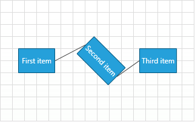
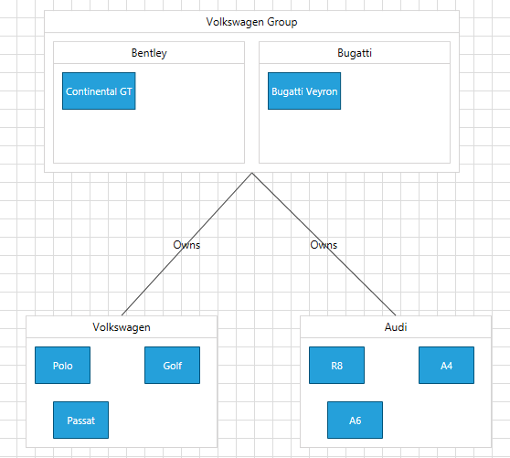

# Use MVVM in RadDiagram

The following help article will demonstrate how to bind the __RadDiagram__ in MVVM scenario using the extension ViewModels which are part of the __Telerik.Windows.Controls.Diagrams.Extensions.dll__ project.			

* [Sample MVVM RadDiagram](#sample-mvvm-raddiagram)
* [Using MVVM to populate RadDiagram with ContainerShapes](#using-mvvm-to-populate-raddiagram-with-containershapes)
* [Bind the source and target connector positions of the connection](#bind-the-source-and-target-connector-positions-of-the-connection)

>Please note that the examples in this tutorial are showcasing Telerik Windows8 theme. In the [Setting a Theme](http://www.telerik.com/help/silverlight/common-styling-apperance-setting-theme.html#Setting_Application-Wide_Built-In_Theme_in_the_Code-Behind)[Setting a Theme](http://www.telerik.com/help/wpf/common-styling-apperance-setting-theme-wpf.html#Setting_Application-Wide_Built-In_Theme_in_the_Code-Behind) article you can find more information on how to set an application-wide theme.				

The DiagrammingFramework comes with a predefined set of ViewModels, further described in the [DiagramExtensions ViewModels]() tutorial. We will take advantage of these built-in models bellow to quickly build MVVM diagramming solutions.			

## Sample MVVM RadDiagram

A sample MVVM implementation has basically 3 steps:

##### 1. __Set up the ViewModels__
To start, in a basic MVVM application we need ViewModels to describe the connections and shapes within a __RadDiagram__ instance. And then we need to create a class to describe the collection that will hold the nodes and links of a diagramming structure. Telerik Diagrams Extensions offer three ViewModels that can serve as base implementations of a __GraphSource__:						

* [GraphSourceBase]()

* [ObservableGraphSourceBase]()

* [SerializableGraphSourceBase]()

For simplicity, in this first example we will use the __GraphSourceBase__ class and we will create a new ViewModel class deriving from it:						
__Example 1: Creating ViewModel__
```C#
	using Telerik.Windows.Controls.Diagrams.Extensions.ViewModels;
	public class DiagramViewModel : GraphSourceBase<NodeViewModelBase, LinkViewModelBase<NodeViewModelBase>>
	{
		public DiagramViewModel()
		{
			var first = new NodeViewModelBase
			{
				Content = "First item",
				Position = new Point(50, 100)
			};
			var second = new NodeViewModelBase
			{
				Content = "Second item",
				Position = new Point(150, 100),
				RotationAngle = 45
			};
			var third = new NodeViewModelBase
			{
				Content = "Third item",
				Position = new Point(250, 100)
			};
			this.AddNode(first);
			this.AddNode(second);
			this.AddNode(third);
			this.AddLink(new LinkViewModelBase<NodeViewModelBase>(first, second));
			this.AddLink(new LinkViewModelBase<NodeViewModelBase>(second, third));
		}
	}
```
```VB.NET
	Imports Telerik.Windows.Controls.Diagrams.Extensions.ViewModels
	Public Class DiagramViewModel
		Inherits GraphSourceBase(Of NodeViewModelBase, LinkViewModelBase(Of NodeViewModelBase))
		Public Sub New()
			Dim first = New NodeViewModelBase With {.Content = "First item", .Position = New Point(50, 100)}
			Dim second = New NodeViewModelBase With {.Content = "Second item", .Position = New Point(150, 100), .RotationAngle = 45}
			Dim third = New NodeViewModelBase With {.Content = "Third item", .Position = New Point(250, 100)}
			Me.AddNode(first)
			Me.AddNode(second)
			Me.AddNode(third)
			Me.AddLink(New LinkViewModelBase(Of NodeViewModelBase)(first, second))
			Me.AddLink(New LinkViewModelBase(Of NodeViewModelBase)(second, third))
		End Sub
	End Class
```

> It is important to add all nodes in the graph source __before__ the links that connect them. Otherwise, the connection could be missed when the visual elements are created (RadDiagramShape and RadDiagramConnection).

The __GraphSourceBase<TNode,TLink>__ class inherits __ViewModelBase__ and it also implements the __IGraphSource__ interface. This is why the class exposes   two __IEnumerable__ collections - one with the nodes -__Items__, and the other one with the links - __Links__.
		
##### 2. __Configure the View__
Once we have all __ViewModels__ in place, we can go ahead and define a __RadDiagram__ instance in our view to consume the business data. We can use style bindings and __DataTemplates__ to apply bindings on the __RadDiagramConnection__ and __RadDiagramShape__ properties.						

__Example 2: Creating custom style for the connections and shapes__

```XAML
	<Style TargetType="telerik:RadDiagramShape">
		  <Setter Property="Position" Value="{Binding Position}" />
		  <Setter Property="RotationAngle" Value="{Binding RotationAngle}" />
		  <Setter Property="ContentTemplate">
			<Setter.Value>
			  <DataTemplate>
				<TextBlock Text="{Binding Content}"/>
			  </DataTemplate>
			</Setter.Value>
		  </Setter>
	 </Style>
	<Style  TargetType="telerik:RadDiagramConnection">
		  <Setter Property="ContentTemplate"  >
			<Setter.Value>
			  <DataTemplate>
				<TextBlock Text="{Binding Content}"/>
			  </DataTemplate>
			</Setter.Value>
		  </Setter>
	</Style>
```
	
##### 3. __Associate the ViewModel with the View__
The final step is to assign the __GraphSource__ property of the __RadDiagram__ to the ViewModel:						

__Example 3: Declaring RadDiagram in XAML__

```XAML
	<telerik:RadDiagram x:Name="xDiagram"/>
```

__Example 4: Setting the GraphSource property__

```C#
	xDiagram.GraphSource = new DiagramViewModel();
```
```VB.NET
	xDiagram.GraphSource = New DiagramViewModel()
```

So as a result of our MVVM implementation, the __RadDiagram__ instance contains the following 3 shapes and 2 connections:


>In order to use bi-directional MVVM, the DiagramViewModel must implement the __IObservableGraphSource__ interface. Check out the  [DataBinding]() article for further information.					

## Using MVVM to populate RadDiagram with ContainerShapes

The __RadDiagramContainerShapes__ are essentially considered shapes and therefore in a databinding scenario, they are part of the __Nodes__ collection in the __RadDiagram GraphSource__. However, as a container can wrap a collection of shapes, we need to make sure its data model has a children collection as well. The RadDiagram Extensions expose a [ContainerNodeViewModelBase]() that can serve as a base __ViewModel__ for __RadDiagramContainerShapes__. The __ContainerNodeViewModelBase__  derives from the [NodeViewModelBase](), which means that you can add it in the __Items__ collection of any __GraphSourceBase__ implementation.				

For the purpose of this example, we will create the following ViewModels:

* __Brand__: A class deriving from the __ContainerNodeViewModelBase__ ViewModel that represents a container node.						

* __Model__: A class deriving from the __NodeViewModelBase__ ViewModel that represents a node.						

* __Link__: A class deriving from the __LinkViewModelBase__ ViewModel that represent a link.					

* __CarsGraphSource__ - a class deriving from the __ObservableGraphSourceBase__ ViewModel that represent the __RadDiagram GraphSource__.

__Example 5: Creating ViewModels__

```C#
	public class Brand : ContainerNodeViewModelBase<object>
	{
	}
	public class Model : NodeViewModelBase
	{
	
	}
	public class Link : LinkViewModelBase<NodeViewModelBase>
	{
	
	}
	public class CarsGraphSource : ObservableGraphSourceBase<NodeViewModelBase, Link>
	{
		public CarsGraphSource()
		{
			Brand vwGroup = new Brand() { Content = "Volkswagen Group", Position = new Point(250, 100) };
	
			Brand bentley = new Brand() { Content = "Bentley", Position = new Point(250, 100) };
			Model continental = new Model() { Content = "Continental GT", Position = new Point(250, 100) };
			bentley.AddItem(continental);
			vwGroup.AddItem(bentley);
	
			Brand bugatti = new Brand() { Content = "Bugatti", Position = new Point(475, 100) };
			Model veyron = new Model() { Content = "Bugatti Veyron", Position = new Point(475, 100) };
			bugatti.AddItem(veyron);
			vwGroup.AddItem(bugatti);
	
			Brand vw = new Brand() { Content = "Volkswagen", Position = new Point(220, 400) };
			Model polo = new Model() { Content = "Polo", Position = new Point(220, 400) };
			Model golf = new Model() { Content = "Golf", Position = new Point(340, 400) };
			Model passat = new Model() { Content = "Passat", Position = new Point(240, 460) };
			vw.AddItem(polo);
			vw.AddItem(golf);
			vw.AddItem(passat);
			Link groupToVw = new Link() { Content = "Owns", Source = vwGroup, Target = vw };
	
			Brand audi = new Brand() { Content = "Audi", Position = new Point(520, 400) };
			Model r8 = new Model() { Content = "R8", Position = new Point(520, 400) };
			Model a4 = new Model() { Content = "A4", Position = new Point(640, 400) };
			Model a6 = new Model() { Content = "A6", Position = new Point(540, 460) };
			audi.AddItem(r8);
			audi.AddItem(a4);
			audi.AddItem(a6);
			Link groupToAudi = new Link() { Content = "Owns", Source = vwGroup, Target = audi };
	
			this.AddNode(vw);
			this.AddNode(audi);
			this.AddNode(vwGroup);
	
			this.AddLink(groupToVw);
			this.AddLink(groupToAudi);
		}
	}
```
```VB.NET
	Public Class Brand
	    Inherits ContainerNodeViewModelBase(Of Object)
	End Class
	Public Class Model
	    Inherits NodeViewModelBase
	
	End Class
	Public Class Link
	    Inherits LinkViewModelBase(Of NodeViewModelBase)
	
	End Class
	Public Class CarsGraphSource
	    Inherits ObservableGraphSourceBase(Of NodeViewModelBase, Link)
	    Public Sub New()
	        Dim vwGroup As New Brand() With {
	             .Content = "Volkswagen Group",
	             .Position = New Point(250, 100)
	        }
	
	        Dim bentley As New Brand() With {
	             .Content = "Bentley",
	             .Position = New Point(250, 100)
	        }
	        Dim continental As New Model() With {
	             .Content = "Continental GT",
	             .Position = New Point(250, 100)
	        }
	        bentley.AddItem(continental)
	        vwGroup.AddItem(bentley)
	
	        Dim bugatti As New Brand() With {
	             .Content = "Bugatti",
	             .Position = New Point(475, 100)
	        }
	        Dim veyron As New Model() With {
	             .Content = "Bugatti Veyron",
	             .Position = New Point(475, 100)
	        }
	        bugatti.AddItem(veyron)
	        vwGroup.AddItem(bugatti)
	
	        Dim vw As New Brand() With {
	             .Content = "Volkswagen",
	             .Position = New Point(220, 400)
	        }
	        Dim polo As New Model() With {
	             .Content = "Polo",
	             .Position = New Point(220, 400)
	        }
	        Dim golf As New Model() With {
	             .Content = "Golf",
	             .Position = New Point(340, 400)
	        }
	        Dim passat As New Model() With {
	             .Content = "Passat",
	             .Position = New Point(240, 460)
	        }
	        vw.AddItem(polo)
	        vw.AddItem(golf)
	        vw.AddItem(passat)
	        Dim groupToVw As New Link() With {
	             .Content = "Owns",
	             .Source = vwGroup,
	             .Target = vw
	        }
	
	        Dim audi As New Brand() With {
	             .Content = "Audi",
	             .Position = New Point(520, 400)
	        }
	        Dim r8 As New Model() With {
	             .Content = "R8",
	             .Position = New Point(520, 400)
	        }
	        Dim a4 As New Model() With {
	             .Content = "A4",
	             .Position = New Point(640, 400)
	        }
	        Dim a6 As New Model() With {
	             .Content = "A6",
	             .Position = New Point(540, 460)
	        }
	        audi.AddItem(r8)
	        audi.AddItem(a4)
	        audi.AddItem(a6)
	        Dim groupToAudi As New Link() With {
	             .Content = "Owns",
	             .Source = vwGroup,
	             .Target = audi
	        }
	
	        Me.AddNode(vw)
	        Me.AddNode(audi)
	        Me.AddNode(vwGroup)
	
	        Me.AddLink(groupToVw)
	        Me.AddLink(groupToAudi)
	    End Sub
	End Class
```

Please note that the __ContainerNodeViewModelBase__ exposes a collection of __InternalItems__ and this is why in the __CarsGraphSource__ constructor, all __Brand__ instances are populated with __Model__ instances.				

Next, we can go ahead and define a __RadDiagram__ control in our View:				

__Example 7: Defining RadDiagram in XAML__

```XAML
	<telerik:RadDiagram x:Name="diagram"
	                    ConnectionEditTemplate="{StaticResource editTemplate}"
	                    ConnectionTemplate="{StaticResource contentTemplate}"
	                    IsSnapToGridEnabled="False"
	                    IsSnapToItemsEnabled="False"
	                    ShapeEditTemplate="{StaticResource editTemplate}"
	                    ShapeTemplate="{StaticResource contentTemplate}">
	    <telerik:RadDiagram.ContainerShapeStyle>
	        <Style TargetType="telerik:RadDiagramContainerShape">
	            <Setter Property="Position" Value="{Binding Position, Mode=TwoWay}" />
	            <Setter Property="ContentTemplate" Value="{StaticResource contentTemplate}" />
	            <Setter Property="EditTemplate" Value="{StaticResource editTemplate}" />
	        </Style>
	    </telerik:RadDiagram.ContainerShapeStyle>
	    <telerik:RadDiagram.ShapeStyle>
	        <Style TargetType="telerik:RadDiagramShape">
	            <Setter Property="Position" Value="{Binding Position, Mode=TwoWay}" />
	        </Style>
	    </telerik:RadDiagram.ShapeStyle>
	</telerik:RadDiagram>
```

And finally, we need to set the __RadDiagram GraphSource__ property:

__Example 8: Setting GraphSource property__

```C#
	public Example()
	{
		InitializeComponent();	
		this.diagram.GraphSource = new CarsGraphSource();
	}
```
```VB.NET
	Public Sub New()
	    InitializeComponent()
	
	    Me.diagram.GraphSource = New CarsGraphSource()
	End Sub
```

If you run the application now, the __RadDiagram__ should display the following structure:


>tip Find a runnable project of the previous example in the [WPF Samples GitHub repository](https://github.com/telerik/xaml-sdk/tree/master/Diagram/MVVM).

## Bind the source and target connector positions of the connection

To bind the __SourceConnectorPoistion__ and __TargetConnectorPoistion__ properties of the RadDiagramConnection you can create string properties in your __LinkViewModelBase<NodeViewModelBase>__ class. The next step is to create an implicit style to bind them in XAML.

> Note that the diagram expects the SourceConnectorPosition and TargetConnectorPosition properties to have default values set.

__Example 10: Creating string SourceConnectorPosition and TargetConnectorPosition properties__
```C#
	public class Link : LinkViewModelBase<NodeViewModelBase>
	{
        public Link()
        {
            this.SourceConnectionName = ConnectorPosition.Auto;
            this.TargetConnectionName = ConnectorPosition.Auto;
        }
		
        private string _sourceConnectionName;
        public string SourceConnectionName
        {
            get { return _sourceConnectionName; }
            set
            {
                _sourceConnectionName = value;
                OnPropertyChanged("SourceConnectionName");
            }
        }

        private string _targetConnectionName;
        public string TargetConnectionName
        {
            get { return _targetConnectionName; }
            set
            {
                _targetConnectionName = value;
                OnPropertyChanged("TargetConnectionName");
            }
        }
    }
```

__Example 11: Binding SourceConnectorPosition and TargetConnectorPosition in XAML__

```XAML
	<Style  TargetType="telerik:RadDiagramConnection">
		<Setter Property="SourceConnectorPosition" Value="{Binding SourceConnectionName,Mode=TwoWay}" />
		<Setter Property="TargetConnectorPosition" Value="{Binding TargetConnectionName,Mode=TwoWay}" />         
	</Style>
```

## See Also
 * [DataBinding]()
 * [DiagramExtensions ViewModels]()
 * [Serialize a Databound Diagram]()
