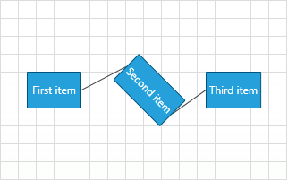
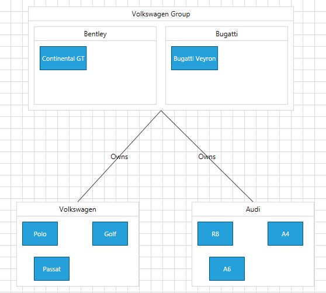

# Use MVVM in RadDiagram

The following help article will demonstrate how to bind the __RadDiagram__ in MVVM scenario using the extension ViewModels which are part of the __Telerik.Windows.Controls.Diagrams.Extensions.dll__ project.			

* [Sample MVVM RadDiagram](#sample-mvvm-raddiagram)
* [Using MVVM to populate RadDiagram with ContainerShapes](#using-mvvm-to-populate-raddiagram-with-containershapes)
* [Bind the source and target connector positions of the connection](#bind-the-source-and-target-connector-positions-of-the-connection)

>Please note that the examples in this tutorial are showcasing Telerik Windows8 theme. In the [Setting a Theme](http://www.telerik.com/help/silverlight/common-styling-apperance-setting-theme.html#Setting_Application-Wide_Built-In_Theme_in_the_Code-Behind)[Setting a Theme](http://www.telerik.com/help/wpf/common-styling-apperance-setting-theme-wpf.html#Setting_Application-Wide_Built-In_Theme_in_the_Code-Behind) article you can find more information on how to set an application-wide theme.				

The DiagrammingFramework comes with a predefined set of ViewModels, further described in the [DiagramExtensions ViewModels]() tutorial. We will take advantage of these built-in models bellow to quickly build MVVM diagramming solutions.			

## Sample MVVM RadDiagram

A sample MVVM implementation has basically 3 steps:

##### 1. __Set up the ViewModels__
To start, in a basic MVVM application we need ViewModels to describe the connections and shapes within a __RadDiagram__ instance. And then we need to create a class to describe the collection that will hold the nodes and links of a diagramming structure. Telerik Diagrams Extensions offer three ViewModels that can serve as base implementations of a __GraphSource__:						

* [GraphSourceBase]()

* [ObservableGraphSourceBase]()

* [SerializableGraphSourceBase]()

For simplicity, in this first example we will use the __GraphSourceBase__ class and we will create a new ViewModel class deriving from it:						
__Example 1: Creating ViewModel__
<snippet id='raddiagram-howto-raddiagrams-mvvm-example_1_creating_viewmodel-cs' />

<snippet id='raddiagram-howto-raddiagrams-mvvm-example_1_creating_viewmodel-vb' />

> It is important to add all nodes in the graph source __before__ the links that connect them. Otherwise, the connection could be missed when the visual elements are created (RadDiagramShape and RadDiagramConnection).

The __GraphSourceBase<TNode,TLink>__ class inherits __ViewModelBase__ and it also implements the __IGraphSource__ interface. This is why the class exposes   two __IEnumerable__ collections - one with the nodes -__Items__, and the other one with the links - __Links__.
		
##### 2. __Configure the View__
Once we have all __ViewModels__ in place, we can go ahead and define a __RadDiagram__ instance in our view to consume the business data. We can use style bindings and __DataTemplates__ to apply bindings on the __RadDiagramConnection__ and __RadDiagramShape__ properties.						

__Example 2: Creating custom style for the connections and shapes__

<snippet id='raddiagram-howto-raddiagrams-mvvm-example_2_creating_custom_style_for_the_connections_and_shapes-xaml' />

	
##### 3. __Associate the ViewModel with the View__
The final step is to assign the __GraphSource__ property of the __RadDiagram__ to the ViewModel:						

__Example 3: Declaring RadDiagram in XAML__

<snippet id='raddiagram-howto-raddiagrams-mvvm-example_3_declaring_raddiagram_in_xaml-xaml' />

__Example 4: Setting the GraphSource property__

<snippet id='raddiagram-howto-raddiagrams-mvvm-example_4_setting_the_graphsource_property-cs' />

<snippet id='raddiagram-howto-raddiagrams-mvvm-example_4_setting_the_graphsource_property-vb' />

So as a result of our MVVM implementation, the __RadDiagram__ instance contains the following 3 shapes and 2 connections:

>In order to use bi-directional MVVM, the DiagramViewModel must implement the __IObservableGraphSource__ interface. Check out the  [DataBinding]() article for further information.					

## Using MVVM to populate RadDiagram with ContainerShapes

The __RadDiagramContainerShapes__ are essentially considered shapes and therefore in a databinding scenario, they are part of the __Nodes__ collection in the __RadDiagram GraphSource__. However, as a container can wrap a collection of shapes, we need to make sure its data model has a children collection as well. The RadDiagram Extensions expose a [ContainerNodeViewModelBase]() that can serve as a base __ViewModel__ for __RadDiagramContainerShapes__. The __ContainerNodeViewModelBase__  derives from the [NodeViewModelBase](), which means that you can add it in the __Items__ collection of any __GraphSourceBase__ implementation.				

For the purpose of this example, we will create the following ViewModels:

* __Brand__: A class deriving from the __ContainerNodeViewModelBase__ ViewModel that represents a container node.						

* __Model__: A class deriving from the __NodeViewModelBase__ ViewModel that represents a node.						

* __Link__: A class deriving from the __LinkViewModelBase__ ViewModel that represent a link.					

* __CarsGraphSource__ - a class deriving from the __ObservableGraphSourceBase__ ViewModel that represent the __RadDiagram GraphSource__.

__Example 5: Creating ViewModels__

<snippet id='raddiagram-howto-raddiagrams-mvvm-example_5_creating_viewmodels-cs' />

<snippet id='raddiagram-howto-raddiagrams-mvvm-example_5_creating_viewmodels-vb' />

Please note that the __ContainerNodeViewModelBase__ exposes a collection of __InternalItems__ and this is why in the __CarsGraphSource__ constructor, all __Brand__ instances are populated with __Model__ instances.				

Next, we can go ahead and define a __RadDiagram__ control in our View:				

__Example 7: Defining RadDiagram in XAML__

<snippet id='raddiagram-howto-raddiagrams-mvvm-example_7_defining_raddiagram_in_xaml-xaml' />

And finally, we need to set the __RadDiagram GraphSource__ property:

__Example 8: Setting GraphSource property__

<snippet id='raddiagram-howto-raddiagrams-mvvm-example_8_setting_graphsource_property-cs' />

<snippet id='raddiagram-howto-raddiagrams-mvvm-example_8_setting_graphsource_property-vb' />

If you run the application now, the __RadDiagram__ should display the following structure:

>tip Find a runnable project of the previous example in the [WPF Samples GitHub repository](https://github.com/telerik/xaml-sdk/tree/master/Diagram/MVVM).

## Bind the source and target connector positions of the connection

To bind the __SourceConnectorPoistion__ and __TargetConnectorPoistion__ properties of the RadDiagramConnection you can create string properties in your __LinkViewModelBase<NodeViewModelBase>__ class. The next step is to create an implicit style to bind them in XAML.

> Note that the diagram expects the SourceConnectorPosition and TargetConnectorPosition properties to have default values set.

__Example 10: Creating string SourceConnectorPosition and TargetConnectorPosition properties__
<snippet id='raddiagram-howto-raddiagrams-mvvm-example_10_creating_string_sourceconnectorposition_and_targetconnectorposition_properties-cs' />

__Example 11: Binding SourceConnectorPosition and TargetConnectorPosition in XAML__

<snippet id='raddiagram-howto-raddiagrams-mvvm-example_11_binding_sourceconnectorposition_and_targetconnectorposition_in_xaml-xaml' />

## See Also
 * [DataBinding]()
 * [DiagramExtensions ViewModels]()
 * [Serialize a Databound Diagram]()
