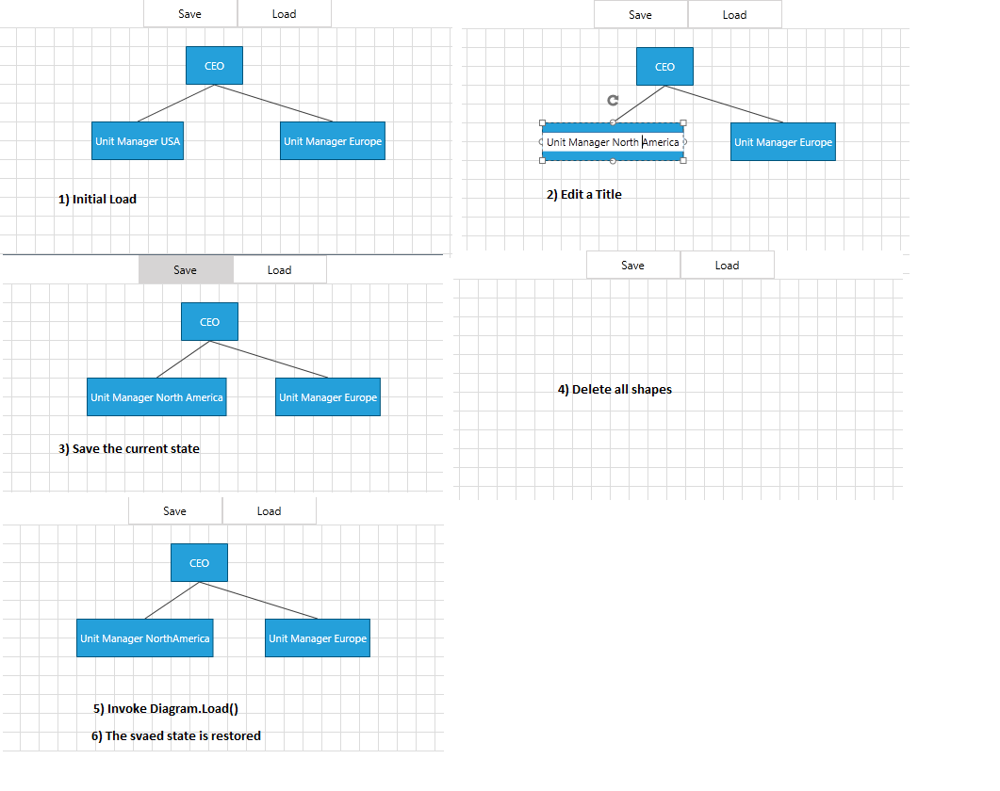

# Serialize a Databound Diagram

This article shows how to serialize and deserialize the __RadDiagram__ in MVVM scenarios. It also demonstrates how to save/load custom properties from the ViewModels during the serialization/deserialization process.

>With the __2024 Q3 SP1__ release, the RadDiagram control requires registering the custom types of shapes, connections, and connectors, in order to deserialize them successfully. Read more about this change [here](#allowing-safe-types-and-assemblies).

>important Please keep in mind that the Serialization / Deserialization is internally used in the copy / paste operations of the __RadDiagramShapes__ and __RadDiagramConnections__.		

## ISerializableGraphSource and SerializableGraphSourceBase

When you need to serialize / deserialize a data-bound __RadDiagram__, you have to use a __GraphSource__ which implements the __ISerializableGraphSource__ interface from the __Telerik.Windows.Diagrams.Core__ namespace.		


```C#
	public interface ISerializableGraphSource : IObservableGraphSource
	{
	    void SerializeNode(object model, SerializationInfo info);
	    void SerializeLink(ILink link, SerializationInfo info);
	
	    object DeserializeNode(IShape shape, SerializationInfo info);
	    ILink DeserializeLink(IConnection connection, SerializationInfo info);
	}
```

[IObservableGraphSource](https://docs.telerik.com/devtools/wpf/api/telerik.windows.diagrams.core.iserializablegraphsource) enables the two-way binding capabilities of the RadDiagram. __ISerializableGraphSource__ (from __Telerik.Windows.Controls.Diagrams.Extensions.ViewModels__ namespace) extends it with Serialization and Deserialization methods for "Links" and "Nodes".		

Similarly, the [SerializableGraphSourceBase]() class extends the __ObservableGraphSourceBase__.


```C#
	namespace Telerik.Windows.Controls.Diagrams.Extensions.ViewModels
	{
	    public abstract class SerializableGraphSourceBase<TNode, TLink> : ObservableGraphSourceBase<TNode, TLink>,
	                                                                      ISerializableGraphSource where TLink : ILink
	    {
	        public abstract string GetNodeUniqueId(TNode node);
	    }
	}
```

>important Please note that when you use the SerializableGraphSourceBase, you have to override the __GetNodeUniqueId()__ method which must return a unique string identifier of your __TNode__ ViewModel. Furthermore your __TNode__ implementation must provide a parameterless constructor.		  

## Serializing ViewModel's properties

The following section will show you how to save and load properties from your ViewModels during the serialization / deserialization process.

Let's first create a proper ViewModels. Do not forget to create parameterless constructors and unique ID properties:


```C#
	public class OrgItem : HierarchicalNodeViewModel
	{
	    public OrgItem()
	    {
	    }
	
	    public OrgItem(string title)
	    {
	        this.Title = title;
	    }
	
	    private string title;
	    public string Title
	    {
	        get { return this.title; }
	        set
	        {
	            if (this.title != value)
	            {
	                this.title = value;
	                this.OnPropertyChanged("Title");
	            }
	        }
	    }
	
	    public string Id { get; set; }
	}
	
	public class OrgLink : LinkViewModelBase<OrgItem>
	{
	    public OrgLink()
	    {
	    }
	
	    public OrgLink(OrgItem source, OrgItem target)
	        : base(source, target)
	    {
	    }
	
	    public string Id { get; set; }
	}
```
```VB.NET
	Public Class OrgItem
	    Inherits HierarchicalNodeViewModel
	    Public Sub New()
	    End Sub
	
	    Public Sub New(title As String)
	        Me.Title = title
	    End Sub
	
	    Private m_title As String
	    Public Property Title() As String
	        Get
	            Return Me.m_title
	        End Get
	        Set(value As String)
	            If Me.m_title <> value Then
	                Me.m_title = value
	                Me.OnPropertyChanged("Title")
	            End If
	        End Set
	    End Property
	
	    Public Property Id() As String
	        Get
	            Return m_Id
	        End Get
	        Set(value As String)
	            m_Id = Value
	        End Set
	    End Property
	    Private m_Id As String
	End Class
	
	Public Class OrgLink
	    Inherits LinkViewModelBase(Of OrgItem)
	    Public Sub New()
	    End Sub
	
	    Public Sub New(source As OrgItem, target As OrgItem)
	        MyBase.New(source, target)
	    End Sub
	
	    Public Property Id() As String
	        Get
	            Return m_Id
	        End Get
	        Set(value As String)
	            m_Id = Value
	        End Set
	    End Property
	    Private m_Id As String
	End Class
```

Then our GraphSource should look like this:		


```C#
	public class GraphSource : SerializableGraphSourceBase<OrgItem, OrgLink>
	{
	    public override string GetNodeUniqueId(OrgItem node)
	    {
	        return node.Id;
	    }
	
	    public override void SerializeNode(OrgItem node, Telerik.Windows.Diagrams.Core.SerializationInfo info)
	    {
	        base.SerializeNode(node, info);
	        info["Title"] = node.Title;
	    }
	
	    public override OrgItem DeserializeNode(Telerik.Windows.Diagrams.Core.IShape shape, Telerik.Windows.Diagrams.Core.SerializationInfo info)
	    {
	        base.DeserializeNode(shape, info);
	        if (info["Title"] != null)
	        {
	            return new OrgItem(info["Title"].ToString());
	        }
	        return null;
	    }
	}
```
```VB.NET
	Public Class GraphSource
	    Inherits SerializableGraphSourceBase(Of OrgItem, OrgLink)
	
	    Public Overrides Function GetNodeUniqueId(node As OrgItem) As String
	        Return node.Id
	    End Function
	
	    Public Overrides Sub SerializeNode(node As OrgItem, info As Telerik.Windows.Diagrams.Core.SerializationInfo)
	        MyBase.SerializeNode(node, info)
	        info("Title") = node.Title
	    End Sub
	
	    Public Overrides Function DeserializeNode(shape As Telerik.Windows.Diagrams.Core.IShape, info As Telerik.Windows.Diagrams.Core.SerializationInfo) As OrgItem
	        MyBase.DeserializeNode(shape, info)
	        If info("Title") IsNot Nothing Then
	            Return New OrgItem(info("Title").ToString())
	        End If
	        Return Nothing
	    End Function
	End Class
```

>important If you do not override the __GetNodeUniqueId()__ method, you will receive a compilation error. Also please note that you need to make sure that the method returns a unique value for every __Node__ object.		  

Now let's create a __RadDiagram__ and bind it to our __GraphSource__:		


```XAML
	<Grid>
	    <Grid.Resources>
	        <DataTemplate x:Key="ShapeContentTemplate">
	            <TextBlock Text="{Binding Title}" />
	        </DataTemplate>
	        <Style x:Key="OrgChartShapeStyle" TargetType="telerik:RadDiagramShape">
	            <Setter Property="Position" Value="{Binding Position, Mode=TwoWay}" />
	            <Setter Property="ContentTemplate" Value="{StaticResource ShapeContentTemplate}" />
	            <Setter Property="EditTemplate">
	                <Setter.Value>
	                    <DataTemplate>
	                        <TextBox Text="{Binding Title, Mode=TwoWay}" />
	                    </DataTemplate>
	                </Setter.Value>
	            </Setter>
	        </Style>
	        <Style TargetType="telerik:RadDiagramConnection">
	            <Setter Property="ContentTemplate">
	                <Setter.Value>
	                    <DataTemplate />
	                </Setter.Value>
	            </Setter>
	            <Setter Property="SourceConnectorPosition" Value="Bottom" />
	            <Setter Property="TargetConnectorPosition" Value="Top" />
	        </Style>
	    </Grid.Resources>
	    <Grid.RowDefinitions>
	        <RowDefinition Height="30" />
	        <RowDefinition Height="*" />
	    </Grid.RowDefinitions>
	    <StackPanel HorizontalAlignment="Center" Orientation="Horizontal">
	        <telerik:RadButton Width="100"
	                            Height="30"
	                            Command="telerik:DiagramCommands.Save"
	                            CommandTarget="{Binding ElementName=xDiagram}"
	                            Content="Save" />
	        <telerik:RadButton Width="100"
	                            Height="30"
	                            Command="telerik:DiagramCommands.Open"
	                            CommandTarget="{Binding ElementName=xDiagram}"
	                            Content="Load" />
	    </StackPanel>
	    <telerik:RadDiagram x:Name="xDiagram"
	                        Grid.Row="1"
	                        ShapeStyle="{StaticResource OrgChartShapeStyle}">
	        <telerik:RadDiagram.CommandBindings>
	            <CommandBinding CanExecute="CommandBinding_CanExecute"
	                            Command="telerik:DiagramCommands.Save"
	                            Executed="CommandBinding_Executed_Save" />
	            <CommandBinding Command="telerik:DiagramCommands.Open" Executed="CommandBinding_Executed_Open" />
	        </telerik:RadDiagram.CommandBindings>
	    </telerik:RadDiagram>
	</Grid>
```

In code-behid we can populate the __RadDiagram.GraphSource__ and use a counter to make sure each Node has a unique ID:		


```C#
	public MainWindow()
	{
	    InitializeComponent();
	    BindGraphSource();
	}
	private void BindGraphSource()
	{
		int uniqueIdCounter = 0;
		GraphSource source = new GraphSource();
		OrgItem rootItem = new OrgItem() { Title = "CEO", Position = new Point(200, 20), Id = (uniqueIdCounter++).ToString() };
		source.AddNode(rootItem);
	
		OrgItem unitOne = new OrgItem() { Title = "Unit Manager USA", Position = new Point(100, 100), Id = (uniqueIdCounter++).ToString() };
		source.AddNode(unitOne);
		source.AddLink(new OrgLink(rootItem, unitOne) { Id = (uniqueIdCounter++).ToString() });
	
		OrgItem unitTwo = new OrgItem() { Title = "Unit Manager Europe", Position = new Point(300, 100), Id = (uniqueIdCounter++).ToString() };
		source.AddNode(unitTwo);
		source.AddLink(new OrgLink(rootItem, unitTwo) { Id = (uniqueIdCounter++).ToString() });
	
		this.xDiagram.GraphSource = source;
	}	
```
```VB.NET
	Public Sub New()
	    InitializeComponent()
	    BindGraphSource()
	End Sub
	Private Sub BindGraphSource()
	    Dim uniqueIdCounter As Integer = 0
	    Dim source As New GraphSource()
	    Dim rootItem As New OrgItem() With {
	         .Title = "CEO",
	         .Position = New Point(200, 20),
	         .Id = (System.Math.Max(System.Threading.Interlocked.Increment(uniqueIdCounter), uniqueIdCounter - 1)).ToString()
	    }
	    source.AddNode(rootItem)
	
	    Dim unitOne As New OrgItem() With {
	         .Title = "Unit Manager USA",
	         .Position = New Point(100, 100),
	         .Id = (System.Math.Max(System.Threading.Interlocked.Increment(uniqueIdCounter), uniqueIdCounter - 1)).ToString()
	    }
	    source.AddNode(unitOne)
	    source.AddLink(New OrgLink(rootItem, unitOne) With {
	         .Id = (System.Math.Max(System.Threading.Interlocked.Increment(uniqueIdCounter), uniqueIdCounter - 1)).ToString()
	    })
	
	    Dim unitTwo As New OrgItem() With {
	         .Title = "Unit Manager Europe",
	         .Position = New Point(300, 100),
	         .Id = (System.Math.Max(System.Threading.Interlocked.Increment(uniqueIdCounter), uniqueIdCounter - 1)).ToString()
	    }
	    source.AddNode(unitTwo)
	    source.AddLink(New OrgLink(rootItem, unitTwo) With {
	         .Id = (System.Math.Max(System.Threading.Interlocked.Increment(uniqueIdCounter), uniqueIdCounter - 1)).ToString()
	    })
	
	    Me.xDiagram.GraphSource = source
	End Sub
```

Fianlly, we have to define the __RadDiagram CommandBindings__ execution methods:


```C#
	private string diagramXMLString;
	private void CommandBinding_Executed_Save(object sender, ExecutedRoutedEventArgs e)
	{
	    diagramXMLString = this.xDiagram.Save();
	}
	
	private void CommandBinding_Executed_Open(object sender, ExecutedRoutedEventArgs e)
	{
	    if (diagramXMLString != null)
	    {
	        this.xDiagram.Load(diagramXMLString);
	    }
	}
	
	private void CommandBinding_CanExecute(object sender, CanExecuteRoutedEventArgs e)
	{
	    e.CanExecute = this.xDiagram.Items.Count > 0;
	}
```
```VB.NET
	Private diagramXMLString As String
	Private Sub CommandBinding_Executed_Save(sender As Object, e As ExecutedRoutedEventArgs)
	    diagramXMLString = Me.xDiagram.Save()
	End Sub
	
	Private Sub CommandBinding_Executed_Open(sender As Object, e As ExecutedRoutedEventArgs)
	    If diagramXMLString IsNot Nothing Then
	        Me.xDiagram.Load(diagramXMLString)
	    End If
	End Sub
	
	Private Sub CommandBinding_CanExecute(sender As Object, e As CanExecuteRoutedEventArgs)
	    e.CanExecute = Me.xDiagram.Items.Count > 0
	End Sub
```

>tip The __Save__ command implementation saves the serialized __RadDiagram__ in a string object. This means that you can use this approach in case you need to save your diagramming structures in a database. Once you have the string saved, you can later retrieve it and load the data using the __RadDiagram Load(serializationString)__ method.		  

Now let's see a possible use case with this set of Diagram configuration and ViewModels:


>tip You can download a runnable project demonstrating a similar approach from [the online SDK repository](https://github.com/telerik/xaml-sdk/tree/master/Diagram/MVVM).

>important Please note that copy/pasting requires additional effort. Pasting a copied node, for example, means that you have to override the [AddNode](https://docs.telerik.com/devtools/wpf/api/telerik.windows.diagrams.core.iobservablegraphsource#Telerik_Windows_Diagrams_Core_IObservableGraphSource_AddNode_System_Object_) method of the [ObservableGraphSourceBase]() and provide a new unique __Id__ for the new __NodeViewModel__.			  

## See Also
 * [Serialization]()
 * [DiagramExtensions ViewModels]()
 * [DataBinding]()
 * [Use MVVM in RadDiagram]()
 * [Commands]()