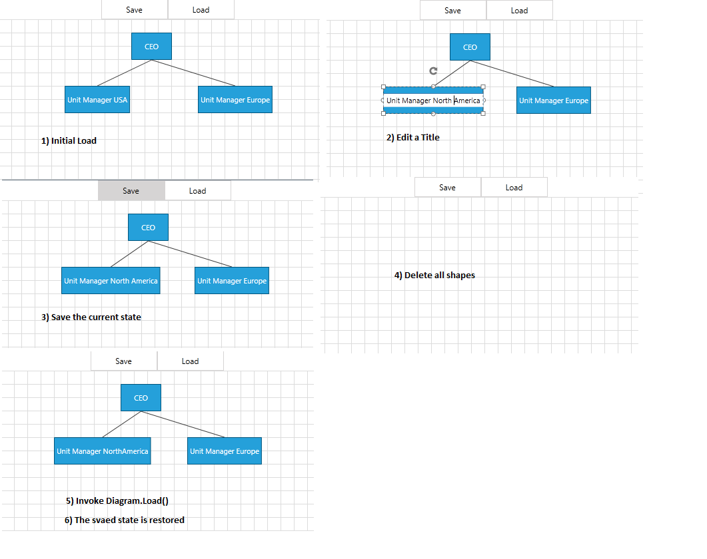

# Serialize a Databound Diagram

This article shows how to serialize and deserialize the __RadDiagram__ in MVVM scenarios. It also demonstrates how to save/load custom properties from the ViewModels during the serialization/deserialization process.

>With the __2024 Q3 SP1__ release, the RadDiagram control requires registering the custom types of shapes, connections, and connectors, in order to deserialize them successfully. Read more about this change [here](#allowing-safe-types-and-assemblies).

>important Please keep in mind that the Serialization / Deserialization is internally used in the copy / paste operations of the __RadDiagramShapes__ and __RadDiagramConnections__.		

## ISerializableGraphSource and SerializableGraphSourceBase

When you need to serialize / deserialize a data-bound __RadDiagram__, you have to use a __GraphSource__ which implements the __ISerializableGraphSource__ interface from the __Telerik.Windows.Diagrams.Core__ namespace.		

<snippet id='raddiagram-howto-raddiagrams-serialize-databound-diagram-block_1-cs' />

[IObservableGraphSource](https://docs.telerik.com/devtools/wpf/api/telerik.windows.diagrams.core.iserializablegraphsource) enables the two-way binding capabilities of the RadDiagram. __ISerializableGraphSource__ (from __Telerik.Windows.Controls.Diagrams.Extensions.ViewModels__ namespace) extends it with Serialization and Deserialization methods for "Links" and "Nodes".		

Similarly, the [SerializableGraphSourceBase]() class extends the __ObservableGraphSourceBase__.

<snippet id='raddiagram-howto-raddiagrams-serialize-databound-diagram-block_2-cs' />

>important Please note that when you use the SerializableGraphSourceBase, you have to override the __GetNodeUniqueId()__ method which must return a unique string identifier of your __TNode__ ViewModel. Furthermore your __TNode__ implementation must provide a parameterless constructor.		  

## Serializing ViewModel's properties

The following section will show you how to save and load properties from your ViewModels during the serialization / deserialization process.

Let's first create a proper ViewModels. Do not forget to create parameterless constructors and unique ID properties:

<snippet id='raddiagram-howto-raddiagrams-serialize-databound-diagram-block_3-cs' />

<snippet id='raddiagram-howto-raddiagrams-serialize-databound-diagram-block_3-vb' />

Then our GraphSource should look like this:		

<snippet id='raddiagram-howto-raddiagrams-serialize-databound-diagram-block_4-cs' />

<snippet id='raddiagram-howto-raddiagrams-serialize-databound-diagram-block_4-vb' />

>important If you do not override the __GetNodeUniqueId()__ method, you will receive a compilation error. Also please note that you need to make sure that the method returns a unique value for every __Node__ object.		  

Now let's create a __RadDiagram__ and bind it to our __GraphSource__:		

<snippet id='raddiagram-howto-raddiagrams-serialize-databound-diagram-block_5-xaml' />

In code-behid we can populate the __RadDiagram.GraphSource__ and use a counter to make sure each Node has a unique ID:		

<snippet id='raddiagram-howto-raddiagrams-serialize-databound-diagram-block_6-cs' />

<snippet id='raddiagram-howto-raddiagrams-serialize-databound-diagram-block_6-vb' />

Fianlly, we have to define the __RadDiagram CommandBindings__ execution methods:

<snippet id='raddiagram-howto-raddiagrams-serialize-databound-diagram-block_7-cs' />

<snippet id='raddiagram-howto-raddiagrams-serialize-databound-diagram-block_7-vb' />

>tip The __Save__ command implementation saves the serialized __RadDiagram__ in a string object. This means that you can use this approach in case you need to save your diagramming structures in a database. Once you have the string saved, you can later retrieve it and load the data using the __RadDiagram Load(serializationString)__ method.		  

Now let's see a possible use case with this set of Diagram configuration and ViewModels:

>tip You can download a runnable project demonstrating a similar approach from [the online SDK repository](https://github.com/telerik/xaml-sdk/tree/master/Diagram/MVVM).

>important Please note that copy/pasting requires additional effort. Pasting a copied node, for example, means that you have to override the [AddNode](https://docs.telerik.com/devtools/wpf/api/telerik.windows.diagrams.core.iobservablegraphsource#Telerik_Windows_Diagrams_Core_IObservableGraphSource_AddNode_System_Object_) method of the [ObservableGraphSourceBase]() and provide a new unique __Id__ for the new __NodeViewModel__.			  

## See Also
 * [Serialization]()
 * [DiagramExtensions ViewModels]()
 * [DataBinding]()
 * [Use MVVM in RadDiagram]()
 * [Commands]()