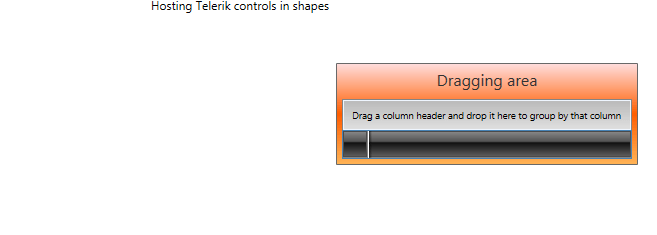
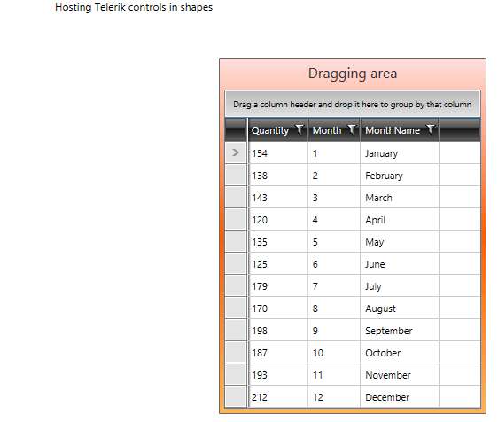
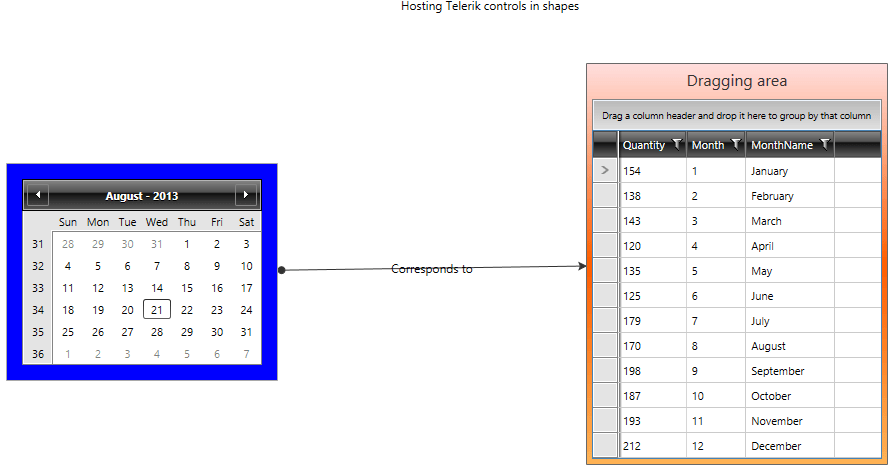

# Place Rad Controls in Diagram Shapes

This tutorial demonstrates how to use __UI for WPF____UI for Silverlight__ in the content of a __RadDiagramShape__ component.

As the __RadDiagramShape__ essentially derives from a __ContentControl__, its __Content__ can wrap other controls. For the purpose of this tutorial we will use a __RadCalendar__ and a __RadGridView__ and will display both in __RadDiagramShapes__. We will also connect these shapes with a __RadDiagramConnection__.

Let's start by defining a __RadDiagram__ instance in our view:

<snippet id='raddiagram-howto-radin-shape-block_1-xaml' />

Next, we can add a __RadDiagramShape__ that contains a __RadGridView__ component. We will define these controls in our XAML view:

<snippet id='raddiagram-howto-radin-shape-block_2-xaml' />

If you run the solution at this point, you should get the following diagramming structure:

And as our __RadGridView__ is currently empty, we can go ahead and populate it with sample data. For that purpose, we first need to define a custom data class - let's name it *ProductSales*:

<snippet id='raddiagram-howto-radin-shape-block_3-cs' />

<snippet id='raddiagram-howto-radin-shape-block_3-vb' />

Next in our code-behind we can create a method that returns a list of __ProductSales__ and use its result as a __DataContext__ of the view:        

<snippet id='raddiagram-howto-radin-shape-block_4-cs' />

<snippet id='raddiagram-howto-radin-shape-block_4-vb' />

Now if we run the solution we will have a populated __RadGridView__ control inside the __RadDiagramShape__.

We can also define a shape in the code-behind file and set its content to any RadControl. Please have a look at the example below as it demonstrates how to create a __RadDiagramShape__ and use a __RadCalendar__ in its __Content__:

<snippet id='raddiagram-howto-radin-shape-block_5-cs' />

<snippet id='raddiagram-howto-radin-shape-block_5-vb' />

Running the project now should display two shapes within the __RadDiagram__ instance:

Finally, we can connect these shapes using a single connection. Let's set it up in the __OnLoaded()__ method implementation:

<snippet id='raddiagram-howto-radin-shape-block_6-cs' />

<snippet id='raddiagram-howto-radin-shape-block_6-vb' />

>tip Find a runnable project of the previous example in the [WPF Samples GitHub repository](https://github.com/telerik/xaml-sdk/tree/master/Diagram/ControlShape).