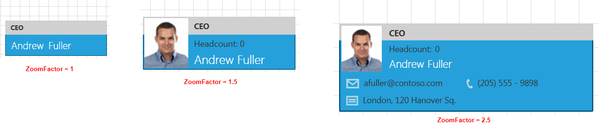

# Implement Semantic Zoom on a Shape level

This tutorial demonstrates how to implement custom semantic zoom on a __RadDiagramShape__ level.	  

For the purpose of the tutorial we will use DataBinding and bind the __RadDiagram GraphSource__ property to a collection of business objects. Then we will take advantage of the __RadFluidContentControl__ to display three different contents inside each shape and we will make sure that the __RadFluidContentControl.Content__ is changed based on the zoom factor of the __RadDiagram__.

Let's start with the ViewModels definitions. As the purpose of this example is to demonstrate a sample approach for implementing semantic zoom using the __RadFluidContentControl__, we will need one custom data class to describe the content of each shape. And as we need to change the information displayed in each shape along with the zoom factor applied in the __RadDiagram__, we will define a variety of properties in that class:		

```C#
	public class CustomNode : HierarchicalNodeViewModel
	{
	    private ItemDisplayMode currentDisplayMode;
	    public ItemDisplayMode CurrentDisplayMode
	    {
	        get
	        {
	            return this.currentDisplayMode;
	        }
	        internal set
	        {
	            if (this.currentDisplayMode != value)
	            {
	                this.currentDisplayMode = value;
	                OnPropertyChanged("CurrentDisplayMode");
	            }
	        }
	    }
	
	    public string Email { get; set; }
	
	    public string Phone { get; set; }
	
	    public string ImagePath { get; set; }
	
	    public string Address { get; set; }
	
	    public int HeadCount { get; set; }
	
	    public string JobPosition { get; set; }
	
	    public string FirstName { get; set; }
	
	    public string LastName { get; set; }
	
	    public CustomNode()
	    {
	        this.CurrentDisplayMode = ItemDisplayMode.Small;
	    }
	}
	
	public enum ItemDisplayMode
	{
	    Medium,
	    Large,
	    Small
	}
```
```VB.NET
	Public Class CustomNode
		Inherits HierarchicalNodeViewModel
		Private m_currentDisplayMode As ItemDisplayMode
		Public Property CurrentDisplayMode() As ItemDisplayMode
			Get
				Return Me.m_currentDisplayMode
			End Get
			Friend Set(value As ItemDisplayMode)
				If Me.m_currentDisplayMode <> value Then
					Me.m_currentDisplayMode = value
					OnPropertyChanged("CurrentDisplayMode")
				End If
			End Set
		End Property
	
		Public Property Email() As String
			Get
				Return m_Email
			End Get
			Set(value As String)
				m_Email = Value
			End Set
		End Property
		Private m_Email As String
	
		Public Property Phone() As String
			Get
				Return m_Phone
			End Get
			Set(value As String)
				m_Phone = Value
			End Set
		End Property
		Private m_Phone As String
	
		Public Property ImagePath() As String
			Get
				Return m_ImagePath
			End Get
			Set(value As String)
				m_ImagePath = Value
			End Set
		End Property
		Private m_ImagePath As String
	
		Public Property Address() As String
			Get
				Return m_Address
			End Get
			Set(value As String)
				m_Address = Value
			End Set
		End Property
		Private m_Address As String
	
		Public Property HeadCount() As Integer
			Get
				Return m_HeadCount
			End Get
			Set(value As Integer)
				m_HeadCount = Value
			End Set
		End Property
		Private m_HeadCount As Integer
	
		Public Property JobPosition() As String
			Get
				Return m_JobPosition
			End Get
			Set(value As String)
				m_JobPosition = Value
			End Set
		End Property
		Private m_JobPosition As String
	
		Public Property FirstName() As String
			Get
				Return m_FirstName
			End Get
			Set(value As String)
				m_FirstName = Value
			End Set
		End Property
		Private m_FirstName As String
	
		Public Property LastName() As String
			Get
				Return m_LastName
			End Get
			Set(value As String)
				m_LastName = Value
			End Set
		End Property
		Private m_LastName As String
	
		Public Sub New()
			Me.CurrentDisplayMode = ItemDisplayMode.Small
		End Sub
	End Class
	
	Public Enum ItemDisplayMode
		Medium
		Large
		Small
	End Enum
```

Next, let's build a sample collection of items to populate the __RadDiagram.GraphSource__:		

```C#
	public class MainViewModel : ViewModelBase
	{
	    public ObservableGraphSourceBase<CustomNode, LinkViewModelBase<CustomNode>> Employees { get; set; }
	
	    public MainViewModel()
	    {
	        this.Employees = new ObservableGraphSourceBase<CustomNode, LinkViewModelBase<CustomNode>>();
	        this.Employees.AddNode(new CustomNode()
	        {
	            FirstName = "Andrew",
	            LastName = "Fuller",
	            Email = "afuller@contoso.com",
	            Phone = "(205) 555 - 9898",
	            Address = "London, 120 Hanover Sq.",
	            Position = new Point(250, 250),
	            ImagePath = "/Images/AndrewFuller.jpg",
	            JobPosition = "CEO"
	        });
	    }
	}
```
```VB.NET
	Public Class MainViewModel
		Inherits ViewModelBase
	
		Public Property Employees() As ObservableGraphSourceBase(Of CustomNode, LinkViewModelBase(Of CustomNode))
			Get
				Return m_Employees
			End Get
			Set(value As ObservableGraphSourceBase(Of CustomNode, LinkViewModelBase(Of CustomNode)))
				m_Employees = Value
			End Set
		End Property
		Private m_Employees As ObservableGraphSourceBase(Of CustomNode, LinkViewModelBase(Of CustomNode))
	
		Public Sub New()
			Me.Employees = New ObservableGraphSourceBase(Of CustomNode, LinkViewModelBase(Of CustomNode))()
			Me.Employees.AddNode(New CustomNode() With {
															.FirstName = "Andrew",
															.LastName = "Fuller",
															.Email = "afuller@contoso.com",
															.Phone = "(205) 555 - 9898",
															.Address = "London, 120 Hanover Sq.",
															.Position = New Point(250, 250),
															.ImagePath = "/Images/AndrewFuller.jpg",
															.JobPosition = "CEO"
														})
		End Sub
	End Class
```

Now that our ViewModels are defined, we can start describing the View where the __RadDiagram__ will be displayed. What we need is a __RadDiagram__ instance which __GraphSource__ property is data bound to the *Employees* collection. And in order to visualize the nodes in the diagram, we have to declare a __DataTemplate__. In this example, we will use a __RadFluidContentControl__ to visualize the business data representing each node of our diagramming structure. And we will define the __RadDiagramShape.ContentTemplate__ using the __RadDiagram ShapeStyle__ property:		

```XAML
	<Grid>
		<telerik:RadDiagram x:Name="xDiagram"
							GraphSource="{Binding Employees}"
							Zoom="{Binding ZoomFactor,
										   Mode=TwoWay}">
			<telerik:RadDiagram.ShapeStyle>
				<Style TargetType="telerik:RadDiagramShape">
					<Setter Property="Position" Value="{Binding Position, Mode=TwoWay}" />
					<Setter Property="Padding" Value="0" />
					<Setter Property="ContentTemplate">
						<Setter.Value>
							<DataTemplate>
								<telerik:RadFluidContentControl Width="212"
																Height="74"
																ContentChangeMode="Manual">
									<telerik:RadFluidContentControl.SmallContent>
										<Grid>
											<Grid.RowDefinitions>
												<RowDefinition Height="2*" />
												<RowDefinition Height="3*" />
											</Grid.RowDefinitions>
											<Grid HorizontalAlignment="Stretch" Background="{StaticResource MetroGray}" />
											<TextBlock x:Name="positionTextBlock"
													   FontSize="14"
													   Style="{StaticResource PositionTextBlockStyle}"
													   Text="{Binding JobPosition}" />

											<StackPanel Grid.Row="1"
														Margin="10 0 0 0"
														Orientation="Horizontal">
												<TextBlock FontSize="21"
														   Style="{StaticResource NameTextBlockStyle}"
														   Text="{Binding FirstName}" />
												<TextBlock Margin="8 0 0 0"
														   FontSize="21"
														   Style="{StaticResource NameTextBlockStyle}"
														   Text="{Binding LastName}" />
											</StackPanel>
										</Grid>
									</telerik:RadFluidContentControl.SmallContent>
									<telerik:RadFluidContentControl.Content>
										<Grid>
											<Grid.RowDefinitions>
												<RowDefinition Height="25" />
												<RowDefinition Height="49" />
											</Grid.RowDefinitions>
											<Grid.ColumnDefinitions>
												<ColumnDefinition Width="Auto" />
												<ColumnDefinition />
											</Grid.ColumnDefinitions>
											<Grid Grid.Column="0"
												  Grid.ColumnSpan="2"
												  Width="212"
												  HorizontalAlignment="Stretch"
												  Background="{StaticResource MetroGray}" />

											<Grid Name="imageGrid"
												  Grid.RowSpan="2"
												  Width="65"
												  Background="Transparent">
												<Image Grid.RowSpan="2"
													   Width="61"
													   Height="70"
													   Margin="2"
													   Source="{Binding ImagePath}"
													   Stretch="Fill" />
											</Grid>

											<TextBlock Grid.Column="1"
													   Margin="6 3 0 0"
													   HorizontalAlignment="Left"
													   Style="{StaticResource PositionTextBlockStyle}"
													   Text="{Binding JobPosition}" />

											<Grid Name="nameAndHeadCountGrid"
												  Grid.Row="1"
												  Grid.Column="1">
												<Grid.RowDefinitions>
													<RowDefinition Height="45*" />
													<RowDefinition Height="55*" />
												</Grid.RowDefinitions>
												<StackPanel Orientation="Horizontal">
													<TextBlock Margin="6 5 0 0"
															   Style="{StaticResource HeadCountTextBlockStyle}"
															   Text="Headcount:" />
													<TextBlock Margin="3 5 0 0"
															   Style="{StaticResource HeadCountTextBlockStyle}"
															   Text="{Binding HeadCount}" />
												</StackPanel>
												<StackPanel Grid.Row="1" Orientation="Horizontal">
													<TextBlock Margin="6 0 0 3"
															   Style="{StaticResource NameTextBlockStyle}"
															   Text="{Binding FirstName}" />
													<TextBlock Margin="5 0 0 3"
															   Style="{StaticResource NameTextBlockStyle}"
															   Text="{Binding LastName}" />
												</StackPanel>
											</Grid>
										</Grid>
									</telerik:RadFluidContentControl.Content>
									<telerik:RadFluidContentControl.LargeContent>
										<Grid>
											<Grid.RowDefinitions>
												<RowDefinition Height="Auto" />
												<RowDefinition Height="Auto" />
												<RowDefinition Height="Auto" />
												<RowDefinition Height="*" />
												<RowDefinition Height="*" />
											</Grid.RowDefinitions>
											<Grid.ColumnDefinitions>
												<ColumnDefinition Width="Auto" />
												<ColumnDefinition Width="*" />
											</Grid.ColumnDefinitions>

											<Grid Grid.Column="0"
												  Grid.ColumnSpan="2"
												  HorizontalAlignment="Stretch"
												  Background="{StaticResource MetroGray}" />

											<TextBlock Grid.Column="1"
													   Margin="4 3 0 0"
													   FontSize="7"
													   Style="{StaticResource PositionTextBlockStyle}"
													   Text="{Binding JobPosition}" />

											<Grid Grid.Row="1"
												  Grid.RowSpan="2"
												  Grid.Column="1">
												<Grid.RowDefinitions>
													<RowDefinition Height="0.45*" />
													<RowDefinition Height="0.55*" />
												</Grid.RowDefinitions>
												<StackPanel Orientation="Horizontal">
													<TextBlock Margin="4 3 0 0"
															   FontSize="7"
															   Style="{StaticResource HeadCountTextBlockStyle}"
															   Text="Headcount:" />
													<TextBlock Margin="3 3 0 0"
															   FontSize="7"
															   Style="{StaticResource HeadCountTextBlockStyle}"
															   Text="{Binding HeadCount}" />
												</StackPanel>
												<StackPanel Grid.Row="1"
															Margin="4 0 0 3"
															VerticalAlignment="Center"
															Orientation="Horizontal">
													<TextBlock Margin="0"
															   FontSize="9"
															   Style="{StaticResource NameTextBlockStyle}"
															   Text="{Binding FirstName}" />
													<TextBlock Margin="3 0 0 0"
															   FontSize="9"
															   Style="{StaticResource NameTextBlockStyle}"
															   Text="{Binding LastName}" />
												</StackPanel>
											</Grid>

											<StackPanel Grid.Row="3"
														Grid.ColumnSpan="2"
														Margin="6,0,0,0"
														Orientation="Horizontal">
												<Viewbox Width="10.66"
														 Height="8"
														 Stretch="Fill">
													<Path HorizontalAlignment="Left"
														  VerticalAlignment="Center"
														  Data="M13.999998,3.7658489 L13.94845,3.803616 C12.542283,4.8337059 8.0308743,8.1299944 7.8814616,8.1299944 C7.7320304,8.1299944 3.3899567,4.9128594 2.0367067,3.907505 L2,3.8802307 L2,9.999999 L13.999998,9.999999 z M2.5423753,2.0000005 L7.8829308,6.0973635 L13.441984,2.0000005 z M0,0 L15.999998,0 L16,12 L1.1920929E-06,12 z"
														  Fill="#FFEDEDED"
														  Opacity="0.7"
														  Stretch="Fill"
														  UseLayoutRounding="False" />
												</Viewbox>

												<TextBlock Margin="4 0 0 0"
														   FontSize="7"
														   Style="{StaticResource HeadCountTextBlockStyle}"
														   Text="{Binding Email}" />

												<Viewbox Width="5.2"
														 Height="8"
														 Margin="20 0 0 0"
														 Stretch="Fill">
													<Path HorizontalAlignment="Left"
														  VerticalAlignment="Center"
														  Data="M739.14526,183.75031 C739.14526,183.75031 736.72418,184.84114 736.49939,187.25047 C736.41388,188.16693 735.96222,188.58353 737.70624,193.2502 C739.12305,197.04138 740.83221,198.00002 742.37421,198.04219 C743.70874,198.07869 745.40796,197.68605 745.66803,197.16695 C745.96014,196.584 744.95941,194.33397 744.39557,193.87529 C744.07941,193.6181 743.83295,193.50031 743.08319,194.0009 C742.41235,194.44879 741.46832,194.96967 740.66663,194.08388 C739.98315,193.32875 738.70654,190.04181 738.93683,188.9693 C739.17474,187.86108 740.9682,187.82338 741.17651,187.40672 C741.38483,186.99005 741.02002,186.0629 740.08252,184.31284 C739.61816,183.44601 739.14526,183.75031 739.14526,183.75031 z"
														  Fill="#FFEDEDED"
														  Opacity="0.7"
														  Stretch="Fill"
														  UseLayoutRounding="False" />
												</Viewbox>

												<TextBlock Margin="4 0 20 0"
														   FontSize="7"
														   Style="{StaticResource HeadCountTextBlockStyle}"
														   Text="{Binding Phone}" />
											</StackPanel>

											<StackPanel Grid.Row="4"
														Grid.ColumnSpan="2"
														Margin="6 0 0 3"
														Orientation="Horizontal">
												<Viewbox Width="9.85"
														 Height="8"
														 Stretch="Fill">
													<Path HorizontalAlignment="Left"
														  VerticalAlignment="Center"
														  Data="M3.0000026,7.0000038 L13.000003,7.0000038 L13.000003,9.0000038 L3.0000026,9.0000038 z M3.0000026,4.0000038 L13.000003,4.0000038 L13.000003,6.0000038 L3.0000026,6.0000038 z M2,2 L2,2.1666667 L2,10.833334 L2,11 L14,11 L14,10.833334 L14,2.1666667 L14,2 z M0,0 L16,0 L16,13 L0,13 z"
														  Fill="#FFEDEDED"
														  Opacity="0.7"
														  Stretch="Fill"
														  StrokeThickness="0"
														  UseLayoutRounding="False" />
												</Viewbox>

												<TextBlock Grid.Column="1"
														   Margin="4 0 0 0"
														   FontSize="7"
														   Style="{StaticResource HeadCountTextBlockStyle}"
														   Text="{Binding Address}" />
											</StackPanel>

											<Grid Grid.RowSpan="3"
												  HorizontalAlignment="Left"
												  VerticalAlignment="Top"
												  Background="Transparent">
												<Viewbox Height="38.58"
														 Margin="2"
														 Stretch="Fill">
													<Image Source="{Binding ImagePath}" Stretch="Fill" />
												</Viewbox>
											</Grid>
										</Grid>
									</telerik:RadFluidContentControl.LargeContent>
								</telerik:RadFluidContentControl>
							</DataTemplate>
						</Setter.Value>
					</Setter>
				</Style>
			</telerik:RadDiagram.ShapeStyle>
		</telerik:RadDiagram>
	</Grid>
```

In order to customize the appearance of each __Content__ of the __RadFluidContentControl__, we can create a few custom styles. Please add the following in the __Resources__ section of your View:

```XAML
	<Grid.Resources>
	    <SolidColorBrush x:Key="MetroGray" Color="#FFD0D0D0" />
	    <Style x:Key="NameTextBlockStyle" TargetType="TextBlock">
	        <Setter Property="FontFamily" Value="Segoe UI Light" />
	        <Setter Property="FontSize" Value="17" />
	        <Setter Property="Foreground" Value="{telerik:Windows8Resource ResourceKey=MainBrush}" />
	        <Setter Property="VerticalAlignment" Value="Center" />
	        <Setter Property="HorizontalAlignment" Value="Center" />
	        <Setter Property="Margin" Value="2 0" />
	    </Style>
	    <Style x:Key="PositionTextBlockStyle" TargetType="TextBlock">
	        <Setter Property="FontFamily" Value="Sergoe UI" />
	        <Setter Property="FontSize" Value="11" />
	        <Setter Property="VerticalAlignment" Value="Center" />
	        <Setter Property="HorizontalAlignment" Value="Left" />
	        <Setter Property="Foreground" Value="#FF333333" />
	        <Setter Property="Margin" Value="11 2 0 0" />
	        <Setter Property="FontWeight" Value="Bold" />
	    </Style>
	    <Style x:Key="HeadCountTextBlockStyle" TargetType="TextBlock"
						BasedOn="{StaticResource PositionTextBlockStyle}">
	        <Setter Property="FontSize" Value="12" />
	        <Setter Property="FontWeight" Value="Normal" />
	    </Style>
	</Grid.Resources>
```

Now that we have all prerequisites in place, we can start working on the semantic zoom logic. We need to bind the __RadFluidContentControl State__ property to a business property in order to manually control it based on the __RadDiagram Zoom__. Now if you go back to the *CustomNode* class definition, you can see that we've defined a *CurrentDisplayMode* property and an __ItemDisplayMode Enum__ to describe the current state of a __RadDiagramShape__. But in a real-life application, we will need to synchronize the state of all items so that they can change together. This is why we can create a business property in our *MainViewModel* that reflects the __ItemDisplayMode__ of all __RadDiagramShapes__.		

```C#
	public ItemDisplayMode ItemsCurrentDisplayMode { get; set; }	
```
```VB.NET
	Private m_ItemsCurrentDisplayMode As ItemDisplayMode
	Public Property ItemsCurrentDisplayMode() As ItemDisplayMode
		Get
			Return m_ItemsCurrentDisplayMode
		End Get
		Set(value As ItemDisplayMode)
			m_ItemsCurrentDisplayMode = Value
		End Set
	End Property
```
	
The essence of the semantic zoom discussed in this article, is to change the visual representation of the nodes based on the __RadDiagram__ zoom. This is why we also need to define a business property to reflect the zoom factor in the *MainViewModels*. In the setter of the property, we will call a method that changes the *ItemsCurrentDisplayMode* value accordingly. In order to implement this logic we will also describe two static properties to act as thresholds - basically their values will determine the relation between the zoom factor and the __ItemDisplayMode__ of our custom nodes. Please find below the complete definition of the __MainViewModel__ class:

```C#
	public class MainViewModel : ViewModelBase
	{
	    private static double SmallToNormalTemplateThreshHold = 1.2d;
	    private static double NormallToLargeTemplateThreshHold = 2.1d;
	
	    public ObservableGraphSourceBase<CustomNode, LinkViewModelBase<CustomNode>> Employees { get; set; }
	
	    private double zoomFactor;
	    /// <summary>
	    ///     Gets or sets the zoom factor of the diagram.
	    /// </summary>
	    public double ZoomFactor
	    {
	        get
	        {
	            return this.zoomFactor;
	        }
	        internal set
	        {
	            if (this.zoomFactor != value)
	            {
	                this.zoomFactor = value;
	                this.OnZoomChanged();
	                OnPropertyChanged("ZoomFactor");
	            }
	        }
	    }
	    public ItemDisplayMode ItemsCurrentDisplayMode { get; set; }
	
	    public MainViewModel()
	    {
	        this.Employees = new ObservableGraphSourceBase<CustomNode, LinkViewModelBase<CustomNode>>();
	        this.Employees.AddNode(new CustomNode()
	        {
	            FirstName = "Andrew",
	            LastName = "Fuller",
	            Email = "afuller@contoso.com",
	            Phone = "(205) 555 - 9898",
	            Address = "London, 120 Hanover Sq.",
	            Position = new Point(250, 250),
	            ImagePath = "/Images/AndrewFuller.jpg",
	            JobPosition = "CEO"
	        });
	        this.ItemsCurrentDisplayMode = ItemDisplayMode.Medium;
	        this.ZoomFactor = 1;
	    }
	
	    private void OnZoomChanged()
	    {
	        ItemDisplayMode newMode;
	        if (SmallToNormalTemplateThreshHold < this.ZoomFactor && this.ZoomFactor <= NormallToLargeTemplateThreshHold)
	            newMode = ItemDisplayMode.Medium;
	        else if (this.ZoomFactor <= SmallToNormalTemplateThreshHold)
	            newMode = ItemDisplayMode.Small;
	        else
	            newMode = ItemDisplayMode.Large;
	
	        if (this.ItemsCurrentDisplayMode != newMode)
	            this.ChangeAllShapesDisplayMode(newMode);
	    }
	
	    private void ChangeAllShapesDisplayMode(ItemDisplayMode newMode)
	    {
	        this.ItemsCurrentDisplayMode = newMode;
	        foreach (var node in this.Employees.InternalItems)
	        {
	            node.CurrentDisplayMode = newMode;
	        }
	    }
	}
```
```VB.NET
	Public Class MainViewModel
		Inherits ViewModelBase
		Private Shared SmallToNormalTemplateThreshHold As Double = 1.2
		Private Shared NormallToLargeTemplateThreshHold As Double = 2.1
	
		Public Property Employees() As ObservableGraphSourceBase(Of CustomNode, LinkViewModelBase(Of CustomNode))
			Get
				Return m_Employees
			End Get
			Set(value As ObservableGraphSourceBase(Of CustomNode, LinkViewModelBase(Of CustomNode)))
				m_Employees = Value
			End Set
		End Property
		Private m_Employees As ObservableGraphSourceBase(Of CustomNode, LinkViewModelBase(Of CustomNode))
	
		Private m_zoomFactor As Double
		''' <summary>'''
		'''     Gets or sets the zoom factor of the diagram.
		''' </summary>'''
		Public Property ZoomFactor() As Double
			Get
				Return Me.m_zoomFactor
			End Get
			Friend Set(value As Double)
				If Me.m_zoomFactor <> value Then
					Me.m_zoomFactor = value
					Me.OnZoomChanged()
					OnPropertyChanged("ZoomFactor")
				End If
			End Set
		End Property
		Private m_ItemsCurrentDisplayMode As ItemDisplayMode
		Public Property ItemsCurrentDisplayMode() As ItemDisplayMode
			Get
				Return m_ItemsCurrentDisplayMode
			End Get
			Set(value As ItemDisplayMode)
				m_ItemsCurrentDisplayMode = Value
			End Set
		End Property
	
	
		Public Sub New()
			Me.Employees = New ObservableGraphSourceBase(Of CustomNode, LinkViewModelBase(Of CustomNode))()
			Me.Employees.AddNode(New CustomNode() With {
															.FirstName = "Andrew",
															.LastName = "Fuller",
															.Email = "afuller@contoso.com",
															.Phone = "(205) 555 - 9898",
															.Address = "London, 120 Hanover Sq.",
															.Position = New Point(250, 250),
															.ImagePath = "/Images/AndrewFuller.jpg",
															.JobPosition = "CEO"
														})
			Me.ItemsCurrentDisplayMode = ItemDisplayMode.Medium
			Me.ZoomFactor = 1
		End Sub
	
		Private Sub OnZoomChanged()
			Dim newMode As ItemDisplayMode
			If SmallToNormalTemplateThreshHold < Me.ZoomFactor AndAlso Me.ZoomFactor <= NormallToLargeTemplateThreshHold Then
				newMode = ItemDisplayMode.Medium
			ElseIf Me.ZoomFactor <= SmallToNormalTemplateThreshHold Then
				newMode = ItemDisplayMode.Small
			Else
				newMode = ItemDisplayMode.Large
			End If
	
			If Me.ItemsCurrentDisplayMode <> newMode Then
				Me.ChangeAllShapesDisplayMode(newMode)
			End If
		End Sub
	
		Private Sub ChangeAllShapesDisplayMode(newMode As ItemDisplayMode)
			Me.ItemsCurrentDisplayMode = newMode
			For Each node As var In Me.Employees.InternalItems
				node.CurrentDisplayMode = newMode
			Next
		End Sub
	End Class
```

Finally, we need to change the __RadDiagram__ and __RadFluidContentControl__ definitions to reflect the new properties. We will bind the __RadDiagram.Zoom__ property to the *MainViewModel ZoomFactor* and the __RadFluidContentControl State__ property to the *CustomNode CurrentDisplayMode* property. We can also apply a __Transition__ on the __RadFluidContentControl__ to animate the changes in the __RadDiagramShape__ content.

```XAML
	<telerik:RadDiagram x:Name="xDiagram"
						GraphSource="{Binding Employees}"
						Zoom="{Binding ZoomFactor,
									   Mode=TwoWay}">
		<telerik:RadDiagram.ShapeStyle>
			<Style TargetType="telerik:RadDiagramShape">
				<Setter Property="Position" Value="{Binding Position, Mode=TwoWay}" />
				<Setter Property="Padding" Value="0" />
				<Setter Property="ContentTemplate">
					<Setter.Value>
						<DataTemplate>
							<telerik:RadFluidContentControl Width="212"
															Height="74"
															ContentChangeMode="Manual"
															State="{Binding CurrentDisplayMode,
																			Converter={StaticResource ModeToStateConverter}}"
															TransitionDuration="0:0:0.3">

								<telerik:RadFluidContentControl.Transition>
									<telerik:FadeTransition LayoutAnimation="Instant" />
								</telerik:RadFluidContentControl.Transition>

								<telerik:RadFluidContentControl.SmallContent>
									//Small Content
								</telerik:RadFluidContentControl.SmallContent>
								<telerik:RadFluidContentControl.Content>
									//Content
								</telerik:RadFluidContentControl.Content>
								<telerik:RadFluidContentControl.LargeContent>
									//Large Content
								 </telerik:RadFluidContentControl.LargeContent>
							</telerik:RadFluidContentControl>
						</DataTemplate>
					</Setter.Value>
				</Setter>
			</Style>
		</telerik:RadDiagram.ShapeStyle>
	</telerik:RadDiagram>
```

If you run the application now, you should be able to dynamically change the content of the sample __RadDiagramShape__ while zooming in or out of the __RadDiagram__.


A semantic zoom feature is implemented in the [OrgChart demo](https://demos.telerik.com/silverlight/#Diagrams/OrgChart)[Diagrams->OrgChart demo](https://demos.telerik.com/wpf/#Diagrams/OrgChart) solution.