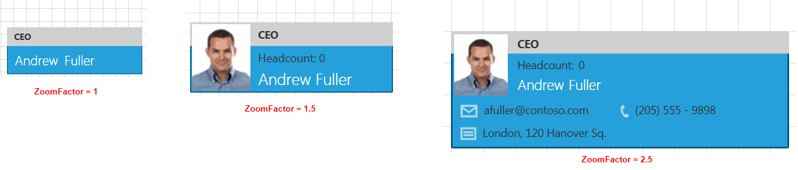

# Implement Semantic Zoom on a Shape level

This tutorial demonstrates how to implement custom semantic zoom on a __RadDiagramShape__ level.	  

For the purpose of the tutorial we will use DataBinding and bind the __RadDiagram GraphSource__ property to a collection of business objects. Then we will take advantage of the __RadFluidContentControl__ to display three different contents inside each shape and we will make sure that the __RadFluidContentControl.Content__ is changed based on the zoom factor of the __RadDiagram__.

Let's start with the ViewModels definitions. As the purpose of this example is to demonstrate a sample approach for implementing semantic zoom using the __RadFluidContentControl__, we will need one custom data class to describe the content of each shape. And as we need to change the information displayed in each shape along with the zoom factor applied in the __RadDiagram__, we will define a variety of properties in that class:		

<snippet id='raddiagram-howto-semantic-zoom-block_1-cs' />

<snippet id='raddiagram-howto-semantic-zoom-block_1-vb' />

Next, let's build a sample collection of items to populate the __RadDiagram.GraphSource__:		

<snippet id='raddiagram-howto-semantic-zoom-block_2-cs' />

<snippet id='raddiagram-howto-semantic-zoom-block_2-vb' />

Now that our ViewModels are defined, we can start describing the View where the __RadDiagram__ will be displayed. What we need is a __RadDiagram__ instance which __GraphSource__ property is data bound to the *Employees* collection. And in order to visualize the nodes in the diagram, we have to declare a __DataTemplate__. In this example, we will use a __RadFluidContentControl__ to visualize the business data representing each node of our diagramming structure. And we will define the __RadDiagramShape.ContentTemplate__ using the __RadDiagram ShapeStyle__ property:		

<snippet id='raddiagram-howto-semantic-zoom-block_3-xaml' />

In order to customize the appearance of each __Content__ of the __RadFluidContentControl__, we can create a few custom styles. Please add the following in the __Resources__ section of your View:

<snippet id='raddiagram-howto-semantic-zoom-block_4-xaml' />

Now that we have all prerequisites in place, we can start working on the semantic zoom logic. We need to bind the __RadFluidContentControl State__ property to a business property in order to manually control it based on the __RadDiagram Zoom__. Now if you go back to the *CustomNode* class definition, you can see that we've defined a *CurrentDisplayMode* property and an __ItemDisplayMode Enum__ to describe the current state of a __RadDiagramShape__. But in a real-life application, we will need to synchronize the state of all items so that they can change together. This is why we can create a business property in our *MainViewModel* that reflects the __ItemDisplayMode__ of all __RadDiagramShapes__.		

<snippet id='raddiagram-howto-semantic-zoom-block_5-cs' />

<snippet id='raddiagram-howto-semantic-zoom-block_5-vb' />

	
The essence of the semantic zoom discussed in this article, is to change the visual representation of the nodes based on the __RadDiagram__ zoom. This is why we also need to define a business property to reflect the zoom factor in the *MainViewModels*. In the setter of the property, we will call a method that changes the *ItemsCurrentDisplayMode* value accordingly. In order to implement this logic we will also describe two static properties to act as thresholds - basically their values will determine the relation between the zoom factor and the __ItemDisplayMode__ of our custom nodes. Please find below the complete definition of the __MainViewModel__ class:

<snippet id='raddiagram-howto-semantic-zoom-block_6-cs' />

<snippet id='raddiagram-howto-semantic-zoom-block_6-vb' />

Finally, we need to change the __RadDiagram__ and __RadFluidContentControl__ definitions to reflect the new properties. We will bind the __RadDiagram.Zoom__ property to the *MainViewModel ZoomFactor* and the __RadFluidContentControl State__ property to the *CustomNode CurrentDisplayMode* property. We can also apply a __Transition__ on the __RadFluidContentControl__ to animate the changes in the __RadDiagramShape__ content.

<snippet id='raddiagram-howto-semantic-zoom-block_7-xaml' />

If you run the application now, you should be able to dynamically change the content of the sample __RadDiagramShape__ while zooming in or out of the __RadDiagram__.

A semantic zoom feature is implemented in the [OrgChart demo](https://demos.telerik.com/silverlight/#Diagrams/OrgChart)[Diagrams->OrgChart demo](https://demos.telerik.com/wpf/#Diagrams/OrgChart) solution.