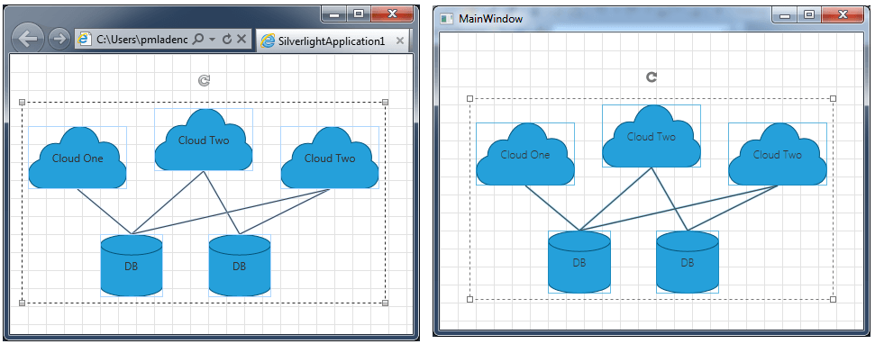

# Clipboard Operations

__RadDiagram__ gives you the ability to __Cut__, __Copy__ and __Paste__ RadDiagramItems within an application or from __WPF__ to __Silverlight 5__ application and vice versa.
	  

>Please note that the examples in this tutorial are showcasing Telerik Windows8 theme. In the
		  [Setting a Theme](http://www.telerik.com/help/silverlight/common-styling-apperance-setting-theme.html#Setting_Application-Wide_Built-In_Theme_in_the_Code-Behind)[Setting a Theme](http://www.telerik.com/help/wpf/common-styling-apperance-setting-theme-wpf.html#Setting_Application-Wide_Built-In_Theme_in_the_Code-Behind)
		  article you can find more information on how to set an application-wide theme.
		

## AllowCopy, AllowCut, AllowPaste 

By default, the __AllowCopy__, __AllowCut__ and __AllowPaste__ properties are set to True but you can set then to False in order to disable these Clipboard operations.
		

## Cut, Copy, Paste with Keyboard

In order to Cut, Copy or Paste particular RadDiagramItems you have to select them and use the standard keyboard combinations:

* __(Ctrl + C)__ -  copies the selected items.
		  

* __(Ctrl + X)__ -  cuts the selected items.
		  

* __(Ctrl + V)__ -  pastes the selected items.
		  

You can perform these operations in a single WPF or SL 5 application but you can also copy/cut and paste items from WPF to SL 5 and vice versa.

Below you can see three shapes copied from SL 5 application and pasted in WPF 4 application: 

## Cut, Copy, Paste with DiagramCommands

You can use the DiagramCommands "__Cut__", "__Copy__" and "__Paste__" in order to perform the standard clipboard operations.
		

For more information on this, please check out the [Commands article]().
		

## Copy Shapes from Visio, MSOffice and more...

With the Q3 2012 release, we introduced a built-in feature in the __Diagramming__ framework, that allows you to copy shapes from __Visio__ and paste them directly onto the Diagramming surface. 
		

>Please have in mind that the true Visio XML format pasted on the clipboard describes an object model which has nothing in common with the __RadDiagram__ object model. This is why we implemented this feature by using an image format to read the clipboard data and paste a __RadDiagramShape__ containing the clipboard image onto the WPF __RadDiagram__ surface.
		  

Furthermore, you can now copy any portion of __MicrosoftOffice__ data or part of a __Photoshop__ image and paste it directly onto the Diagramming surface. You can also copy an xml representing __RadDiagram__ elements and as soon as you paste it onto your __RadDiagram__, the elements will be deserialized and automatically generated on the surface.

# See Also

 * [Structure]()

 * [Getting Started]()

 * [Populating with Data]()

 * [Shapes]()

 * [Connections]()

 * [Items Editing]()

 * [Pan and Zoom]()

 * [Undo and Redo]()

 * [Commands]()

 * [Keyboard Support]()
