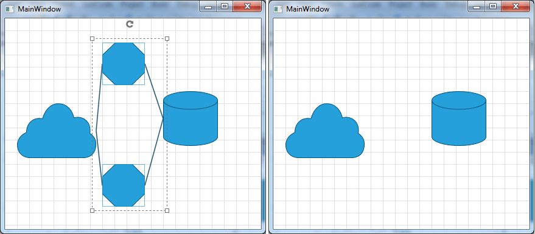

# Removing Items

__RadDiagram__ gives you the ability to remove __RadDiagramItems__ interactively, programmatically or with DiagramCommands.	  

>Please note that the examples in this tutorial are showcasing Telerik Windows8 theme. In the [Setting a Theme](http://www.telerik.com/help/silverlight/common-styling-apperance-setting-theme.html#Setting_Application-Wide_Built-In_Theme_in_the_Code-Behind)[Setting a Theme](http://www.telerik.com/help/wpf/common-styling-apperance-setting-theme-wpf.html#Setting_Application-Wide_Built-In_Theme_in_the_Code-Behind) article you can find more information on how to set an application-wide theme.		

## Removing Items Interactively

You can remove the selected RadDiagramItems by pressing the Delete Key.

Below you can see the result of delete operation over the selected RadDiagramItems:

## Removing Items in Code Behind

You can remove RadDiagramItems in code behind by using the __RadDiagram.Items__ collection and its __Remove()__ or __RemoveAt()__ methods:


```C#
	this.diagram.Items.RemoveAt(3);
	this.diagram.Items.Remove(this.diagram.SelectedItems);
```
```VB.NET
	Me.diagram.Items.RemoveAt(3)
	Me.diagram.Items.Remove(Me.diagram.SelectedItems)
```

## Delete with DiagramCommands

You can use the __DiagramCommand__ "__Delete__" in order to remove the selected RadDiagramItems.		

For more information on this, please check out the [Commands article]().		

## See Also
 * [Structure]()
 * [Getting Started]()
 * [Populating with Data]()
 * [Shapes]()
 * [Connections]()
 * [Virtualization]()
 * [Serialization]()
 * [Commands]()