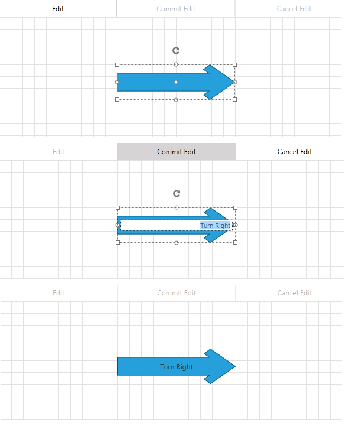
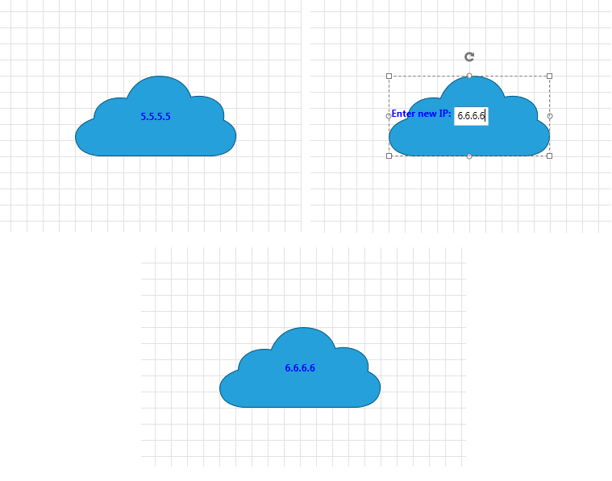

# Items Editing

__RadDiagram__ gives you the ability to edit the Content of its items. You can double-click items in order to edit them or use __DiagramCommands__. __RadDiagramShape__ and __RadDiagramConnection__ also provide __EditTemplates__ and __EditTemplateSelectors__. Please note that through the examples in the tutorial, __Telerik Windows8 theme__ is applied as an Application Theme.

>Please note that the examples in this tutorial are showcasing Telerik Windows8 theme. In the [Setting a Theme](http://www.telerik.com/help/silverlight/common-styling-apperance-setting-theme.html#Setting_Application-Wide_Built-In_Theme_in_the_Code-Behind)[Setting a Theme](http://www.telerik.com/help/wpf/common-styling-apperance-setting-theme-wpf.html#Setting_Application-Wide_Built-In_Theme_in_the_Code-Behind) article you can find more information on how to set an application-wide theme.

## Enable/Disable Items Editing

By default, the __RadDiagramItems__ are enabled for editing. In order to disable this functionality, you can use the __IsEditable__ property:		

	
```XAML
	<telerik:RadDiagram IsEditable="False">
```

## Start Editing by Using Keyboard

Once the edit behavior is enabled, you can start the editing process by selecting the item and pressing the __F2__ key.		

## Controlling Editing In Code Behind

In order to start/end editing a __RadDiagramItem__ , you can set __IsInEditMode__ property to True/False.		

__RadDiagramItem__ also provides four editing events:		

* __PreviewBeginEdit__ - fires when a RadDiagramItem is about to be edited.			  

* __BeginEdit__ - fires when a RadDiagramItem has just entered in edit mode.			  

* __PreviewEndEdit__ - fires when a RadDiagramItem is about to leave the edit mode.			  

* __EndEdit__ - fires when a RadDiagramItem is has just left the edit mode.			  

## Edit Using Commands

__RadDiagram__ provides three predefined commands for editing the selected item - __BeginEdit__, __CommitEdit__ and __CancelEdit__.		

Consider the following code: 

```XAML
	 <Grid>
	        <Grid.RowDefinitions>
	            <RowDefinition Height="Auto" />
	            <RowDefinition Height="*" />
	        </Grid.RowDefinitions>
	        <StackPanel Orientation="Horizontal">
	            <telerik:RadButton Width="200" 
	                               Height="30"
	                               Command="telerik:DiagramCommands.BeginEdit"
	                               CommandTarget="{Binding ElementName=diagram}"
	                               Content="Edit" />
	            <telerik:RadButton Width="200" 
	                               Height="30"
	                               Command="telerik:DiagramCommands.CommitEdit"
	                               CommandTarget="{Binding ElementName=diagram}"
	                               Content="Commit Edit" />
	            <telerik:RadButton Width="200" 
	                               Height="30"
	                               Command="telerik:DiagramCommands.CancelEdit"
	                               CommandTarget="{Binding ElementName=diagram}"
	                               Content="Cancel Edit" />
	        </StackPanel>
	        <telerik:RadDiagram x:Name="diagram" Grid.Row="1" >
	            <telerik:RadDiagramShape FlowDirection="RightToLeft" 
	                                     Width="200"
	                                     Height="60" 
	                                     Position="200 80"
	                                     Geometry="{telerik:ArrowShape ShapeType=Arrow3}" />
	        </telerik:RadDiagram>
	</Grid>
```

In the picture below you can see a shape being edited:


## EditTemplates and EditTemplateSelectors

__RadDiagram__ provides the following EditTemplates and EditTemplateSelectors:		

* __ShapeEditTemplate__ - applies as EditTemplate of the Shapes.			  

* __ShapeEditTemplateSelector__ - could be used in order to apply different EditTemplates to different Shapes.			  

* __ConnectionEditTemplate__ - applies as EditTemplate of the Connections.			  

* __ConnectionEditTemplateSelector__ - could be used in order to apply different EditTemplates to different Connections.			  

Below you can find example of basic EditTemplate of a Shape. Suppose we have a sample business object called DataItem:


```C#
	public class DataItem : ViewModelBase
	{
		private string ipAddress;
		public string IpAddress
		{
			get { return ipAddress; }
			set
			{
				ipAddress = value;
				this.OnPropertyChanged("IpAddress");
			}
		}
	}
```
```VB.NET
	Public Class DataItem
		Inherits ViewModelBase
		Private m_ipAddress As String
		Public Property IpAddress() As String
			Get
				Return m_ipAddress
			End Get
			Set
				m_ipAddress = value
				Me.OnPropertyChanged("IpAddress")
			End Set
		End Property
	End Class
```


```C#
	this.shape.DataContext = new DataItem() { IpAddress = "5.5.5.5" };
```
```VB.NET
	Me.shape.DataContext = New DataItem() With { .IpAddress = "5.5.5.5" }
```

Now you can define __ContentTemplate__ and __EditTemplate__ like so:
		

```XAML
	 <Grid>
	        <Grid.Resources>
	            <DataTemplate x:Key="editTemplate">
	                <StackPanel Orientation="Horizontal">
	                    <TextBlock Height="24" 
	                               FontWeight="Bold"
	                               Foreground="Blue"
	                               Text=" Enter new IP: " />
	                    <TextBox Height="24" Text="{Binding IpAddress}" />
	                </StackPanel>
	            </DataTemplate>
	            <DataTemplate x:Key="template">
	                <TextBlock FontWeight="Bold" 
	                           Foreground="Blue"
	                           Text="{Binding IpAddress}" />
	            </DataTemplate>
	        </Grid.Resources>
	        
	        <telerik:RadDiagram x:Name="diagram" >
	            <telerik:RadDiagramShape x:Name="shape" 
	                                     Width="200"
	                                     Height="100"
	                                     Position="100 100"
	                                     Content="{Binding}"
	                                     ContentTemplate="{StaticResource template}"
	                                     EditTemplate="{StaticResource editTemplate}"
	                                     Geometry="{telerik:CommonShape ShapeType=CloudShape}" />
	        </telerik:RadDiagram>
	</Grid>
```

In the picture below you can see the result of successful edit of the shape:


## See Also
 * [Structure]()
 * [Getting Started]()
 * [Populating with Data]()
 * [Shapes]()
 * [Connections]()