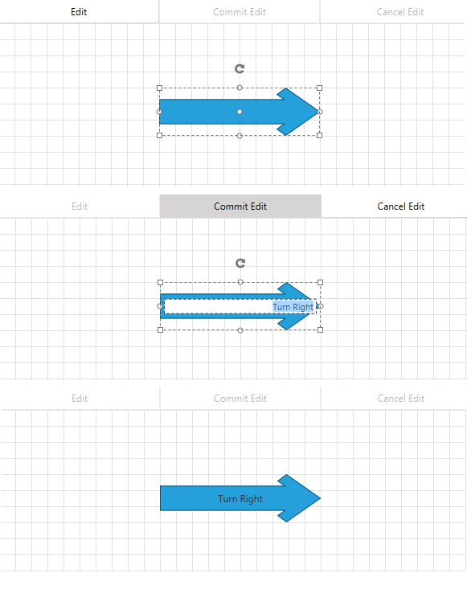
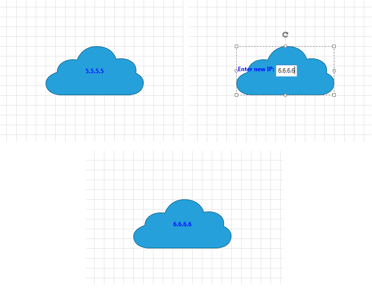

# Items Editing

__RadDiagram__ gives you the ability to edit the Content of its items. You can double-click items in order to edit them or use __DiagramCommands__. __RadDiagramShape__ and __RadDiagramConnection__ also provide __EditTemplates__ and __EditTemplateSelectors__. Please note that through the examples in the tutorial, __Telerik Windows8 theme__ is applied as an Application Theme.

>Please note that the examples in this tutorial are showcasing Telerik Windows8 theme. In the [Setting a Theme](http://www.telerik.com/help/silverlight/common-styling-apperance-setting-theme.html#Setting_Application-Wide_Built-In_Theme_in_the_Code-Behind)[Setting a Theme](http://www.telerik.com/help/wpf/common-styling-apperance-setting-theme-wpf.html#Setting_Application-Wide_Built-In_Theme_in_the_Code-Behind) article you can find more information on how to set an application-wide theme.

## Enable/Disable Items Editing

By default, the __RadDiagramItems__ are enabled for editing. In order to disable this functionality, you can use the __IsEditable__ property:		

	
<snippet id='raddiagram-items-manipulation-raddiagrams-features-edit-block_1-xaml' />

## Start Editing by Using Keyboard

Once the edit behavior is enabled, you can start the editing process by selecting the item and pressing the __F2__ key.		

## Controlling Editing In Code Behind

In order to start/end editing a __RadDiagramItem__ , you can set __IsInEditMode__ property to True/False.		

__RadDiagramItem__ also provides four editing events:		

* __PreviewBeginEdit__ - fires when a RadDiagramItem is about to be edited.			  

* __BeginEdit__ - fires when a RadDiagramItem has just entered in edit mode.			  

* __PreviewEndEdit__ - fires when a RadDiagramItem is about to leave the edit mode.			  

* __EndEdit__ - fires when a RadDiagramItem is has just left the edit mode.			  

## Edit Using Commands

__RadDiagram__ provides three predefined commands for editing the selected item - __BeginEdit__, __CommitEdit__ and __CancelEdit__.		

Consider the following code: 

<snippet id='raddiagram-items-manipulation-raddiagrams-features-edit-block_2-xaml' />

In the picture below you can see a shape being edited:

## EditTemplates and EditTemplateSelectors

__RadDiagram__ provides the following EditTemplates and EditTemplateSelectors:		

* __ShapeEditTemplate__ - applies as EditTemplate of the Shapes.			  

* __ShapeEditTemplateSelector__ - could be used in order to apply different EditTemplates to different Shapes.			  

* __ConnectionEditTemplate__ - applies as EditTemplate of the Connections.			  

* __ConnectionEditTemplateSelector__ - could be used in order to apply different EditTemplates to different Connections.			  

Below you can find example of basic EditTemplate of a Shape. Suppose we have a sample business object called DataItem:

<snippet id='raddiagram-items-manipulation-raddiagrams-features-edit-block_3-cs' />

<snippet id='raddiagram-items-manipulation-raddiagrams-features-edit-block_3-vb' />

<snippet id='raddiagram-items-manipulation-raddiagrams-features-edit-block_4-cs' />

<snippet id='raddiagram-items-manipulation-raddiagrams-features-edit-block_4-vb' />

Now you can define __ContentTemplate__ and __EditTemplate__ like so:
		

<snippet id='raddiagram-items-manipulation-raddiagrams-features-edit-block_5-xaml' />

In the picture below you can see the result of successful edit of the shape:

## See Also
 * [Structure]()
 * [Getting Started]()
 * [Populating with Data]()
 * [Shapes]()
 * [Connections]()