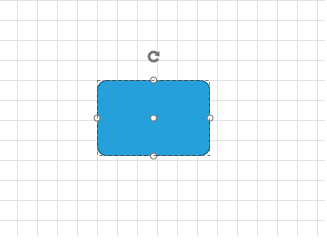
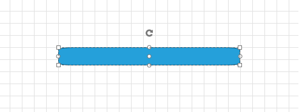

# Resizing

__RadDiagram__ gives you the ability to resize shapes by dragging their __Resizing Thumbs__. You can also use the Shapes' __Width__ and __Height__ for this purpose.

>Please note that the examples in this tutorial are showcasing Telerik Windows8 theme. In the [Setting a Theme](http://www.telerik.com/help/silverlight/common-styling-apperance-setting-theme.html#Setting_Application-Wide_Built-In_Theme_in_the_Code-Behind)[Setting a Theme](http://www.telerik.com/help/wpf/common-styling-apperance-setting-theme-wpf.html#Setting_Application-Wide_Built-In_Theme_in_the_Code-Behind) article you can find more information on how to set an application-wide theme.		

## Enable/Disable Resizing

By default the __RadDiagram__ is enabled for resizing manipulation. In order to disable this functionality, you can set __IsResizingEnabled__ to __False__


```XAML
	<telerik:RadDiagram IsResizingEnabled="False">
		<telerik:RadDiagramShape 
								 Geometry="{telerik:CommonShape ShapeType=RoundedRectangleShape}"
								 Position="100 80" />
	</telerik:RadDiagram>
```



## Width and Height

You can resize shapes by using their __Width__ and __Height__ properties:


```XAML
	<telerik:RadDiagram>
		<telerik:RadDiagramShape Width="300" 
								 Height="30"
								 Geometry="{telerik:CommonShape ShapeType=RoundedRectangleShape}"
								 Position="100 80" />
	</telerik:RadDiagram>
```



## See Also
 * [Structure]()
 * [Getting Started]()
 * [Populating with Data]()
 * [Shapes]()
 * [Connections]()
 * [Items Editing]()
 * [Rotation]()
 * [ZOrder]()
 * [Selection]()