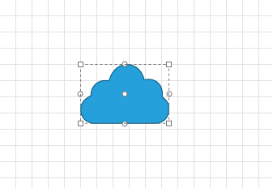
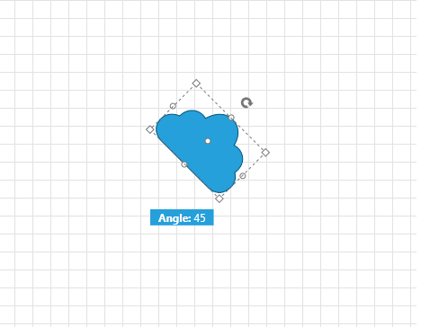

# Rotation

__RadDiagram__ gives you the ability to rotate shapes by dragging their __Rotation Thumb__ or by changing their __RotationAngle__ property.	  

>Please note that the examples in this tutorial are showcasing Telerik Windows8 theme. The [Setting a Theme](http://www.telerik.com/help/silverlight/common-styling-apperance-setting-theme.html#Setting_Application-Wide_Built-In_Theme_in_the_Code-Behind)[Setting a Theme](http://www.telerik.com/help/wpf/common-styling-apperance-setting-theme-wpf.html#Setting_Application-Wide_Built-In_Theme_in_the_Code-Behind) article describes how to set the theme as an application theme.		

## Enable/Disable Rotation

By default the __RadDiagram__ is enabled for rotation manipulation. In order to disable this functionality, you can set __IsRotationEnabled__ to __False__


```XAML
	<telerik:RadDiagram IsRotationEnabled="False">
		<telerik:RadDiagramShape Geometry="{telerik:CommonShape ShapeType=CloudShape}" Position="100 80" />
	</telerik:RadDiagram>		
```



## Rotation Angle

You can rotate shapes by using their __RotationAngle__ property:		


```XAML
	<telerik:RadDiagram>
		<telerik:RadDiagramShape Geometry="{telerik:CommonShape ShapeType=CloudShape}"
								RotationAngle="45"
								Position="200 200"
								x:Name="shape"/>
	</telerik:RadDiagram>		
```



## See Also
 * [Structure]()
 * [Getting Started]()
 * [Populating with Data]()
 * [Shapes]()
 * [Connections]()
 * [Connections]()
 * [Resizing]()
 * [ZOrder]()
 * [Selection]()
 * [Pan and Zoom]()
 * [Clipboard Operations]()