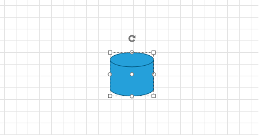
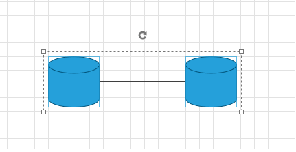
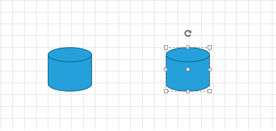
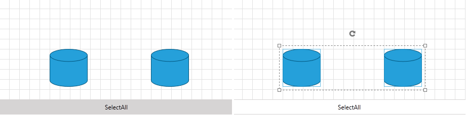

# Selection

__RadDiagram__ gives you the ability to select __RadDiagramItems__ in XAML, code behind, with data binding, interactively or by invoking __RadDiagramCommand__.	  

The following tutorial will show you how select items, work with different selection modes and set up selection commands and events.

>Please note that the examples in this tutorial are showcasing Telerik Windows8 theme. In the [Setting a Theme](http://www.telerik.com/help/silverlight/common-styling-apperance-setting-theme.html#Setting_Application-Wide_Built-In_Theme_in_the_Code-Behind)[Setting a Theme](http://www.telerik.com/help/wpf/common-styling-apperance-setting-theme-wpf.html#Setting_Application-Wide_Built-In_Theme_in_the_Code-Behind) article you can find more information on how to set an application-wide theme.		

## Selection Modes

__RadDiagram__ has four different __Selection Modes__ which determine the way a user performs selection:		

* __Single__ - the user can select only one item.			

* __None__ - the user cannot select any items.			

* __Extended__ - the user can select/deselect multiple items using the combinations (Ctrl Key+ Mouse Left Button) or (Ctr + Key A). This is the default __SelectionMode__'s Value			

* __Multiple__ - the user can select/deselect multiple items using only Left Button or the combinations (Ctrl Key+ Mouse Left Button) and (Ctr + Key A)			

In order to change the way the __Selection Adorner Rectangle__ behaves, you can use the __RectSelectionMode__ property:		

* __Full__ - the user selects item(s) only when the selection rectangle covers it(them) completely.			  

* __Partial__ - the user selects all items that are completely or partially covered by the selection rectangle.			  

## Selection In XAML

In order to select items in XAML, you only need to set their __IsSelected__ property to true:		

#### __XAML__
```XAML
	<telerik:RadDiagram>
		<telerik:RadDiagramShape Geometry="{telerik:FlowChartShape ShapeType=Database1Shape}"
								IsSelected="True"
								Position="200 100"/>
	</telerik:RadDiagram>
```



When multiple items are selected, they are automatically added in one Selection Adorner:

#### __XAML__
```XAML
	<telerik:RadDiagram>
		<telerik:RadDiagramShape x:Name="db1"
								Geometry="{telerik:FlowChartShape ShapeType=Database1Shape}"
								IsSelected="True"
								Position="100 100" />

		<telerik:RadDiagramConnection Source="{Binding ElementName=db1}"
									SourceConnectorPosition="Right"
									Target="{Binding ElementName=db2}"
									TargetConnectorPosition="Left"
									IsSelected="True"/>

		<telerik:RadDiagramShape x:Name="db2"
								Geometry="{telerik:FlowChartShape ShapeType=Database1Shape}"
								IsSelected="True"
								Position="300 100" />
	</telerik:RadDiagram>		
```



You may also want to use the __SelectedIndex__ or the __SelectedItem__ property of the __RadDiagram__:
		

#### __XAML__
```XAML
	<telerik:RadDiagram  SelectedIndex="1"
						x:Name="diagram">
		<telerik:RadDiagramShape x:Name="db1"
								Geometry="{telerik:FlowChartShape ShapeType=Database1Shape}"
								Position="100 100" />
		<telerik:RadDiagramShape x:Name="db2"
								Geometry="{telerik:FlowChartShape ShapeType=Database1Shape}"
								Position="300 100" />
	</telerik:RadDiagram>
```

Or

#### __XAML__
```XAML
	<telerik:RadDiagram  SelectedItem="{Binding ElementName=db2}"
						x:Name="diagram">
		<telerik:RadDiagramShape x:Name="db1"
								Geometry="{telerik:FlowChartShape ShapeType=Database1Shape}"
								Position="100 100" />
		<telerik:RadDiagramShape x:Name="db2"
								Geometry="{telerik:FlowChartShape ShapeType=Database1Shape}"
								Position="300 100" />
	</telerik:RadDiagram>
```

Below is the result of the code snippets above:

## Binding the IsSelected

When the __RadDiagram__ is bound to collection of business objects or ViewModels, you can bind the __IsSelected__ property of an item via __Style Bindings__.		

For example, you can have Selected property in your ViewModel and bind it to the Shape's __IsSelected__ like so:		

#### __XAML__
```XAML
	<Style TargetType="telerik:RadDiagramShape">
		<Setter Property="IsSelected" Value="{Binding Selected, Mode=TwoWay}" />
	</Style>
```

## SelectAll

You are able to select all __RadDiagramItems__ interactively (by Mouse or by pressing Ctrl + A), programmatically (via the __SelectAll()__ method), set IsSelected to every Shape and Connection via StyleBindings, or with Command. Below is shown how you can use the __SelectAll__ command:

#### __XAML__
```XAML
	<telerik:RadDiagram x:Name="diagram" Height="200">
		<telerik:RadDiagramShape x:Name="db1"
								Geometry="{telerik:FlowChartShape ShapeType=Database1Shape}"
								Position="100 100" />
		<telerik:RadDiagramShape x:Name="db2"
								Geometry="{telerik:FlowChartShape ShapeType=Database1Shape}"
								Position="300 100" />
	</telerik:RadDiagram>
	
	<telerik:RadButton Height="30"
						Command="telerik:DiagramCommands.SelectAll"
						CommandTarget="{Binding ElementName=diagram}"
						Content="SelectAll" />
```



## Selection Events

__RadDiagram__ provides the following Selection events:		

* __PreviewSelectionChanged__ - occurs when the selection of the diagram starts changing.			

* __SelectionChanged__ - fires when a selection operations has just been performed.			

* __SelectionBoundsChanged__ - fires when the SelectionRectangle's bounds have just been changed.			

## See Also
 * [Structure]()
 * [Getting Started]()
 * [Populating with Data]()
 * [Shapes]()
 * [Connections]()
 * [Items Editing]()
 * [Rotation]()
 * [Resizing]()
 * [ZOrder]()