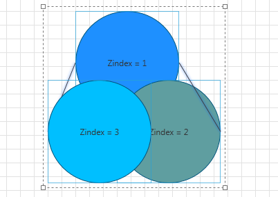
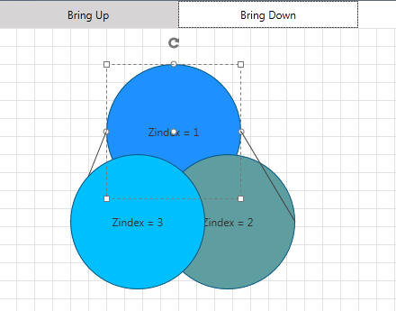
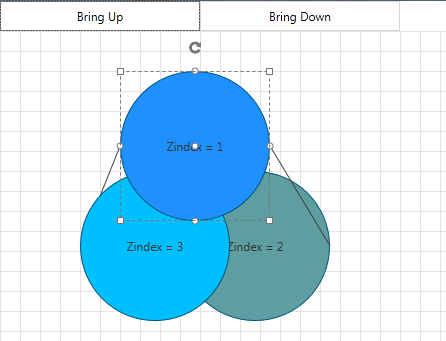

# ZOrder

__RadDiagram__ gives you the ability to control the __Z-Order__ of shapes and connections by using their __ZIndex__ property. You can also use __RadDiagramCommands__ in order to increase/decrease __ZIndex__ of the selected __RadDiagramItems__ simultaneously.	  

>Please note that the examples in this tutorial are showcasing Telerik Windows8 theme. In the [Setting a Theme](http://www.telerik.com/help/silverlight/common-styling-apperance-setting-theme.html#Setting_Application-Wide_Built-In_Theme_in_the_Code-Behind)[Setting a Theme](http://www.telerik.com/help/wpf/common-styling-apperance-setting-theme-wpf.html#Setting_Application-Wide_Built-In_Theme_in_the_Code-Behind) article you can find more information on how to set an application-wide theme.

## Using the ZIndex property

Consider the following code:
		
#### __XAML__
```XAML
	<telerik:RadDiagram x:Name="diagram" Grid.Row="1">
		<telerik:RadDiagramShape x:Name="shape1" 
								 Width="150"
								 Height="150"
								 Background="DeepSkyBlue"
								 Content="Zindex = 3"
								 Geometry="{telerik:CommonShape ShapeType=EllipseShape}"
								 Position="80 120"
								 ZIndex="3" />
		<telerik:RadDiagramShape x:Name="shape2" 
								 Width="150"
								 Height="150"
								 Background="CadetBlue"
								 Content="Zindex = 2"
								 Geometry="{telerik:CommonShape ShapeType=EllipseShape}"
								 Position="180 120"
								 ZIndex="2" />
		<telerik:RadDiagramShape x:Name="shape3" 
								 Width="150"
								 Height="150"
								 Background="DodgerBlue"
								 Content="Zindex = 1"
								 Geometry="{telerik:CommonShape ShapeType=EllipseShape}"
								 Position="120 20"
								 ZIndex="1" />

		<telerik:RadDiagramConnection Source="{Binding ElementName=shape3}" 
									  SourceConnectorPosition="Right"
									  Target="{Binding ElementName=shape2}"
									  TargetConnectorPosition="Right"
									  ZIndex="4" />

		<telerik:RadDiagramConnection Source="{Binding ElementName=shape3}" 
									  SourceConnectorPosition="Left"
									  Target="{Binding ElementName=shape1}"
									  TargetConnectorPosition="Left"
									  ZIndex="0" />
	</telerik:RadDiagram>
```

We have reversed the natural ZOrder of the 3 Shapes. On the other hand, the connection on the right is on top of the shapes and connection on the left is below them: 


## Using the RadDiagram Commands

__RadDiagram__ provides a set of predefined commands for manipulating the selected items' ZIndices. __"BringForward"__ and __"SendBackward"__ allow you to increase/decrease the Z-Indices of the selected RadDiagramItems. If you need to bring the selected item(s) on top of all other items or below them, you can use __"BringToFront"__ and __"SentToback"__:
		
#### __XAML__
```XAML
	<Grid>
		<Grid.RowDefinitions>
			<RowDefinition Height="Auto" />
			<RowDefinition Height="*" />
		</Grid.RowDefinitions>
		<StackPanel Orientation="Horizontal">
			<telerik:RadButton Width="200" 
							   Height="30"
							   Command="telerik:DiagramCommands.BringToFront"
							   CommandTarget="{Binding ElementName=diagram}"
							   Content="Bring Up" />
			<telerik:RadButton Width="200" 
							   Height="30"
							   Command="telerik:DiagramCommands.SendToBack"
							   CommandTarget="{Binding ElementName=diagram}"
							   Content="Bring Down" />
		</StackPanel>
		<telerik:RadDiagram x:Name="diagram" Grid.Row="1">
			<telerik:RadDiagramShape x:Name="shape1" 
									 Width="150"
									 Height="150"
									 Background="DeepSkyBlue"
									 Content="Zindex = 3"
									 Geometry="{telerik:CommonShape ShapeType=EllipseShape}"
									 Position="80 120"
									 ZIndex="3" />
			<telerik:RadDiagramShape x:Name="shape2" 
									 Width="150"
									 Height="150"
									 Background="CadetBlue"
									 Content="Zindex = 2"
									 Geometry="{telerik:CommonShape ShapeType=EllipseShape}"
									 Position="180 120"
									 ZIndex="2" />
			<telerik:RadDiagramShape x:Name="shape3" 
									 Width="150"
									 Height="150"
									 Background="DodgerBlue"
									 Content="Zindex = 1"
									 Geometry="{telerik:CommonShape ShapeType=EllipseShape}"
									 Position="120 20"
									 ZIndex="1" />

			<telerik:RadDiagramConnection Source="{Binding ElementName=shape3}" 
										  SourceConnectorPosition="Right"
										  Target="{Binding ElementName=shape2}"
										  TargetConnectorPosition="Right"
										  ZIndex="4" />

			<telerik:RadDiagramConnection Source="{Binding ElementName=shape3}" 
										  SourceConnectorPosition="Left"
										  Target="{Binding ElementName=shape1}"
										  TargetConnectorPosition="Left"
										  ZIndex="0" />
		</telerik:RadDiagram>
	</Grid>
```

This way configured, the two buttons are ready to bring to front or sent to back the selected items of the __RadDiagram__: 


Here is the result of selecting the shape with ZIndex = 1 and clicking the left button:


## See Also
 * [Structure]()
 * [Getting Started]()
 * [Populating with Data]()
 * [Shapes]()
 * [Connections]()
 * [Items Editing]()
 * [Rotation]()
 * [Resizing]()
 * [Selection]()