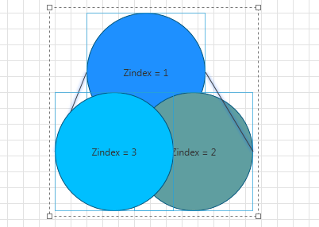
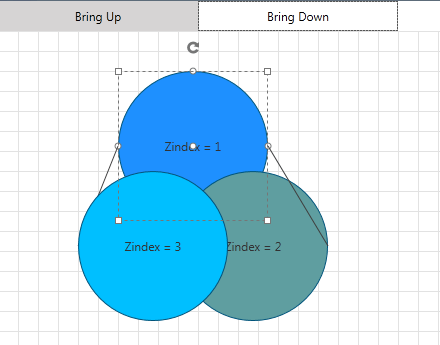
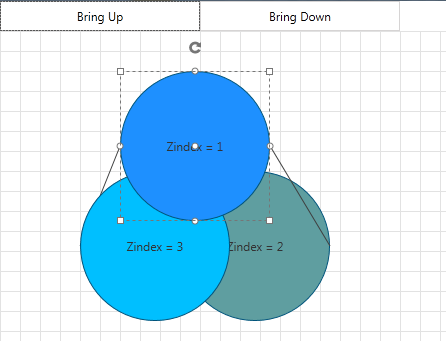

# ZOrder

__RadDiagram__ gives you the ability to control the __Z-Order__ of shapes and connections by using their __ZIndex__ property. You can also use __RadDiagramCommands__ in order to increase/decrease __ZIndex__ of the selected __RadDiagramItems__ simultaneously.	  

>Please note that the examples in this tutorial are showcasing Telerik Windows8 theme. In the [Setting a Theme](http://www.telerik.com/help/silverlight/common-styling-apperance-setting-theme.html#Setting_Application-Wide_Built-In_Theme_in_the_Code-Behind)[Setting a Theme](http://www.telerik.com/help/wpf/common-styling-apperance-setting-theme-wpf.html#Setting_Application-Wide_Built-In_Theme_in_the_Code-Behind) article you can find more information on how to set an application-wide theme.

## Using the ZIndex property

Consider the following code:
		

<snippet id='raddiagram-items-manipulation-raddiagrams-features-zorder-block_1-xaml' />

We have reversed the natural ZOrder of the 3 Shapes. On the other hand, the connection on the right is on top of the shapes and connection on the left is below them: 

## Using the RadDiagram Commands

__RadDiagram__ provides a set of predefined commands for manipulating the selected items' ZIndices. __"BringForward"__ and __"SendBackward"__ allow you to increase/decrease the Z-Indices of the selected RadDiagramItems. If you need to bring the selected item(s) on top of all other items or below them, you can use __"BringToFront"__ and __"SentToback"__:
		

<snippet id='raddiagram-items-manipulation-raddiagrams-features-zorder-block_2-xaml' />

This way configured, the two buttons are ready to bring to front or sent to back the selected items of the __RadDiagram__: 

Here is the result of selecting the shape with ZIndex = 1 and clicking the left button:

## See Also
 * [Structure]()
 * [Getting Started]()
 * [Populating with Data]()
 * [Shapes]()
 * [Connections]()
 * [Items Editing]()
 * [Rotation]()
 * [Resizing]()
 * [Selection]()