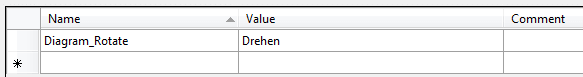
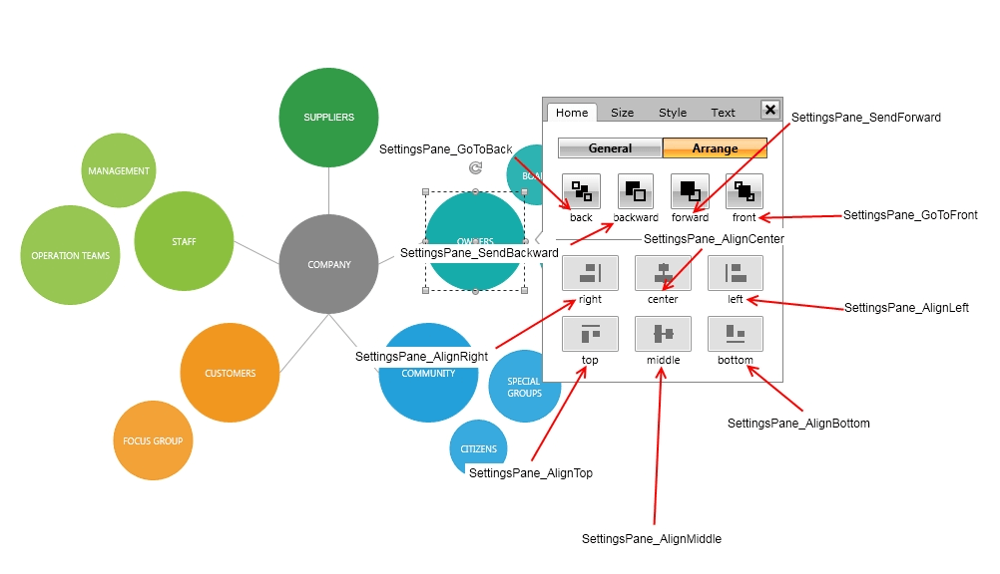
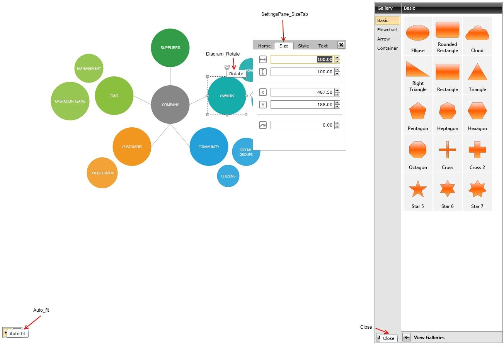
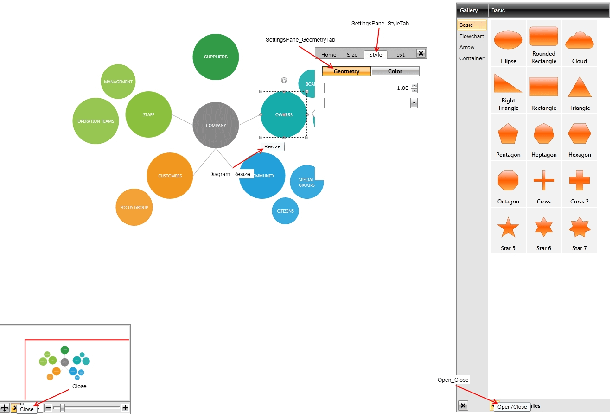
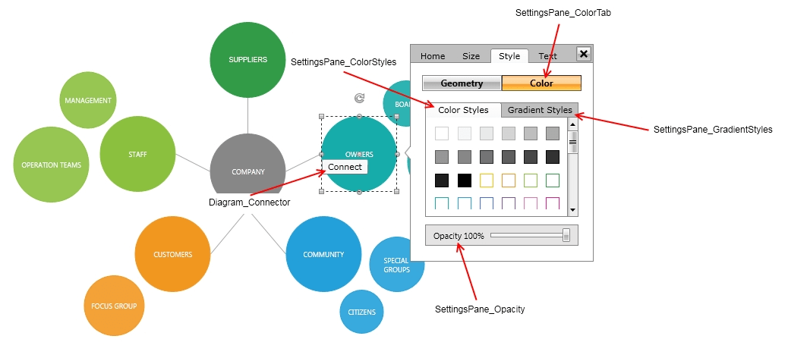
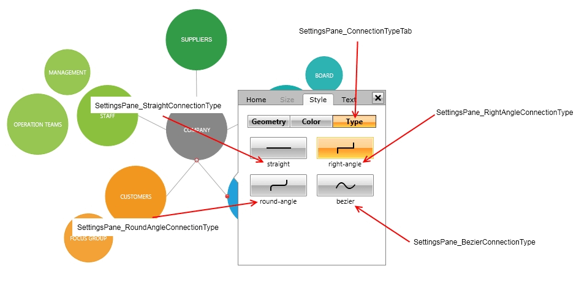
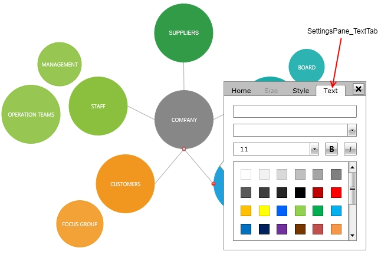

# Localization

This tutorial describes the localization support implemented in the RadDiagram elements

## Localization Using ResourceManager

You can base your localization on the standard resource files provided by the .NET framework. For that purpose you will have to create a separate .ResX file for each one of the languages that your application will support.		

Imagine that you want to translate your diagramming implementation into English and German. For that purpose you will have to add two new resource files to your project:		

* `DiagramResources.resx`&mdash;this resource file will store the English(default) resources for the grid control. Set the AccessModifier property to Public.			

* `DiagramResources.de.resx`&mdash;this resource file will store the German resources for the grid control. Set the AccessModifier property to No code generation.


Now, having the needed files, it's time to illustrate the idea and localize only the text for the group panel. For that purpose you need to create a single resource string in each one of the three resource files and translate it to the appropriate language. 

>Note that the name of the resource string should be the same as the resource key for the string that you are localizing. The resource key for the diagram rotation thumb tooltip is Diagram_Rotate. 

<!-- -->
>For a full list of ResourceKeys, check out the LocalizationStrings section of this article. 

The snapshot below shows the content of the DiagramResources.de.resx file. The resource name of the other file should be the same. The Value column will contain the translation for the appropriate language.



The last step is to instantiate the `LocalizationManager` class and set its `ResourceManager` to the resources that have been just created (you can do this in the default constructor of the `Application` class).		


```C#
    LocalizationManager.Manager = new LocalizationManager()
    {
        ResourceManager = DiagramResources.ResourceManager
    };
```
```VB.NET
    LocalizationManager.Manager = New LocalizationManager()
    LocalizationManager.Manager.ResourceManager = DiagramResources.ResourceManager  
```

>If you rely on culture settings to load the right resources automatically, you have to write some code inside your application's project file. For example, if you have to support English and German languages, you can store the localized strings in `Resources.resx` and `Resources.de.resx` files. For the Resources.resx file you can set `ResXFileCodeGenerator` to `Internal` or `Public` and for the others - to `No code generation`. Then, open the project file in a text-mode and insert the code below into the <PropertyGroup> section. In this way you notify the framework about the supported cultures.


```XAML
	<SupportedCultures>en;de</SupportedCultures>			
```

## Localization Using Custom Localization Manager

The other way to localize your `RadDiagram` is to create a class that derives from the `LocalizationManager` object and to override its method `GetStringOverride()`. The logic is pretty simple, you just have to create a switch statement and return the correct translation for each resource key, as it is shown below: 
		

```C#
    public class CustomLocalizationManager : LocalizationManager
    {
        public override string GetStringOverride(string key)
        {
            switch (key)
            {
                case "Diagram_Rotate":
                    return "Rotate";
                case "Auto_fit":
                    return "Auto Fit";
                //SettingsPane parts localization strings
                case "SettingsPane_SizeTab":
                    return "Size";
                case "SettingsPane_HomeTab":
                    return "Home";
                case "SettingsPane_Copy":
                    return "Copy";
                case "SettingsPane_Cut":
                    return "Cut";
                case "SettingsPane_Paste":
                    return "Paste";
                case "SettingsPane_Delete":
                    return "Delete";
            }
            return base.GetStringOverride(key);
        }
    }
```
```VB.NET	
	Public Class CustomLocalizationManager
		Inherits LocalizationManager
		Public Overrides Function GetStringOverride(key As String) As String
			Select Case key
				Case "Diagram_Rotate"
					Return "Rotate"
				Case "Auto_fit"
					Return "Auto Fit"
				'SettingsPane parts localization strings
				Case "SettingsPane_SizeTab"
					Return "Size"
				Case "SettingsPane_HomeTab"
					Return "Home"
				Case "SettingsPane_Copy"
					Return "Copy"
				Case "SettingsPane_Cut"
					Return "Cut"
				Case "SettingsPane_Paste"
					Return "Paste"
				Case "SettingsPane_Delete"
					Return "Delete"
			End Select
			Return MyBase.GetStringOverride(key)
		End Function
	End Class	
```

Of course, if you don't want to hard-code your translation inside your source code, you can always use resource files:
		

```C#	
    public override string GetStringOverride(string key)
    {
        switch (key)
        {
            //----------------------
            case "Diagram_Rotate":
                return DiagramResources.Diagram_Rotate;
            //----------------------
        }
        return base.GetStringOverride(key);
    }	    
```
```VB.NET	
	Public Overrides Function GetStringOverride(key As String) As String
		Select Case key
			'----------------------'
			Case "Diagram_Rotate"
				Return DiagramResources.Diagram_Rotate
			'----------------------'
		End Select
		Return MyBase.GetStringOverride(key)
	End Function		
```

## Diagram Localization Strings

In the following snapshots you can find a list of all Diagram localization strings:








## Diagram Resource Keys

Here is a list of all of the available `Resources Keys` and their default values:

Key |   Value
---	|	---	
Diagram_Connector | Connect
Diagram_Resize | Resize
Diagram_Rotate | Rotate
DiagramRibbon_Align | Align
DiagramRibbon_AlignBottom | Align Bottom
DiagramRibbon_AlignCenter | Align Center
DiagramRibbon_AlignLeft | Align Left
DiagramRibbon_AlignMiddle | Align Middle
DiagramRibbon_AlignRight | Align Right
DiagramRibbon_AlignTop | Align Top
DiagramRibbon_Arrange | Arrange
DiagramRibbon_AStarRouter | AStarRouter
DiagramRibbon_AvoidConnectionOverlap | Avoid Connection Overlap
DiagramRibbon_AvoidShapes | Avoid Shapes
DiagramRibbon_BackgroundColor | Background Color
DiagramRibbon_Bridges | Bridges:
DiagramRibbon_BringForward | Bring Forward
DiagramRibbon_BringToFront | Bring to Front
DiagramRibbon_CellHeight | Cell Height
DiagramRibbon_CellWidth | Cell Width
DiagramRibbon_Clipboard | Clipboard
DiagramRibbon_ClipboardDescription | Show the Clipboard Task options.
DiagramRibbon_Connections | Connections
DiagramRibbon_ConnectionType | Type
DiagramRibbon_ConnectionTypeBezier | Bezier
DiagramRibbon_ConnectionTypeDescription | Automatically organizes the diagram.
DiagramRibbon_ConnectionTypePolyline | Polyline
DiagramRibbon_ConnectionTypeSpline | Spline
DiagramRibbon_ConnectionTypeStraight | Straight
DiagramRibbon_ConnectionTypeTitle | Connection Type
DiagramRibbon_ConnectorTool | Connector
DiagramRibbon_ConnectorToolDescription | Changes the main tool to Connector Tool.
DiagramRibbon_ConnectorToolScreenTip | Connector Tool
DiagramRibbon_Copy | Copy
DiagramRibbon_CopyDescription | Copy the selection and put it on the Clipboard.
DiagramRibbon_Cut | Cut
DiagramRibbon_CutDescription | Cut the selection from the document and put it on the Clipboard.
DiagramRibbon_Delete | Delete
DiagramRibbon_DeleteDescription | Deletes the selected items.
DiagramRibbon_Design | Design
DiagramRibbon_Dragging | Dragging
DiagramRibbon_EllipseShape | Ellipse
DiagramRibbon_EnableRouting | Enable Routing
DiagramRibbon_Export | Export
DiagramRibbon_ExportToHtml | Export to Html
DiagramRibbon_ExportToImage | Export to Image
DiagramRibbon_FitToWindow | Fit to Window
DiagramRibbon_General | General
DiagramRibbon_GeneralDescription | Generic actions.
DiagramRibbon_Grid | Grid
DiagramRibbon_GridColor | Grid Color
DiagramRibbon_Group | Group
DiagramRibbon_GroupDescription | Groups the selected items.
DiagramRibbon_HomeTab | Home
DiagramRibbon_HorizontalRuler | Horizontal Ruler
DiagramRibbon_IgnoreContainers | Ignore Containers
DiagramRibbon_Layout | Layout
DiagramRibbon_LayoutContainerChildren | Layout Container Children
DiagramRibbon_LayoutDescription | Automatically organizes the diagram.
DiagramRibbon_MainPaletteHeaderText | Metro Palette
DiagramRibbon_MindMap | Mind Map
DiagramRibbon_MindMapHorizontal | Mind Map Horizontal
DiagramRibbon_MindMapVertical | Mind Map Vertical
DiagramRibbon_NavigationPane | Navigation Pane
DiagramRibbon_New | New
DiagramRibbon_Open | Open
DiagramRibbon_Page | Page
DiagramRibbon_Paste | Paste
DiagramRibbon_PasteDescription | Paste the contents of the Clipboard.
DiagramRibbon_PathTool | Path
DiagramRibbon_PathToolDescription | Changes the main tool to Path Tool.
DiagramRibbon_PathToolScreenTip | Path Tool
DiagramRibbon_PencilTool | Pencil
DiagramRibbon_PencilToolDescription | Changes the main tool to Pencil Tool.
DiagramRibbon_PencilToolScreenTip | Pencil Tool
DiagramRibbon_PointerTool | Pointer
DiagramRibbon_PointerToolDescription | Changes the main tool to Pointer Tool.
DiagramRibbon_PointerToolScreenTip | Pointer Tool
DiagramRibbon_Print | Print
DiagramRibbon_Properties | Properties
DiagramRibbon_Radial | Radial
DiagramRibbon_RadialTree | Radial Tree
DiagramRibbon_RectangleShape | Rectangle
DiagramRibbon_Redo | Redo
DiagramRibbon_ReLayout | Re-Layout
DiagramRibbon_Resizing | Resizing
DiagramRibbon_Rotation | Rotation
DiagramRibbon_RouteAll | Route All
DiagramRibbon_Save | Save
DiagramRibbon_SelectionMode | Selection Mode
DiagramRibbon_SendBackward | Send Backward
DiagramRibbon_SendToBack | Send to Back
DiagramRibbon_SettingsTab | Settings
DiagramRibbon_ShapeToolDescription | Can be used to create rectangle, ellipse or triangle shape.
DiagramRibbon_ShapeToolScreenTip | Shape Tool
DiagramRibbon_ShowGrid | Shape Tool
DiagramRibbon_SnapToGrid | Snap to Grid
DiagramRibbon_SnapToItems | Snap to Items
DiagramRibbon_SnapX | Snap X
DiagramRibbon_SnapY | Snap Y
DiagramRibbon_Sugiyama | Sugiyama
DiagramRibbon_TextTool | Text
DiagramRibbon_TextToolDescription | Changes the main tool to Text Tool.
DiagramRibbon_TextToolScreenTip | Text Tool
DiagramRibbon_TipOver | Tip Over
DiagramRibbon_TipOverTree | Tip Over Tree
DiagramRibbon_Toolbox | Toolbox
DiagramRibbon_Tools | Tools
DiagramRibbon_ToolsDescription | Show the Tools options.
DiagramRibbon_Tree | Tree
DiagramRibbon_TreeDown | Tree Down
DiagramRibbon_TreeLeft | Tree Left
DiagramRibbon_TreeRight | Tree Right
DiagramRibbon_TreeUp | Tree Up
DiagramRibbon_TriangleShape | Triangle
DiagramRibbon_Undo | Undo
DiagramRibbon_Ungroup | Ungroup
DiagramRibbon_UngroupDescription | Ungroups the selected groups.
DiagramRibbon_UseFreeConnectors | Use Free Connectors
DiagramRibbon_VerticalRuler | Vertical Ruler
DiagramRibbon_View | View
DiagramRibbon_Zoom | Zoom
PrintPreview_Print | Print
PrintPreview_Printer | Printer:
PrintPreview_Settings | Settings
PrintPreview_AdjustTo | Adjust to:
PrintPreview_DiagramPosition | Diagram position:
PrintPreview_FitTo | Fit to:
PrintPreview_PagesHorizontally | pages horizontally
PrintPreview_PagesVertically | pages vertically
PrintPreview_Orientation | Orientation:
PrintPreview_PaperSize | Paper size: