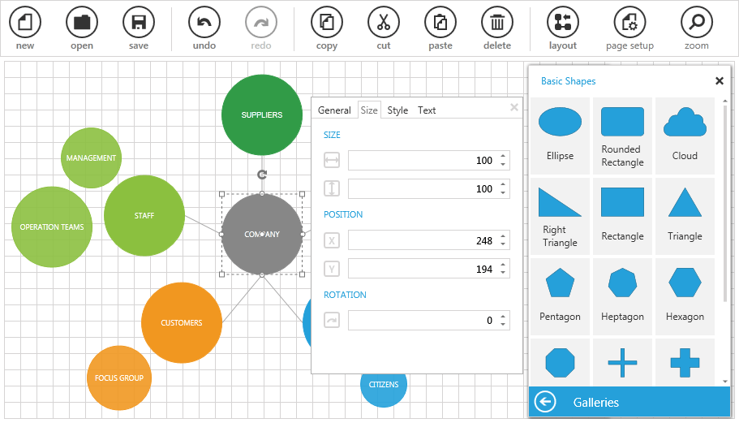

# {{ site.framework_name }} Diagram Overview

Thank you for choosing __RadDiagram__!		

The __RadDiagram__ control and its components allow you to create flexible and interactive diagramming layouts for your rich data-visualization application. The diagram toolset enables you to:

* Design workflows in which case shapes and connections are tightly bound to an underlying API.
* Simulate processes and represent data logic.
* Architect data-visualization and data analysis Diagramming structures.
* Further enhance and customize your geographic maps solutions.





## Key Features

* __Powerful data binding support__: The diagramming framework supports data binding to objects and collections out-of-the-box. Read more about this in the [Populating with Data]() section.

* __Extensive set of diagramming shapes__: The diagramming framework exposes a set of predefined diagramming shapes. Read more about this in the [Diagram Items]() section.

* __Flexible diagramming connections__: The diagramming framework exposes flexible diagram connections. Read more about this in the [Diagram Items]() section.

* __Items editing__: The diagramming framework supports editing the content of the diagramming elements. Read more about this in the [Items Editing]() article.

* __Items rotation__: The diagramming framework supports rotation. Read more about this in the [Rotation]() article.

* __Items resizing__: The diagramming framework supports resizing. Read more about this in the [Resizing]() artcle.

* __Items ZOrder__: The diagramming framework supports changing the z-order of its elements. Read more about this in the [ZOrder]() article.

* __Items selection__: The diagramming framework allows users to select one or multiple diagram elements at any time. Read more about this in the [Selection]()

* __Clipboard operations__: The diagramming framework supports __cut__, __copy__ and __paste__ operations. Read more about this in the [Clipboard Operations]() article.

* __Pan and zoom__: The diagramming framework supports __pan__ and __zoom__ operations. Read more about this in the [Pan and Zoom]() article.

* __Undo and redo__: The diagramming framework supports __undo__ and __redo__ operations. Read more about this in the [Undo and Redo]() article.

* __Align and Snap To Grid__: The diagramming framework allows you to easily _align the diagramming items__ and it also supports __snap-to-grid__ operations. read more about this in the [Align and Snap]() article.

* __Read-Only diagram__: The diagramming framework allows you to create read-only diagramming structures but still keep the events and selections active thus allowing you to keep the interactivity of the solution. Read more about this in the [Read-Only Diagram]() article.

* __Virtualization__: The diagramming framework supports __UI Virtualization__, which collapses all items outside the viewable area, thus, enhancing additionally the UI performance while manipulating the diagramming elements. Read more about this in the [Virtualization]() article.

* __Serialization__: The diagramming framework supports serializing and deserializing Diagramming objects into and from XML documents. Read more about this in the [Serialization]() article.

* __Mouse tools__: The diagramming framework exposes a set of mouse tools - selection, connection and pan tools. Read more about this in the [Mouse Tools]() article.

* __Shortcuts__: The diagramming framework allows you to manipulate the diagramming elements using keyboard shortcuts. Read more about this in the [Keyboard Support]() article.

* __Diagram commands__: The diagramming framework expose a set of commands that allow you to easily implement  RadDiagram interaction logic in MVVM solutions. Read more about this in the [Commands]() article.

* __Services__: The diagramming framework execute its actions via services which can be easily modified, thus allowing very extensive customization of the interaction with the diagramming surface. Read more about this in the [Services]() article.

You can find all the general features of the diagram documented in the [Features]() section.  

>tip Get started with the control with its [Getting Started]() help article that shows how to use it in a basic scenario.  
 
<!-- -->
> Check out the online demo at [demos.telerik.com](https://demos.telerik.com/silverlight/#Diagrams/FirstLook)[demos.telerik.com](https://demos.telerik.com/wpf/)


## Telerik UI for WPF Support and Learning Resources

* [Telerik UI for WPF Diagrams Homepage](https://www.telerik.com/products/wpf/diagrams.aspx)
* [Get Started with the Telerik UI for WPF Diagrams]()
* [Telerik UI for WPF API Reference](https://docs.telerik.com/devtools/wpf/api/)
* [Getting Started with Telerik UI for WPF Components]()
* [Telerik UI for WPF Virtual Classroom (Training Courses for Registered Users)](https://learn.telerik.com/learn/course/external/view/elearning/16/telerik-ui-for-wpf) 
* [Telerik UI for WPF Diagrams Forums](https://www.telerik.com/forums/wpf)
* [Telerik UI for WPF Knowledge Base](https://docs.telerik.com/devtools/wpf/knowledge-base)


## See Also
 * [Structure]()
 * [Getting Started]()
 * [Useful Security Tips]()
