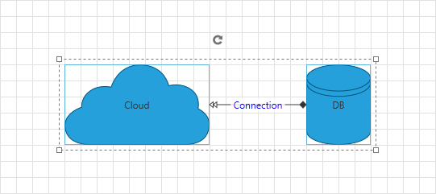

# In Code-Behind

This article will demonstrate how to define __RadDiagram__, __Shapes__ and __Connections__ in code behind	  

>Please note that the examples in this tutorial are showcasing Telerik Windows8 theme. In the [Setting a Theme](http://www.telerik.com/help/silverlight/common-styling-apperance-setting-theme.html#Setting_Application-Wide_Built-In_Theme_in_the_Code-Behind)[Setting a Theme](http://www.telerik.com/help/wpf/common-styling-apperance-setting-theme-wpf.html#Setting_Application-Wide_Built-In_Theme_in_the_Code-Behind) article you can find more information on how to set an application-wide theme.		

## Adding Items In Code Behind

Below you can find a code snippet which creates a __RadDiagram__ and adds two Shapes and a Connection in it:
		

```C#
	private void GenerateRadDiagram()
	{
	    RadDiagram diagram = new RadDiagram();
	
	    RadDiagramShape shapeCloud = new RadDiagramShape()
	    {
	        Width = 180,
	        Height = 100,
	        Position = new Point() { X = 100, Y = 100},
	        Content = "Cloud"
	    };
	    shapeCloud.Geometry = ShapeFactory.GetShapeGeometry(CommonShapeType.CloudShape);
	
	    RadDiagramShape dbShape = new RadDiagramShape()
	    {
	        Width = 80,
	        Height = 100,
	        Position = new Point() { X = 400, Y = 100 },
	        Content = "DB"
	    };
	    dbShape.Geometry = ShapeFactory.GetShapeGeometry(FlowChartShapeType.Database2Shape);
	
	    RadDiagramConnection connection = new RadDiagramConnection()
	    {
	        Source = shapeCloud,
	        SourceConnectorPosition = ConnectorPosition.Right,
	        Target = dbShape,
	        TargetConnectorPosition = ConnectorPosition.Left,
	        SourceCapType = CapType.Arrow4,
	        TargetCapType = CapType.Arrow5Filled,
	        Content = new TextBlock() { Text = " Connection ", Foreground = new SolidColorBrush() { Color = Colors.Blue} }
	    };
	    diagram.Items.Add(shapeCloud);
	    diagram.Items.Add(dbShape);
	    diagram.Items.Add(connection);
	    diagram.SelectAll();
	
	    this.LayoutRoot.Children.Add(diagram);
	}
```
```VB.NET
	Private Sub GenerateRadDiagram()
	    Dim diagram As New RadDiagram()
	
	    Dim shapeCloud As New RadDiagramShape() With
	    {
	        .Width = 180,
	        .Height = 100, .Position = New Point() With {.X = 100, .Y = 100},
	        .Content = "Cloud"
	    }
	    shapeCloud.Geometry = ShapeFactory.GetShapeGeometry(CommonShapeType.CloudShape)
	
	    Dim dbShape As New RadDiagramShape() With
	    {
	      .Width = 80,
	      .Height = 100,
	      .Position = New Point() With {.X = 400, .Y = 100},
	      .Content = "DB"
	    }
	    dbShape.Geometry = ShapeFactory.GetShapeGeometry(FlowChartShapeType.Database2Shape)
	
	    Dim connection As New RadDiagramConnection() With
	    {
	       .Source = shapeCloud,
	       .SourceConnectorPosition = ConnectorPosition.Right,
	       .Target = dbShape,
	       .TargetConnectorPosition = ConnectorPosition.Left,
	       .SourceCapType = CapType.Arrow4,
	       .TargetCapType = CapType.Arrow5Filled,
	       .Content = New TextBlock() With
	           {
	             .Text = " Connection ",
	             .Foreground = New SolidColorBrush() With
	                {
	                    .Color = Colors.Blue
	                }
	            }
	    }
	    diagram.Items.Add(shapeCloud)
	    diagram.Items.Add(dbShape)
	    diagram.Items.Add(connection)
	    diagram.SelectAll()
	
	    Me.LayoutRoot.Children.Add(diagram)
	End Sub
```

In the code above, we use the static class __ShapeFactory__ from the __Telerik.Windows.Controls.Diagrams__ assembly. Below you can find the list of its static methods for creating an EllipseShape, RectangleShape or Geometry:
		  
		
```C#
	public static RadDiagramShape CreateCircle(double radiusX, double radiusY, Point center)
	public static RadDiagramShape CreateRectangle(Rect rect)
	public static Geometry GetShapeGeometry(ArrowShapeType shapeType)
	public static Geometry GetShapeGeometry(CommonShapeType shapeType)
	public static Geometry GetShapeGeometry(FlowChartShapeType shapeType)
```
```VB.NET
	Public Shared Function CreateCircle(ByVal radiusX As Double, ByVal radiusY As Double, ByVal center As Point) As RadDiagramShape
	Public Shared Function CreateRectangle(ByVal rect_Renamed As Rect) As RadDiagramShape
	Public Shared Function GetShapeGeometry(ByVal shapeType As ArrowShapeType) As Geometry
	Public Shared Function GetShapeGeometry(ByVal shapeType As CommonShapeType) As Geometry
	Public Shared Function GetShapeGeometry(ByVal shapeType As FlowChartShapeType) As Geometry
```

Here you see a snapshot of the defined __RadDiagram__:


## See Also
 * [Structure]()
 * [Getting Started]()
 * [Declaratively Populating with Data]()
 * [DataBinding]()
 * [Shapes]()
 * [Connections]()
 * [Removing Items]()