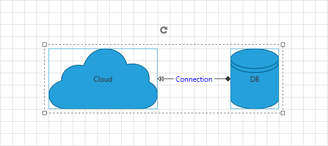

# In Code-Behind

This article will demonstrate how to define __RadDiagram__, __Shapes__ and __Connections__ in code behind	  

>Please note that the examples in this tutorial are showcasing Telerik Windows8 theme. In the [Setting a Theme](http://www.telerik.com/help/silverlight/common-styling-apperance-setting-theme.html#Setting_Application-Wide_Built-In_Theme_in_the_Code-Behind)[Setting a Theme](http://www.telerik.com/help/wpf/common-styling-apperance-setting-theme-wpf.html#Setting_Application-Wide_Built-In_Theme_in_the_Code-Behind) article you can find more information on how to set an application-wide theme.		

## Adding Items In Code Behind

Below you can find a code snippet which creates a __RadDiagram__ and adds two Shapes and a Connection in it:
		

<snippet id='raddiagram-populating-with-data-data-code-behind-block_1-cs' />

<snippet id='raddiagram-populating-with-data-data-code-behind-block_1-vb' />

In the code above, we use the static class __ShapeFactory__ from the __Telerik.Windows.Controls.Diagrams__ assembly. Below you can find the list of its static methods for creating an EllipseShape, RectangleShape or Geometry:
		  
		
<snippet id='raddiagram-populating-with-data-data-code-behind-block_2-cs' />

<snippet id='raddiagram-populating-with-data-data-code-behind-block_2-vb' />

Here you see a snapshot of the defined __RadDiagram__:

## See Also
 * [Structure]()
 * [Getting Started]()
 * [Declaratively Populating with Data]()
 * [DataBinding]()
 * [Shapes]()
 * [Connections]()
 * [Removing Items]()