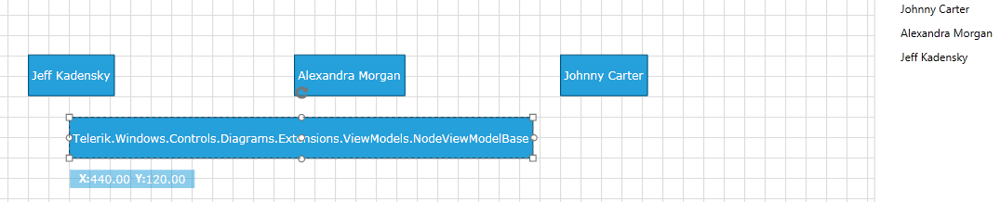

# DataBinding

The following article will show you how to bind the __RadDiagram__ to ViewModel collections which represent nodes and edges of a Graph.	  

>Please note that the examples in this tutorial are showcasing Telerik Windows8 theme. In the [Setting a Theme](http://www.telerik.com/help/silverlight/common-styling-apperance-setting-theme.html#Setting_Application-Wide_Built-In_Theme_in_the_Code-Behind)[Setting a Theme](http://www.telerik.com/help/wpf/common-styling-apperance-setting-theme-wpf.html#Setting_Application-Wide_Built-In_Theme_in_the_Code-Behind) article you can find more information on how to set an application-wide theme.		

## Defining GraphSource

In order to bind a __RadDiagram__ successfully you have to use its __GraphSource__ property and create a collection that implements the __IGraphSource__ or __IGraphSource&lt;T&gt;.__ The __IGraphSource__ interface basically describes the elements (items and links (or nodes or edges)) of an __MVVM__ graph source.
		
__Example 1: IGraphSource interfaces__
```C#
	public interface IGraphSource
	{
	    IEnumerable<ILink> Links { get; }
	    IEnumerable Items { get; }
	}
	
	public interface IGraphSource<T> : IGraphSource
	{
	    new IEnumerable<ILink<T>> Links { get; }
	    new IEnumerable<T> Items { get; }
	}
```
```VB.NET
	Public Interface IGraphSource
	    ReadOnly Property Links() As IEnumerable(Of ILink)
	    ReadOnly Property Items() As IEnumerable
	End Interface
	
	Public Interface IGraphSource(Of T)
	    Inherits IGraphSource
	    Shadows ReadOnly Property Links() As IEnumerable(Of ILink(Of T))
	    Shadows ReadOnly Property Items() As IEnumerable(Of T)
	End Interface
```

So let's start with creating a ViewModel for the nodes of our Graph (Diagram). We will create the class PascalNode that will have 'Position' property of type Point and 'PascalNumber' of type int:

__Example 2: Creating a ViewModel for nodes__
```C#
	public class PascalNode
	{
	    public Point Position
	    {
	        get;
	        set;
	    }
	    public int PascalNumber
	    {
	        get;
	        set;
	    }
	}
```
```VB.NET
	Public Class PascalNode
	    Public Property Position() As Point
	    Public Property PascalNumber() As Integer
	End Class
```

Now we need a ViewModel for the edges (links) of the Graph. Let's call it PascalEdge. Note that this class must implement the __ILink<PascalNode>__ interface:
		
__Example 3: Creating a ViewModel for links__
```C#
	public class PascalEdge : ILink<PascalNode>
	{
	    public PascalNode Source
	    {
	        get;
	        set;
	    }
	
	    public PascalNode Target
	    {
	        get;
	        set;
	    }
	
	    object ILink.Source
	    {
	        get
	        {
	            return this.Source;
	        }
	        set
	        {
	        }
	
	    }
	
	    object ILink.Target
	    {
	        get
	        {
	            return this.Target;
	        }
	        set
	        {
	        }
	    }
	}
```
```VB.NET
	Public Class PascalEdge
	    Implements ILink(Of PascalNode)
	    Public Property Source() As PascalNode
	
	    Public Property Target() As PascalNode
	
	    Private Property ILink_Source() As Object Implements ILink.Source
	        Get
	            Return Me.Source
	        End Get
	        Set(ByVal value As Object)
	        End Set
	
	    End Property
	
	    Private Property ILink_Target() As Object Implements ILink.Target
	        Get
	            Return Me.Target
	        End Get
	        Set(ByVal value As Object)
	        End Set
	    End Property
	End Class
```

Now we can successfully create an IGraphSource class to hold collection of nodes and edges:

__Example 4: Implementing IGraphSource__
```C#
	public class PascalTriangleGraphSource : IGraphSource
	{
	    public PascalTriangleGraphSource()
	    {
	        this.InternalItems = new ObservableCollection<PascalNode>();
	        this.InternalEdges = new ObservableCollection<PascalEdge>();
	    }
	
	    public ObservableCollection<PascalNode> InternalItems
	    {
	        get;
	        private set;
	    }
	
	    public ObservableCollection<PascalEdge> InternalEdges
	    {
	        get;
	        private set;
	    }
	
	    IEnumerable<ILink> IGraphSource.Links
	    {
	        get { return this.InternalEdges; }
	    }
	
	    System.Collections.IEnumerable IGraphSource.Items
	    {
	        get { return this.InternalItems; }
	    }
	}
```
```VB.NET
	Public Class PascalTriangleGraphSource
	    Implements IGraphSource
	    Public Sub New()
	        Me.InternalItems = New ObservableCollection(Of PascalNode)()
	        Me.InternalEdges = New ObservableCollection(Of PascalEdge)()
	    End Sub
	
	    Private privateInternalItems As ObservableCollection(Of PascalNode)
	    Public Property InternalItems() As ObservableCollection(Of PascalNode)
	        Get
	            Return privateInternalItems
	        End Get
	        Private Set(ByVal value As ObservableCollection(Of PascalNode))
	            privateInternalItems = value
	        End Set
	    End Property
	
	    Private privateInternalEdges As ObservableCollection(Of PascalEdge)
	    Public Property InternalEdges() As ObservableCollection(Of PascalEdge)
	        Get
	            Return privateInternalEdges
	        End Get
	        Private Set(ByVal value As ObservableCollection(Of PascalEdge))
	            privateInternalEdges = value
	        End Set
	    End Property
	
	    Private ReadOnly Property Links() As IEnumerable(Of ILink) Implements IGraphSource.Links
	        Get
	            Return Me.InternalEdges
	        End Get
	    End Property
	
	    Private ReadOnly Property Items() As System.Collections.IEnumerable Implements IGraphSource.Items
	        Get
	            Return Me.InternalItems
	        End Get
	    End Property
	End Class
```

Our next step is to create a function that accepts integer as a parameter and fills the GraphSource collection with PascalNodes and PascalEdges:

__Example 5: Populating the graph source__
```C#
	const int ROOT_X_Position = 400;
	const int ROOT_Y_Position = 20;
	const int X_DELIMITER_WIDTH = 80;
	const int Y_DELIMITER_HEIGHT = 60;
	const int X_START_NEGATIVE_OFFSET = 40;       
	
	private IGraphSource CreatePascalTriangleGraphSource(int levels)
	{
	    PascalTriangleGraphSource graph = new PascalTriangleGraphSource();
	    for (int i = 0; i < levels; i++)
	    {
	        for (int j = 0; j < i + 1; j++)
	        {
	            PascalNode node = new PascalNode()
	            {
	                Position = new Point() 
	                {
	                    Y = ROOT_Y_Position + i * Y_DELIMITER_HEIGHT,
	                    X = ROOT_X_Position - i * X_START_NEGATIVE_OFFSET + j * X_DELIMITER_WIDTH 
	                },
	                PascalNumber = Binom(i, j)
	            };
	            graph.InternalItems.Add(node);  
	            int currIndex = i * (i + 1) / 2 + j;
	            if (j == 0) graph.InternalEdges.Add(new PascalEdge() { Source = graph.InternalItems[currIndex - i], Target = node });
	            if (j == i && i != 0) graph.InternalEdges.Add(new PascalEdge() { Source = graph.InternalItems[currIndex - i - 1], Target = node });
	            if (0 < j && j < i)
	            {
	                graph.InternalEdges.Add(new PascalEdge() { Source = graph.InternalItems[currIndex - i - 1], Target = node });
	                graph.InternalEdges.Add(new PascalEdge() { Source = graph.InternalItems[currIndex - i], Target = node });
	            }
	        }                
	    }
	    return graph;
	}
	
	private int Binom(int n, int k)
	{           
	    return FactN(n) / (FactN(k) * FactN(n -k));            
	}
	
	private int FactN(int n)
	{
	    if (n == 0 || n == 1) return 1;
	    int res = 1;
	    for (int i = 1; i <= n; i++)
	    {
	        res = res * i;
	    }           
	    return res;
	}
```
```VB.NET
	Private Const ROOT_X_Position As Integer = 400
	Private Const ROOT_Y_Position As Integer = 20
	Private Const X_DELIMITER_WIDTH As Integer = 80
	Private Const Y_DELIMITER_HEIGHT As Integer = 60
	Private Const X_START_NEGATIVE_OFFSET As Integer = 40
	
	Private Function CreatePascalTriangleGraphSource(ByVal levels As Integer) As IGraphSource
	    Dim graph As New PascalTriangleGraphSource()
	    For i As Integer = 0 To levels - 1
	        For j As Integer = 0 To i
	            Dim node As New PascalNode() With {.Position = New Point() With {.Y = ROOT_Y_Position + i * Y_DELIMITER_HEIGHT, .X = ROOT_X_Position - i * X_START_NEGATIVE_OFFSET + j * X_DELIMITER_WIDTH}, .PascalNumber = Binom(i, j)}
	            graph.InternalItems.Add(node)
	            Dim currIndex As Integer = i * (i + 1) / 2 + j
	            If j = 0 Then
	                graph.InternalEdges.Add(New PascalEdge() With {.Source = graph.InternalItems(currIndex - i), .Target = node})
	            End If
	            If j = i AndAlso i <> 0 Then
	                graph.InternalEdges.Add(New PascalEdge() With {.Source = graph.InternalItems(currIndex - i - 1), .Target = node})
	            End If
	            If 0 < j AndAlso j < i Then
	                graph.InternalEdges.Add(New PascalEdge() With {.Source = graph.InternalItems(currIndex - i - 1), .Target = node})
	                graph.InternalEdges.Add(New PascalEdge() With {.Source = graph.InternalItems(currIndex - i), .Target = node})
	            End If
	        Next j
	    Next i
	    Return graph
	End Function
	
	Private Function Binom(ByVal n As Integer, ByVal k As Integer) As Integer
	    Return FactN(n) / (FactN(k) * FactN(n - k))
	End Function
	
	Private Function FactN(ByVal n As Integer) As Integer
	    If n = 0 OrElse n = 1 Then
	        Return 1
	    End If
	    Dim res As Integer = 1
	    For i As Integer = 1 To n
	        res = res * i
	    Next i
	    Return res
	End Function
```

## Configuring XAML

Now let's take care of our Shapes and Connections' look and feel. We have to bind the Shapes' Position property and define ContentTemplate to show the PascalNumber. On the other hand, we have to create an empty ContentTemplate for the Connections if we don't want the default one - the name of the ViewModel's class shown in a TextBlock. We will also define a TargetCapType for the edges.
		
__Example 6: Declaring the RadDiagram in XAML and adding the necessary styles__
```XAML
	  <Grid x:Name="LayoutRoot">
	    <Grid.Resources>
	        <Style x:Key="pascalNodeStyle" TargetType="telerik:RadDiagramShape">
	            <Setter Property="Position" Value="{Binding Position, Mode=TwoWay}" />
	            <Setter Property="Content" Value="{Binding}" />
	            <Setter Property="Geometry" Value="{telerik:CommonShape ShapeType=EllipseShape}" />
	            <Setter Property="Width" Value="40" />
	            <Setter Property="Height" Value="40" />
	            <Setter Property="ContentTemplate">
	                <Setter.Value>
	                    <DataTemplate >
	                        <TextBlock FontSize="14" 
	                                   FontWeight="Bold" 
	                                   Foreground="Black"
	                                   Text="{Binding PascalNumber}" />
	                    </DataTemplate>
	                </Setter.Value>
	            </Setter>
	        </Style>
	
	        <Style x:Key="pascalEdgeStyle" TargetType="telerik:RadDiagramConnection">
	            <Setter Property="TargetCapType" Value="Arrow1" />
	            <Setter Property="ContentTemplate">
	                <Setter.Value>
	                    <DataTemplate />
	                </Setter.Value>
	            </Setter>
	        </Style>           
	    </Grid.Resources>
	
	    <telerik:RadDiagram x:Name="diagram" 
	                        ConnectionStyle="{StaticResource pascalEdgeStyle}"
	                        ShapeStyle="{StaticResource pascalNodeStyle}" />
	</Grid>
```

## Connecting The View And The ViewModel

The final step is to bind the View to the ViewModels:
		
__Example 7: Setting the GraphSource__	
```C#
	this.diagram.GraphSource = CreatePascalTriangleGraphSource(7);
```
```VB.NET
	Me.diagram.GraphSource = CreatePascalTriangleGraphSource(7)
```

#### __Figure 1: **Pascal Triangle** with seven levels represented by **RadDiagram**__


## Two-Way MVVM

In Q2 2012 we improved the MVVM support by adding two-way changes, i.e. changes in the UI or diagram will be reflected in the viewmodel. 

In order to make use of the two-way binding the data source should implement the __IObservableGraphSource__ interface which extends the __IGraphSource__ interface with some methods called by __RadDiagram__ when Items are added or removed in the diagram.		

The simplest way to use the __IObservableGraphSource__ is via its default implementation in the Extensions library. The __ObservableGraphSourceBase__ contains Add and Remove methods which can and should be overriden to make sure that any changes in the view (__RadDiagram__ canvas), will be reflected in the ViewModel. The next examples demonstrate this in a sample scenario.

__Example 8: Defining a model__
```C#
	public class Person : NodeViewModelBase 
	{ 
		public Person(string name) 
		{ 
			this.Name = name; 
		} 
	 
		public string Name 
		{ 
			get 
			{ 
				return this.Content.ToString(); 
			} 
			set 
			{ 
				this.Content = value; 		 
				this.OnPropertyChanged("Name"); 
			} 
		} 
	 
		public override string ToString() 
		{ 
			return this.Name; 
		} 
	}
```
```VB.NET
	Public Class Person
		Inherits NodeViewModelBase
		Public Sub New(name As String)
			Me.Name = name
		End Sub
	
		Public Property Name() As String
			Get
				Return Me.Content.ToString()
			End Get
			Set
				Me.Content = value
				Me.OnPropertyChanged("Name")
			End Set
		End Property
	
		Public Overrides Function ToString() As String
			Return Me.Name
		End Function
	End Class
```

Next, define a graph source deriving from the __ObservableGraphSourceBase<TNode,TLink>__ class as in __Example 9__.

__Example 9: Implement ObservableGraphSourceBase__
```C#
	public class DataStore : ObservableGraphSourceBase<NodeViewModelBase, LinkViewModelBase<NodeViewModelBase>> 
		{ 
			public DataStore() 
			{ 
				this.AddNode(new Person("Johnny Carter")); 
				this.AddNode(new Person("Alexandra Morgan")); 
				this.AddNode(new Person("Jeff Kadensky")); 
			}
	
			public override void AddNode(NodeViewModelBase node)
			{
				if (!(node is Person)) node = new Person("New Person!");
				base.AddNode(node);
			}
		}
```
```VB.NET
	Public Class DataStore
		Inherits ObservableGraphSourceBase(Of NodeViewModelBase, LinkViewModelBase(Of NodeViewModelBase))
		Public Sub New()
			Me.AddNode(New Person("Johnny Carter"))
			Me.AddNode(New Person("Alexandra Morgan"))
			Me.AddNode(New Person("Jeff Kadensky"))
		End Sub
	
		Public Overrides Sub AddNode(node As NodeViewModelBase)
			If Not (TypeOf node Is Person) Then
				node = New Person("New Person!")
			End If
			MyBase.AddNode(node)
		End Sub
	End Class
```

This model is bound to a RadTreeView and a RadDiagram in XAML as demonstrated in __Example 10__.

__Example 10: Showing the items in a RadTreeView__
```XAML
	<telerik:RadDiagram x:Name="diagram" GraphSource="{Binding }" />
	
			<telerik:RadTreeView x:Name="tree" Grid.Column="1" Width="300" ItemsSource="{Binding Items}">
				<telerik:RadTreeView.ItemTemplate>
					<DataTemplate>
						<TextBlock Text="{Binding Name}" />
					</DataTemplate>
				</telerik:RadTreeView.ItemTemplate>
			</telerik:RadTreeView>
```

#### __Figure 2: Result from Example 10__


#### __Figure 3: Selecting an item and pasting it into the diagram__


An item has been created in the MVVM model (the empty treeview item) as a result of the changes in the diagram, as should be with a two-way MVVM source. The item has however an empty content since RadDiagram has thus far no knowledge of the Person data type to insert into the model. 

For this purpose you need to override the AddNode method in the Datastore as in __Example 11__.

__Example 11: Overriding the AddNode method__
```C#
	public override void AddNode(NodeViewModelBase node)
	{
		if (!(node is Person)) node = new Person("New Person!");
		base.AddNode(node);
	}	
```
```VB.NET
	Public Overrides Sub AddNode(node As NodeViewModelBase)
	If Not (TypeOf node Is Person) Then
	node = New Person("New Person!")
	End If
	MyBase.AddNode(node)
	End Sub
```
		
#### __Figure 4: Result from Example 11__


## Clearing the Cache of the ItemContainerGenerator

When an item (node) is removed from the GraphSource, its corresponding UI container (the RadDiagramShape) is stored in a collection of 'recycled' shapes for future use. This aims to speed up the diagram's performance in extensive undo-redo and container generation operations. However, this could lead to an increased use of memory. In order to clear this cache, utilize the __ClearCache__ method of the diagram's __ContainerGenerator__ as demonstrated in __Example 12__.

__Example 12: Invoking the ClearCache method of the ItemContainerGenerator__
```C#
	(this.Diagram.ContainerGenerator as GenericContainerGenerator<Telerik.Windows.Controls.Diagrams.RadDiagramItem>).ClearCache();
```
```VB.NET
	TryCast(Me.Diagram.ContainerGenerator, GenericContainerGenerator(Of Telerik.Windows.Controls.Diagrams.RadDiagramItem)).ClearCache()
```

## See Also
 * [Structure]()
 * [Getting Started]()
 * [Declaratively]()
 * [In Code-Behind]()
 * [Shapes]()
 * [Connections]()
 * [Commands]()
