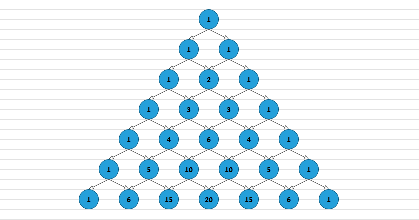
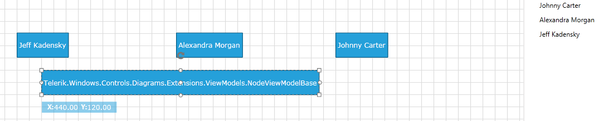

# DataBinding

The following article will show you how to bind the __RadDiagram__ to ViewModel collections which represent nodes and edges of a Graph.	  

>Please note that the examples in this tutorial are showcasing Telerik Windows8 theme. In the [Setting a Theme](http://www.telerik.com/help/silverlight/common-styling-apperance-setting-theme.html#Setting_Application-Wide_Built-In_Theme_in_the_Code-Behind)[Setting a Theme](http://www.telerik.com/help/wpf/common-styling-apperance-setting-theme-wpf.html#Setting_Application-Wide_Built-In_Theme_in_the_Code-Behind) article you can find more information on how to set an application-wide theme.		

## Defining GraphSource

In order to bind a __RadDiagram__ successfully you have to use its __GraphSource__ property and create a collection that implements the __IGraphSource__ or __IGraphSource&lt;T&gt;.__ The __IGraphSource__ interface basically describes the elements (items and links (or nodes or edges)) of an __MVVM__ graph source.
		
__Example 1: IGraphSource interfaces__
<snippet id='raddiagram-populating-with-data-data-databinding-example_1_igraphsource_interfaces-cs' />

<snippet id='raddiagram-populating-with-data-data-databinding-example_1_igraphsource_interfaces-vb' />

So let's start with creating a ViewModel for the nodes of our Graph (Diagram). We will create the class PascalNode that will have 'Position' property of type Point and 'PascalNumber' of type int:

__Example 2: Creating a ViewModel for nodes__
<snippet id='raddiagram-populating-with-data-data-databinding-example_2_creating_a_viewmodel_for_nodes-cs' />

<snippet id='raddiagram-populating-with-data-data-databinding-example_2_creating_a_viewmodel_for_nodes-vb' />

Now we need a ViewModel for the edges (links) of the Graph. Let's call it PascalEdge. Note that this class must implement the __ILink<PascalNode>__ interface:
		
__Example 3: Creating a ViewModel for links__
<snippet id='raddiagram-populating-with-data-data-databinding-example_3_creating_a_viewmodel_for_links-cs' />

<snippet id='raddiagram-populating-with-data-data-databinding-example_3_creating_a_viewmodel_for_links-vb' />

Now we can successfully create an IGraphSource class to hold collection of nodes and edges:

__Example 4: Implementing IGraphSource__
<snippet id='raddiagram-populating-with-data-data-databinding-example_4_implementing_igraphsource-cs' />

<snippet id='raddiagram-populating-with-data-data-databinding-example_4_implementing_igraphsource-vb' />

Our next step is to create a function that accepts integer as a parameter and fills the GraphSource collection with PascalNodes and PascalEdges:

__Example 5: Populating the graph source__
<snippet id='raddiagram-populating-with-data-data-databinding-example_5_populating_the_graph_source-cs' />

<snippet id='raddiagram-populating-with-data-data-databinding-example_5_populating_the_graph_source-vb' />

## Configuring XAML

Now let's take care of our Shapes and Connections' look and feel. We have to bind the Shapes' Position property and define ContentTemplate to show the PascalNumber. On the other hand, we have to create an empty ContentTemplate for the Connections if we don't want the default one - the name of the ViewModel's class shown in a TextBlock. We will also define a TargetCapType for the edges.
		
__Example 6: Declaring the RadDiagram in XAML and adding the necessary styles__
<snippet id='raddiagram-populating-with-data-data-databinding-example_6_declaring_the_raddiagram_in_xaml_and_adding_the_necessary_styles-xaml' />

## Connecting The View And The ViewModel

The final step is to bind the View to the ViewModels:
		
__Example 7: Setting the GraphSource__	
<snippet id='raddiagram-populating-with-data-data-databinding-example_7_setting_the_graphsource-cs' />

<snippet id='raddiagram-populating-with-data-data-databinding-example_7_setting_the_graphsource-vb' />

#### __Figure 1: **Pascal Triangle** with seven levels represented by **RadDiagram**__

## Two-Way MVVM

In Q2 2012 we improved the MVVM support by adding two-way changes, i.e. changes in the UI or diagram will be reflected in the viewmodel. 

In order to make use of the two-way binding the data source should implement the __IObservableGraphSource__ interface which extends the __IGraphSource__ interface with some methods called by __RadDiagram__ when Items are added or removed in the diagram.		

The simplest way to use the __IObservableGraphSource__ is via its default implementation in the Extensions library. The __ObservableGraphSourceBase__ contains Add and Remove methods which can and should be overriden to make sure that any changes in the view (__RadDiagram__ canvas), will be reflected in the ViewModel. The next examples demonstrate this in a sample scenario.

__Example 8: Defining a model__
<snippet id='raddiagram-populating-with-data-data-databinding-example_8_defining_a_model-cs' />

<snippet id='raddiagram-populating-with-data-data-databinding-example_8_defining_a_model-vb' />

Next, define a graph source deriving from the __ObservableGraphSourceBase<TNode,TLink>__ class as in __Example 9__.

__Example 9: Implement ObservableGraphSourceBase__
<snippet id='raddiagram-populating-with-data-data-databinding-example_9_implement_observablegraphsourcebase-cs' />

<snippet id='raddiagram-populating-with-data-data-databinding-example_9_implement_observablegraphsourcebase-vb' />

This model is bound to a RadTreeView and a RadDiagram in XAML as demonstrated in __Example 10__.

__Example 10: Showing the items in a RadTreeView__
<snippet id='raddiagram-populating-with-data-data-databinding-example_10_showing_the_items_in_a_radtreeview-xaml' />

#### __Figure 2: Result from Example 10__

#### __Figure 3: Selecting an item and pasting it into the diagram__

An item has been created in the MVVM model (the empty treeview item) as a result of the changes in the diagram, as should be with a two-way MVVM source. The item has however an empty content since RadDiagram has thus far no knowledge of the Person data type to insert into the model. 

For this purpose you need to override the AddNode method in the Datastore as in __Example 11__.

__Example 11: Overriding the AddNode method__
<snippet id='raddiagram-populating-with-data-data-databinding-example_11_overriding_the_addnode_method-cs' />

<snippet id='raddiagram-populating-with-data-data-databinding-example_11_overriding_the_addnode_method-vb' />

		
#### __Figure 4: Result from Example 11__

## Clearing the Cache of the ItemContainerGenerator

When an item (node) is removed from the GraphSource, its corresponding UI container (the RadDiagramShape) is stored in a collection of 'recycled' shapes for future use. This aims to speed up the diagram's performance in extensive undo-redo and container generation operations. However, this could lead to an increased use of memory. In order to clear this cache, utilize the __ClearCache__ method of the diagram's __ContainerGenerator__ as demonstrated in __Example 12__.

__Example 12: Invoking the ClearCache method of the ItemContainerGenerator__
<snippet id='raddiagram-populating-with-data-data-databinding-example_12_invoking_the_clearcache_method_of_the_itemcontainergenerator-cs' />

<snippet id='raddiagram-populating-with-data-data-databinding-example_12_invoking_the_clearcache_method_of_the_itemcontainergenerator-vb' />

## See Also
 * [Structure]()
 * [Getting Started]()
 * [Declaratively]()
 * [In Code-Behind]()
 * [Shapes]()
 * [Connections]()
 * [Commands]()
