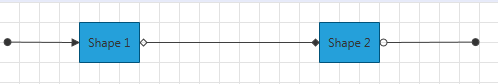

# Declaratively

This tutorial will walk you through the common task of populating __RadDiagram__ with Diagramming items declaratively.

>Please note that the examples in this tutorial are showcasing Telerik Windows8 theme. In the [Setting a Theme](http://www.telerik.com/help/silverlight/common-styling-apperance-setting-theme.html#Setting_Application-Wide_Built-In_Theme_in_the_Code-Behind)[Setting a Theme](http://www.telerik.com/help/wpf/common-styling-apperance-setting-theme-wpf.html#Setting_Application-Wide_Built-In_Theme_in_the_Code-Behind) article you can find more information on how to set an application-wide theme.

Here is a regular __RadDiagram__ declaration without any Diagramming items:	  

#### __XAML__
```XAML
    <Grid>
        <telerik:RadDiagram />
    </Grid>
```

Once you declare the __RadDiagram__ your Diagramming drawing canvas is ready and you can add items in it. The basic items that are used in the Graph Object Model are the __RadDiagramConnection__ and __RadDiagramShape__. You can add them to the __RadDiagram__ declaration in order to create your own Diagramming structure.	  

### Add Shapes

When you create your Diagramming structure in XAML, it is important to keep in mind that by default the __RadDiagramShape__ is positioned at the top left corner of the __RadDiagram__. This is why you'll need to set the __Position__ property of each shape based on your layout requirements. The __Position__ property gets or sets the coordinates of the top left point of the shape. You can find more information about the __RadDiagramShape__ properties in the [Diagram Shapes]() tutorial.

#### __XAML__
```XAML
    <Grid>
        <telerik:RadDiagram>
            <telerik:RadDiagramShape x:Name="Shape1"
                                     Content="Shape 1"
                                     Position="80,20" />
            <telerik:RadDiagramShape x:Name="Shape2"
                                     Content="Shape 2"
                                     Position="320,20" />
        </telerik:RadDiagram>
    </Grid>	  
```


>Please note that the __RadDiagramShape__ declarations set the __x:Name__ of the shapes. You'll need the name of the shapes when attaching a connection to them.

### Add Connections

When you define the __RadDiagramConenctions__ you will need to define the start and end points of the connection. Otherwise the connection will be displayed as a small point at the top left corner of the drawing canvas. You can define the start point either by setting the __Source__ of the connection or by setting its __StartPoint__ property. Alternatively the end point is defined through the __Target__ or __EndPoint__ properties. For more information about the __RadDiagramConnection__ properties, please refer to the [Diagram Connections]() tutorial.		  

#### __XAML__
```XAML
    <Grid>
        <telerik:RadDiagram>
            <telerik:RadDiagramShape x:Name="Shape1"
                                     Content="Shape 1"
                                     Position="80,20" />
            <telerik:RadDiagramShape x:Name="Shape2"
                                     Content="Shape 2"
                                     Position="320,20" />

            <telerik:RadDiagramConnection SourceCapType="Arrow6Filled"
                                          Target="{Binding ElementName=Shape1}"
                                          TargetCapType="Arrow1Filled"
                                          StartPoint="5,40" />
            <telerik:RadDiagramConnection Source="{Binding ElementName=Shape1}"
                                          SourceCapType="Arrow5"
                                          Target="{Binding ElementName=Shape2}"
                                          TargetCapType="Arrow5Filled" />
            <telerik:RadDiagramConnection Source="{Binding ElementName=Shape2}"
                                          SourceCapType="Arrow6"
                                          TargetCapType="Arrow6Filled"
                                          EndPoint="480,40" />
        </telerik:RadDiagram>
    </Grid>  
```
	


## See Also
 * [Structure]()
 * [Getting Started]()
 * [DataBinding]()
 * [Populating with Data in Code-Behind]()
 * [Shapes]()
 * [Connections]()
 * [Removing Items]()