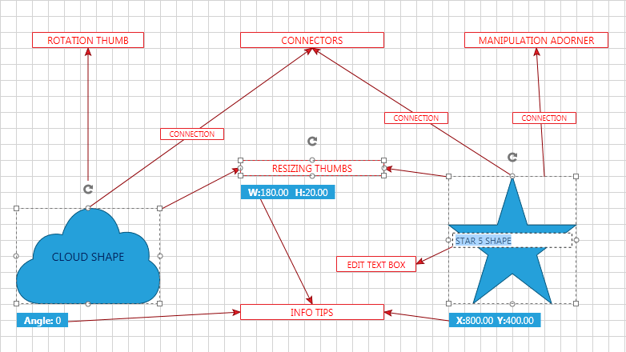

# Structure

__The Telerik Diagramming Framework__ allows you to create various kinds of diagrams like Organizational, Class and Flow as well as many others.	  

This section defines terms and concepts used in the scope of __RadDiagram__ you have to get familiar with prior to continue reading this help.	  

They can also be helpful when contacting our support service in order to describe your issue better.

In the following picture you can see the main components which a __RadDiagram__ could have: 		

* __Shape__- this is the base element of the __Diagram__, just like a node for a graph. You can select it, drag it, resize it, rotate it, connect it to other shapes, set its __Content__, copy/paste it. There are three types of predefined, geometrical shapes - __Basic Shapes__, __Flow Shapes__ and __Arrows__. You can also define your own custom shape by deriving from __RadDiagramShapeBase__ or __RadDiagramShape__ class.			  

* __Connection__ - its main purpose is to connect two shapes but it could be also used separately. You can set its __Label__, select it, resize it, rotate it, copy/paste it.			  

* __Connector__ - every shape has four connectors. The connections connect shapes by linking their connectors.			  

* __Resizing Thumb__ - every shape has four resizing thumbs that you can use to resize the shape.			  

* __Manipulation Adorner__ - when a shape or group of shapes and connections is selected, they are being surrounded by manipulation rectangle called manipulation adorner.			  

* __Rotation Thumb__ - it is part of the manipulation adorner and you can use it to rotate the shape or group of shapes and connections.			  

* __Edit Text Box__ - appears when a shape's content is being edited.			  

* __Information Tooltips__ - tooltips that appear below the manipulation adorner when you resize, rotate or drag a shape or group of shapes and connections.			  

## See Also
 * [Overview]()
 * [Getting Started]()
 * [Shapes]()
 * [Connections]()