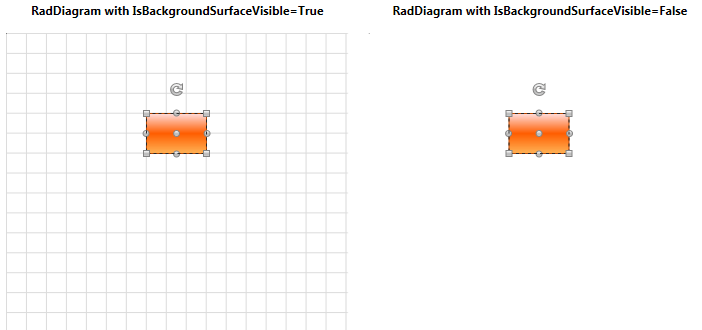
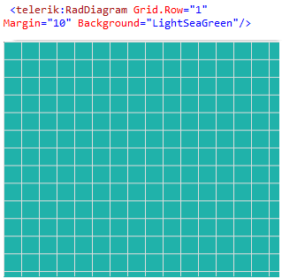
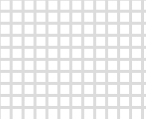
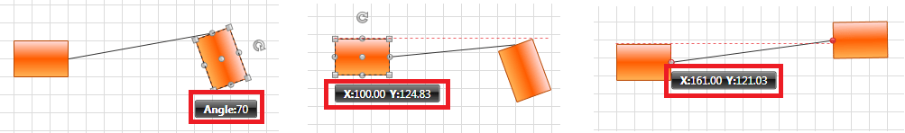
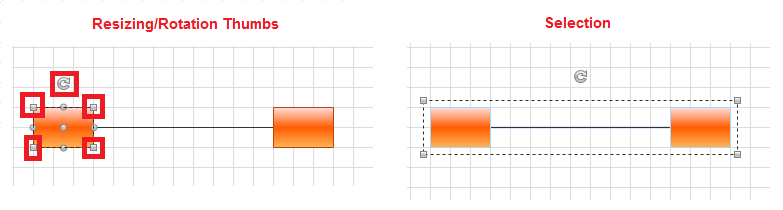
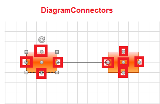

# Customize Appearance

This article describes how to customize the appearance of the __RadDiagram__,__RadDiagramShape__ and __RadDiagramConnection__ through a set of properties exposed by their API.	  

## Customizing the RadDiagram Appearance

### Controlling the Diagramming Surface Appearance

You can control the background settings of the diagramming surface through the following set of properties:

* __IsBackgroundSurfaceVisible__ - a __Boolean__ property that determines whether the background surface of the __RadDiagram__ should be displayed. When set to __true__ both the background grid and the [Preview Pages canvas](#pages-preview-canvas) are displayed. Its default value is __true__.


* __Background__ - this property is of type __Brush__ and it controls the fill of the __RadDiagram__ background.


The settings and appearance of the __RadDiagram__ background grid are controlled through the following set of attached properties:			  

>You can access the __BackgroundGrid__ attached properties through an alias pointing to the __Telerik.Windows.Controls.Diagrams.Primitives__ namespace:  `xmlns:primitives="clr-namespace:Telerik.Windows.Controls.Diagrams.Primitives;assembly=Telerik.Windows.Controls.Diagrams"` or by adding a using for the __Telerik.Windows.Controls.Diagrams.Primitives__ namespace in your code-behind file.

* __BackgroundGrid.IsGridVisible__ - this is a __Boolean__ property that controls the visibility of the background grid. Its default value is __True__.				
	
	#### __XAML__
	```XAML
		<telerik:RadDiagram primitives:BackgroundGrid.IsGridVisible="True" />					  
	```
	
* __BackgroundGrid.IsDynamic__ - this is a __Boolean__ property that determines whether the background grid should be moved and resized accordingly to the __RadDiagram__ viewport changes (panning and zooming). Its default value is __True__ thus enabling the background grid to reflect the changes implemented by a pan and/or a zoom operation.
				
	#### __XAML__
	```XAML
		<telerik:RadDiagram primitives:BackgroundGrid.IsDynamic="True" />
	```
	
* __BackgroundGrid.CellSize__ - this property is of type __Size__ and it controls the size of the cells in the __RadDiagram.BackgroundGrid__ surface. The default value of this property is a size of __20x20__ units.				

	#### __XAML__
	```XAML
		<telerik:RadDiagram primitives:BackgroundGrid.CellSize="40,40" />					  
	```
	
* __BackgroundGrid.LineStroke__ - this property is of type __Brush__ and it specifies how the cells outline is painted.				

	#### __XAML__
	```XAML
		<telerik:RadDiagram primitives:BackgroundGrid.LineStroke="Red" />  					  					  
	```
	
	

* __BackgroundGrid.LineStrokeDashArray__ - this property gets or sets a collection of __Double__ values that indicate the pattern of dashes and gaps that is used to outline the cells in the __RadDiagram BackgroundGrid__.				

* __BackgroundGrid.LineStrokeThickness__ - this property is of type __double__ and it gets or sets the thickness of the __RadDiagram__ background grid lines.				

	#### __XAML__
	```XAML
		<telerik:RadDiagram primitives:BackgroundGrid.LineThickness="5" />					  					  
	```

	
	
>tip If you need to customize the appearance and the settings of the __RadDiagram__ PagesPreview canvas, you can examine the [Pages Preview](#pages-preview-canvas) section in the __Printing__ article.

### DiagramAdorners

The __RadDiagram__ exposes a set of properties that allow you to control which Diagramming adorners to be displayed:			

* __IsInformationAdornerVisible__: A __Boolean__ property that controls the visibility of the __InformationAdorner__ of the __RadDiagram__. The __InformationAdorner__ displays information about the diagram's elements settings like current position and rotation angle. The default value of the __IsInformationAdornerVisible__ property is __true__.
	

* __IsManipulationAdornerVisible__: A __Boolean__ property that controls the visibility of the __ManipulationAdorner__ of the __RadDiagram__. The __ManipulationAdorner__ visualizes the resizing and rotation thumbs of the __RadDiagram__ elements. It also visualizes selections. The default value of the __IsManipulationAdornerVisible__ property is __true__.
	

* __IsConnectorsManipulationEnabled__: A __Boolean__ property that controls the visibility of the __RadDiagram__ elements connectors. The default value of the property is __true__.
	

The __RadDiagram__ also contains __AlignmentAdorner__. This adorner provides visual feedback about the alignment of the Diagramming elements.			

>The __AlignmentAdorner__ definition is placed in the __Telerik.Windows.Controls.Diagrams.Primitives__ namespace. This is why in order to control its settings, you need to add an alias to that namespace:			  >`xmlns:primitives="clr-namespace:Telerik.Windows.Controls.Diagrams.Primitives;assembly=Telerik.Windows.Controls.Diagrams"`
>`<telerik:RadDiagram primitives:AlignmentAdorner.VerticalLineStroke="Blue"/>`

The __RadDiagram__ allows you to control the following properties of the __AlignmentAdorner__:			

* __AlignmentAdorner.HorizontalLineStroke__: A property of type __Brush__ that specifies how the horizontal alignment lines are painted.				

* __AlignmentAdorner.HorizontalLineStrokeDashArray__: A property that gets or sets a collection of __Double__ values that indicate the pattern of dashes and gaps that is used to outline the horizontal alignment lines.				

* __AlignmentAdorner.HorizontalLineStrokeThickness__: A property of type __double__ that gets or sets the thickness of the horizontal alignment lines.				

* __AlignmentAdorner.VerticalLineStroke__: A property of type __Brush__ that specifies how the vertical alignment lines are painted.				

* __AlignmentAdorner.VerticalLineStrokeDashArray__: A property of type __Brush__ that specifies how the vertical alignment lines are painted.				

* __AlignmentAdorner.VerticalLineStrokeThickness__: A property that gets or sets a collection of __Double__ values that indicate the pattern of dashes and gaps that is used to outline the vertical alignment lines.				

## Customizing the RadDiagramShape Appearance

You can easily customize the visual appearance of the __RadDiagramShape__ by using the following properties:		

* __Background__: Gets or sets the brush that specifies the __RadDiagramShape__ background color.			

* __BorderBrush__: Gets or sets the brush that specifies the __RadDiagramShape__ border color.			

* __StrokeDashArray__: Gets or sets a collection of __Double__ values that indicate the pattern of dashes and gaps that is used to outline the __RadDiagramShape__.			

* __StrokeThickness__: Gets or sets the width of the __RadDiagramShape__ outline.			

You can also control what visual information should be displayed on a __RadDiagramShape__ through the following set of properties:		

* __IsConnectorsManipulationEnabled__: A __Boolean__ property that controls the visibility of the __RadDiagramShape__ connectors. The default value of the property is __true__.			

* __IsManipulationAdornerVisible__: A __Boolean__ property that controls the visibility of the __ManipulationAdorner__ of the __RadDiagramShape__. The __ManipulationAdorner__ visualizes the resizing and rotation thumbs of the shape, along with the selections it is part of. The default value of the __IsManipulationAdornerVisible__ property is __true__.			

* __IsResizingEnabled__: A __Boolean__ property that controls the resizing functionality of the shape along with the visibility of the resizing thumb. Its default value is __True__.			

* __IsRotationEnabled__: A __Boolean__ property that controls the visibility of the rotation thumb as well as the rotation functionality of the shape. Its default value is __True__.			

* __IsDraggingEnabled__: A __Boolean__ property that controls the dragging functionality of the shape, along with the visibility of the dragging thumb. Its default value is __True__.			

## Customizing the RadDiagramConnection Appearance

You can easily customize the visual appearance of the __RadDiagramConnection__ by using the following properties:		

* __Stroke__: Gets or sets the brush that specifies how the __RadDiagramConnection__ is painted.			

* __StrokeDashArray__: Gets or sets a collection of __Double__ values that indicate the pattern of dashes and gaps that is used to outline the __RadDiagramConnection__.			

* __StrokeThickness__: Gets or sets the width of the __RadDiagramConnection__ outline.			

* __Background__: Gets or sets the brush that specifies the __SourceCap__ and __TargetCap__ inner background.

## Customizing the BackgroundPageGrid Appearance

__RadDiagram__ supports pages preview canvas. The pages background is enabled by default, but you can control its visibility and appearance through the following set of attached properties:		

* __BackgroundPageGrid.IsGridVisible__: A __Boolean__ property that controls the visibility of the page preview canvas. Its default value is __True__.			

* __BackgroundPageGrid.PageSize__: A property of type __Size__ that determines the size that describes a single page in the __RadDiagram__ surface. The default value of the property is a size of 1092x763 units - the size of an A4 page format.			

* __BackgroundPageGrid.LineStroke__: A property of type __Brush__ that specifies how the pages outline is painted.			

* __BackgroundPageGrid.LineStrokeDashArray__: A property which gets or sets a collection of __Double__ values that indicate the pattern of dashes and gaps that is used to outline the pages.			

* __BackgroundPageGrid.LineStrokeThickness__: A property of type __double__ that gets or sets the thickness of the lines that visualize the pages.			

>tip The __BackgroundPageGrid__ attached properties are defined in the __Telerik.Windows.Controls.Diagrams.Primitives__ namespace. This is why in order to use them you need to add a using statement for that namespace in code-behind or define an alias in XAML: `xmlns:primitives="clr-namespace:Telerik.Windows.Controls.Diagrams.Primitives;assembly=Telerik.Windows.Controls.Diagrams"`

