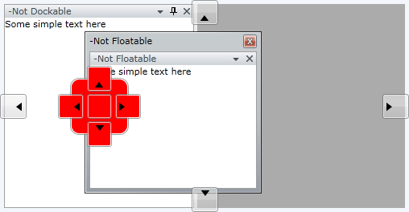

# Compass

The __Compass__ element makes the whole docking process much easier, faster and precise. Thanks to it you can re-arrange the panes of your working plot within a few seconds by just using [drag and drop](). The compass menu appears only when the user is dragging a pane, marking the possible docking positions within the root container and the container on which the mouse is currently over. 

>The menu that marks the docking positions within the container underneath the mouse is called __Compass__, while the one that marks the possible docking positions within the root container is called __RootCompass__.

## Compass

The __Compass__ menu is always shown in the middle of the container you are dragging your panes over. It has five indicators: Left, Top, Right, Bottom and Center, where each one of them points to the respective docking position within this container.

____

As you can see the __Compass__ is situated in the middle of the container on which your mouse is currently over. In this case the "Output" pane is being dragged over the container that hosts "Server Explorer" and "Toolbox" panes.

The class that represents the Compass element is __Telerik.Windows.Controls.Docking.Compass__ which derives from __System.Windows.Controls.Control__.

#### __C#__

{{region cs-raddocking-features-compass_0}}
	Compass compass = new Compass();
	compass.IsBottomIndicatorVisible = false;
	compass.IsCenterIndicatorVisible = false;
{{endregion}}

#### __VB.NET__

{{region vb-raddocking-features-compass_1}}
	Dim compass As Compass = New Compass()
	compass.IsBottomIndicatorVisible = False
	compass.IsCenterIndicatorVisible = False
{{endregion}}

The compass is a completely stylable control that can be easily customized. To learn more take a look at the [Styling the Compass]() topic. 

## Root Compass

The __RootCompass__ always marks the possible docking positions in the root docking container. It has four indicators: Left, Top, Right and Bottom, where each one of them points to the respective docking position within the root container.

____

As you can see the __RootCompass__ is situated in the middle of each of the four sides of the root container. In this case the "Server Explorer" pane is being dragged over the root container.

The class that represents the Compass element is __Telerik.Windows.Controls.Docking.RootCompass__ which derives from __Telerik.Windows.Controls.Docking.Compass__.

#### __C#__

{{region cs-raddocking-features-compass_2}}
	RootCompass rootCompass = new RootCompass();
	rootCompass.IsLeftIndicatorVisible = false;
	rootCompass.IsRightIndicatorVisible = false;
{{endregion}}

#### __VB.NET__

{{region vb-raddocking-features-compass_3}}
	Dim rootCompass As RootCompass = New RootCompass()
	rootCompass.IsLeftIndicatorVisible = False
	rootCompass.IsRightIndicatorVisible = False
{{endregion}}

The root compass is a completely stylable control that can be easily customized. To learn more take a look at the [Styling the RootCompass]() topic.

## Events

You can get notified when the __Compass__ and __RootCompass__ are shown via the __RadDocking__'s event __PreviewShowCompass__. This event can be used for implementation of [conditional docking]().

#### __C#__

{{region cs-raddocking-features-compass_4}}
	public partial class CompassSample : UserControl
	{
	    public CompassSample()
	    {
	        InitializeComponent();
	
	        radDocking.PreviewShowCompass += new EventHandler<Telerik.Windows.Controls.Docking.PreviewShowCompassEventArgs>( radDocking_PreviewShowCompass );
	    }
	
	    private void radDocking_PreviewShowCompass( object sender, Telerik.Windows.Controls.Docking.PreviewShowCompassEventArgs e )
	    {
	        e.Compass.Background = new SolidColorBrush( Colors.Red );
	    }
	}
{{endregion}}

#### __VB.NET__

{{region vb-raddocking-features-compass_5}}
	Public Partial Class CompassSample
	    Inherits UserControl
	
	    Public Sub New()
	        InitializeComponent()
	
	        AddHandler radDocking.PreviewShowCompass, AddressOf radDocking_PreviewShowCompass
	    End Sub
	
	    Private Sub radDocking_PreviewShowCompass(ByVal sender As Object, ByVal e As Telerik.Windows.Controls.Docking.PreviewShowCompassEventArgs)
	        e.Compass.Background = New SolidColorBrush(Colors.Red)
	    End Sub
	End Class
{{endregion}}

And the result:

# See Also

 * [Pane Groups]()

 * [Split Container]()

 * [Tool Window]()

 * [Drag and Drop]()

 * [Document Host]()

 * [Styling the Compass]()

 * [Styling the RootCompass]()
