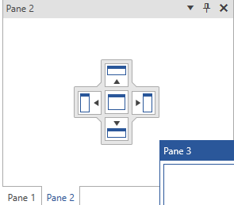
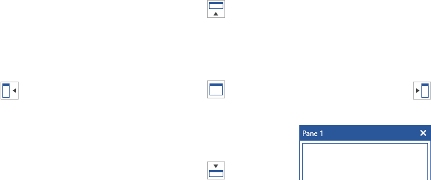

# Compass

The __Compass__ element makes the whole docking process much easier, faster and precise. Thanks to it you can re-arrange the panes of your working plot within a few seconds by using [drag and drop](). The compass menu appears only when the user is dragging a pane, marking the possible docking positions within the root container and the container on which the mouse is currently over. 

>The menu that marks the docking positions within the container underneath the mouse is called __Compass__, while the one that marks the possible docking positions within the root container is called __RootCompass__.

## Compass

The __Compass__ menu is always shown in the middle of the container you are dragging your panes over. It has five indicators: Left, Top, Right, Bottom and Center, where each one of them points to the respective docking position within this container.

#### __Figure 1: RadDocking Compass in the Office2016 theme__


As you can see the __Compass__ is situated in the middle of the container on which your mouse is currently over. In this case "Pane 3" is being dragged over the container that hosts "Pane 1" and "Pane 2" panes.

The class that represents the Compass element is [Telerik.Windows.Controls.Docking.Compass](https://docs.telerik.com/devtools/wpf/api/telerik.windows.controls.docking.compass) which derives from __System.Windows.Controls.Control__. In order to learn how to style it, take a look at the [Styling the Compass]() topic. 

## Root Compass

The __RootCompass__ always marks the possible docking positions in the root docking container. It has four indicators: Left, Top, Right and Bottom, where each one of them points to the respective docking position within the root container.

#### __Figure 1: RadDocking RootCompass in the Office2016 theme__


As you can see the __RootCompass__ is situated in the middle of each of the four sides of the root container. In this case "Pane 1" pane is being dragged over the root container.

The class that represents the RootCompass element is [Telerik.Windows.Controls.Docking.RootCompass](https://docs.telerik.com/DEVTOOLS/WPF/api/telerik.windows.controls.docking.rootcompass) which derives from __Telerik.Windows.Controls.Docking.Compass__. In order to learn how to style it, take a look at the [Styling the RootCompass]() topic.

## Events

You can get notified when the __Compass__ and __RootCompass__ are shown via the __PreviewShowCompass__ event of the __RadDocking__. This event can be used for implementation of [conditional docking]().

__Example 1: Handling the PreviewShowCompass event__

```C#
	       
	public CompassSample()
	{
	    InitializeComponent();
	
	    this.radDocking.PreviewShowCompass += new EventHandler<Telerik.Windows.Controls.Docking.PreviewShowCompassEventArgs>(radDocking_PreviewShowCompass);
	}
	
	private void radDocking_PreviewShowCompass(object sender, Telerik.Windows.Controls.Docking.PreviewShowCompassEventArgs e)
	{
		// The Compass property of the event arguments allows you to check whether the event is thrown for the Compass or the RootCompass
		if(e.Compass is RootCompass)
		{
			e.Compass.IsLeftIndicatorVisible = false;
			e.Compass.IsRightIndicatorVisible = false;
		}
	}
```
```VB.NET
	Public Sub New()
		InitializeComponent()
	
		AddHandler radDocking.PreviewShowCompass, AddressOf radDocking_PreviewShowCompass
	End Sub
	
	Private Sub radDocking_PreviewShowCompass(ByVal sender As Object, ByVal e As Telerik.Windows.Controls.Docking.PreviewShowCompassEventArgs)
		' The Compass property of the event arguments allows you to check whether the event is thrown for the Compass or the RootCompass
		If TypeOf e.Compass Is RootCompass Then
			e.Compass.IsLeftIndicatorVisible = False
			e.Compass.IsRightIndicatorVisible = False
		End If
	End Sub	
```

## See Also
 * [Pane Groups]()
 * [Split Container]()
 * [Tool Window]()
 * [Drag and Drop]()
 * [Document Host]()
 * [Styling the Compass]()
 * [Styling the RootCompass]()