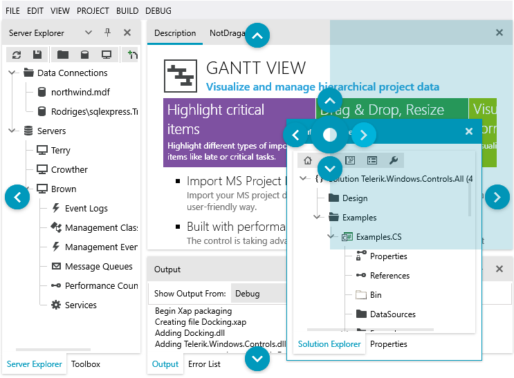
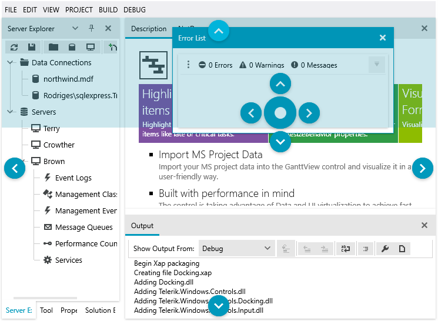
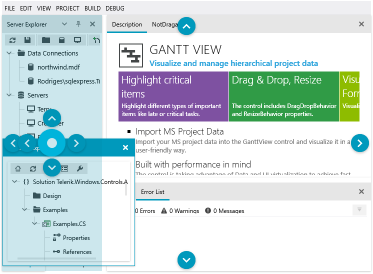
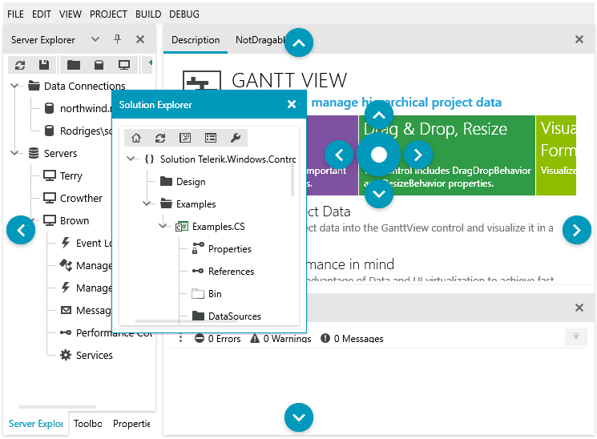
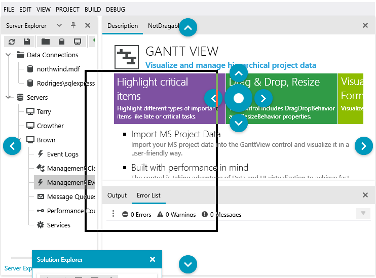

# Drag and Drop

The __Drag and Drop__ compatibilities of the __RadDocking__ control allow you to re-arange the panes in a complete __WYSIWYG__ manner. When the process of dragging starts, the [Compass]() menu appears to help you dock/undock your panes. 

Below you can find several step-by-step tutorials for the most common operations that can be accomplished via drag and drop.

>tipFind out how to implement [conditional docking]() using __PreviewShowCompass__ event exposed by __RadDocking__.

## Docking Panes to a Container

1. Click on the pane's header and start dragging it to the container you wish to dock your pane to. 

1. As soon as your mouse enters a container, the __Compass__ appears right in its middle. 

1. While keeping the mouse button down, position your mouse cursor over the __compass indicator__ that points to the area you wish to dock your pane to. Notice how the possible Dropping Area is highlighted. 

1. Drop the pane and see how it is docked in the highlighted area.

	

As you can see you have dragged your pane over the Compass' right indicator which leads to highlighting the respective dropping area inside the underlying container.

>Note that the Compass menu always marks the possible docking positions within the container your mouse cursor is currently over.

## Docking Panes to the Root Container

1. Click on the pane's header and start dragging it. 

1. The __Root Compass__ appears. 

1. While keeping the mouse button down, position your mouse cursor over the __root compass indicator__ that points to the area you wish to dock your pane to. Notice how the possible Dropping Area is highlighted. 

1. Drop the pane and see how it is docked in the highlighted area.

	

>Note that the Root Compass always marks the possible docking positions only for the root container.

## Adding Panes to Tabbed Documents

1. Click on the pane's header and start dragging it to the container you wish to dock your pane to. 

1. As soon as your mouse enters a container, the __Compass__ appears right in its middle. 

1. While keeping the mouse button down, position your mouse cursor over the __compass' center indicator__. Notice how the whole container is highlighted as Dropping Area. 

1. Drop the pane and see how it is docked as a new tab.

	

>tipTo dock a pane to a [Tabbed Document](), drag and drop it over the center indicator of the Compass.

## Undocking Panes

1. Click on the docked pane's header and start dragging it. 

1. While keeping the mouse button down, position your mouse cursor outside any __Compass__ elements. 

1. Drop the pane and notice that it is undocked and placed as a separate window ([ToolWindow]()).

	

>tipTo undock a pane and make it floatable, just drag it out of its current place and drop it outside any compass indicator.

## Using Native ToolWindow Drag

As of **R1 2020 SP1**, the RadDocking control exposes a **UseNativeInitialToolWindowDrag** property through which you can set to **True** to use the native Windows drag operation when first undocking a pane/group. This is useful if you wish to be able to use the [Windows Snap Assist feature](https://support.microsoft.com/en-us/help/4027324/windows-10-snap-your-windows) or take into account the "Show window contents while dragging" Windows setting.

__Enable Native ToolWindow Drag__  
```XAML
	<telerik:RadDocking x:Name="radDocking" UseNativeInitialToolWindowDrag="True">
		<!-- ... -->
	</telerik:RadDocking>
```



## Moving Panes Between RadDocking Instances

By default the panes in a `RadDocking` instance can be docked (or drag and dropped) only in the same `RadDocking` instance. To allow docking panes from one `RadDocking` instance to another, set the `DragDropGroup.Name` attached property on the `RadDocking` elements. Both instances should have the same name.

__Enable docking between separate RadDocking instances__
```XAML
	 <Grid>
        <Grid.ColumnDefinitions>
            <ColumnDefinition Width="*" />
            <ColumnDefinition Width="*" />
        </Grid.ColumnDefinitions>
		
        <telerik:RadDocking dock:DragDropGroup.Name="mainDragDropGroup">
            <!-- other XAML here -->
        </telerik:RadDocking>

		<telerik:RadDocking dock:DragDropGroup.Name="mainDragDropGroup" Grid.Column="1">
           <!-- other XAML here -->
        </telerik:RadDocking>
    </Grid>
```

## See Also

* [Tool Window]()
* [Compass]()
* [Save/Load Layout]()
