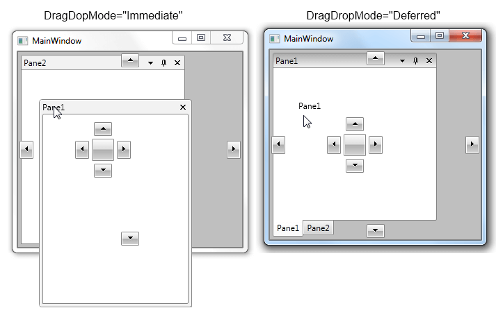
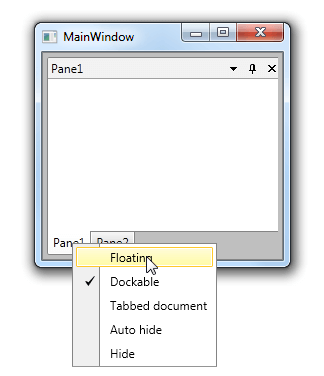
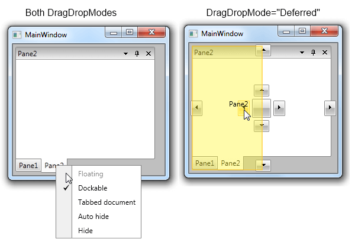

# DragDropMode

With the official Q1 2013 release of UI for SilverlightWPF we introduced a new DragDrop mode for the Docking control which enables dragging and dropping panes without being able to leave them floating.

This behavior can be turned on with the new __DragDropMode__ property which is of Enum type and can be set to any of the following values:

* __Immediate__ - the default DragDrop behavior.

* __Deferred__ - provides a completely different way of handling the drag and drop inside RadDocking. With it you can forbid floating of panes and at the same time allow dragging them.

The following snippets show how __DragDropMode__ property can be set in XAML and in code-behind:


```XAML
	<telerik:RadDocking x:Name="radDocking" DragDropMode="Deferred">
	    ...
	</telerik:RadDocking>
```


```C#
	radDocking.DragDropMode = DockingDragDropMode.Deferred;
```

Let's, for example, have the following RadDocking definition:


```XAML
	<telerik:RadDocking x:Name="radDocking1">
	    <telerik:RadSplitContainer>
	        <telerik:RadPaneGroup>
	            <telerik:RadPane Header="Pane1" >
	            </telerik:RadPane>
	            <telerik:RadPane Header="Pane2" CanFloat="False" />
	        </telerik:RadPaneGroup>
	    </telerik:RadSplitContainer>
	</telerik:RadDocking>
```

Note how the dragging of "Pane1" looks in both DragDropModes:



In the second case ( DragDropMode="Deferred"), "Pane1" can be made floating only through the ContextMenu:



>In "Deferred" DragDropMode if the pane is dropped in the Docking space, it will return to its previous position.

As to "Pane2" which has CanFloat property set to False - in "Immediate" DragDropMode the pane cannot be dragged at all while in "Deferred" it can be dragged and docked using the Compass. However, in both DragDropModes "Floating" option in the ContextMenu is disabled:

>In "Deffered" DragDropMode you will be able to drop a RadPane/RadPaneGroup between two RadPanes in a RadPaneGroup ([AllowDragReorder]() property is disregarded in this mode).
