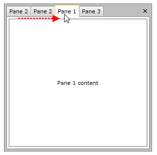
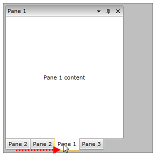

# DragReorder of Tabs

With the official Q3 2012 release of UI for SilverlightWPF we introduced the __DragReorder__ feature of __RadDocking__ control. This feature will help end users to easily reorder existing __RadPanes__ in a specific __RadPaneGroup__.

## Enabling and Disabling DragReorder

By default the __DragReorder__ feature is disabled. In order to enable it you will need to set the AllowDragReorder property of the control to true.

The next code snippet shows how to enable the DragReorder feature:

#### __XAML__

```XAML
	<telerik:RadDocking AllowDragReorder="True">
	    ...
	</telerik:RadDocking>
```

The following screenshots demonstrate the behavior of RadDocking when DragReorder feature is enabled:

* When RadPaneGroup is in DocumentHost:




* When RadPaneGroup is not in DocumentHost:


