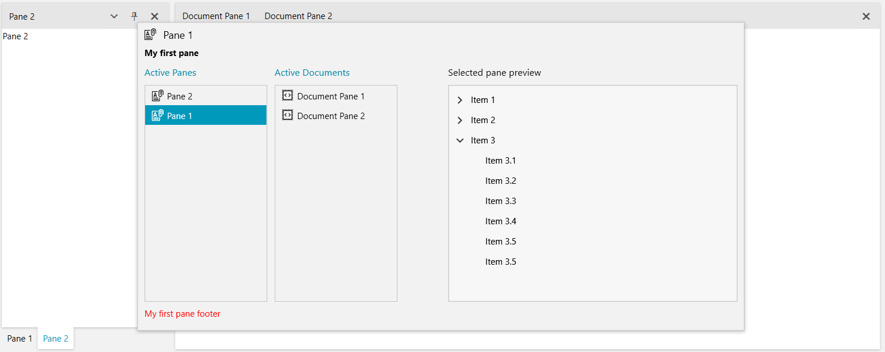

# Navigator

Since the __R2 2020 SP1__ version, the RadDocking allows you to navigate through its panes with the help of the __DockingNavigator__. Press the __Ctrl + Tab__ or __Alt + F7__ key combinations, use the arrow keys to navigate between panes and get a preview of their content. 

## Key Properties

The __DockingNavigator__ control consists of two listboxes allowing for the navigation between the RadPanes/RadDocumentPanes and a preview image showing the content of the current pane. It also has a header, description and footer sections showing more information about the selected pane. The following properties allow you to easily modify its look. 

* __IconTemplate__: Gets or sets the ContentTemplate of the icon presenter next to the header of the navigator. 
* __IconTemplateSelector__: Gets or sets the ContentTemplateSelector of the icon presenter next to the header of the navigator.
* __HeaderStringFormat__: Gets or sets the string format that will be applied to the header of the navigator, if the __HeaderTemplate__ property is not set. 
* __HeaderTemplate__: Gets or sets a DataTemplate that will be applied to the header of the navigator. 
* __HeaderTemplateSelector__: Gets or sets a DataTemplateSelector that allows to select a different DataTemplate depending on the currently selected pane. 
* __DescriptionStringFormat__: Gets or sets the string format that will be applied to the description of the selected pane, if the __DescriptionTemplate__ property is not set. 
* __DescriptionTemplate__: Gets or sets a DataTemplate that will be applied to the presenter of the description for the selected pane. 
* __DescriptionTemplateSelector__: Gets or sets a DataTemplateSelector that will be applied to the presenter of the description for the selected pane.
* __ActivePanesListBoxHeader__: Gets or sets a string displayed over the __DockingNavigatorListBox__ showing the non-document panes.
* __ActiveDocumentsListBoxHeader__: Gets or sets a string displayed over the __DockingNavigatorListBox__ showing the RadDocumentPanes.
* __ActivePanesListBoxStyle__: Gets or sets the __Style__ of the listbox showing the non-document panes. The __TargetType__ should be __DockingNavigatorListBox__.
* __ActiveDocumentsListBoxStyle__: Gets or sets the __Style__ of the listbox showing the RadDocumentPanes. The __TargetType__ should be __DockingNavigatorListBox__.
* __ItemTemplateSelector__: Gets or sets an __DockingNavigatorItemTemplateSelector__ instance, which allows you to specify DataTemplates for normal and document panes.
* __PreviewHeader__: Gets or sets a string displayed over the preview image. 
* __PreviewHeight__: Gets or sets the height of the preview image. 
* __PreviewWidth__: Gets or sets the width of the preview image.
* __FooterStringFormat__: Gets or sets the string format that will be applied to the footer of the navigator, if the __FooterTemplate__ property is not set. 
* __FooterTemplate__: Gets or sets a DataTemplate that will be applied to the footer of the navigator. 
* __FooterTemplateSelector__: Gets or sets a DataTemplateSelector that allows to select a different DataTemplate depending on the currently selected pane.

> The values of the __ActivePanesListBoxHeader__, __ActiveDocumentsListBoxHeader__ and __PreviewHeader__ properties are localized with the following keys: __Docking_ActivePanes__, __Docking_ActiveDocuments__ and __Docking_PreviewHeader__. For more information, check out the [Localization]() article. 

## Attached Properties

The __DockingNavigator__ exposes several attached properties which can be set on RadPane/RadDocumentPane instances in order to transfer information, which can be displayed while navigating. Those properties are used to prepare a __NavigatorItemViewModel__ object, which is the DataContext inside the __ItemTemplateSelector__.

* __Icon__: Gets or sets an object that will represent the icon for that pane.
* __Header__: Gets or sets a object that will represent the header for that pane. 
* __Footer__: Gets or sets a object that will represent the footer for that pane. 
* __Description__: Gets or sets a object that will represent the description for that pane. 

## Navigator Property 

__Example 1__ demonstrates how you can set the __Navigator__ property of the RadDocking to an instance of the __DockingNavigator__. It also demonstrates how you can set the DockingNavigator attached properties on the RadPanes/RadDocumentPanes in order to display additional information for a pane while navigating.

__Example 1: RadDocking with Navigator property set__
```XAML

	<Grid>
        <Grid.Resources>
            <DataTemplate x:Key="IconTemplate">
                <!-- The DataContext here is whatever is set to the telerik:DockingNavigator.Icon of the selected pane-->
                <telerik:RadGlyph Glyph="{Binding}" />
            </DataTemplate>
            <DataTemplate x:Key="DescriptionTemplate">
                <!-- The DataContext here is whatever is set to the telerik:DockingNavigator.Description of the selected pane-->
                <TextBlock Text="{Binding}" FontWeight="Bold" />
            </DataTemplate>
            <DataTemplate x:Key="FooterTemplate">
                <!-- The DataContext here is whatever is set to the telerik:DockingNavigator.Footer of the selected pane-->
                <TextBlock Text="{Binding}" Foreground="Red" FontFamily="Ariel" />
            </DataTemplate>
        </Grid.Resources>
		<telerik:RadDocking x:Name="docking" Margin="150">
            <telerik:RadDocking.Navigator>
                <telerik:DockingNavigator 
                                          PreviewWidth="400" 
                                          PreviewHeight="300" 
                                          Width="850"
                                          IconTemplate="{StaticResource IconTemplate}"
                                          DescriptionTemplate="{StaticResource DescriptionTemplate}"
                                          FooterTemplate="{StaticResource FooterTemplate}" />
            </telerik:RadDocking.Navigator>
            <telerik:RadDocking.DocumentHost>
				<telerik:RadSplitContainer>
					<telerik:RadPaneGroup>
						<telerik:RadDocumentPane Header="Document Pane 1"
                        telerik:DockingNavigator.Icon="&#xe63b;"
						telerik:DockingNavigator.Description="My first document pane"
						telerik:DockingNavigator.Footer="My first document footer">
                            <TextBlock TextWrapping="Wrap" Text="Press Ctrl + Tab or Alt + F7 to open the DockingNavigator."/>
                        </telerik:RadDocumentPane>
                        <telerik:RadDocumentPane Header="Document Pane 2" 
                        telerik:DockingNavigator.Icon="&#xe63b;"
						telerik:DockingNavigator.Description="My second document pane"
						telerik:DockingNavigator.Footer="My second document footer">
                            <TextBlock TextWrapping="Wrap" Text="Navigate between the panes using the arrow keys."/>
                        </telerik:RadDocumentPane>
                    </telerik:RadPaneGroup>
				</telerik:RadSplitContainer>
			</telerik:RadDocking.DocumentHost>

            <telerik:RadSplitContainer InitialPosition="DockedLeft">
                <telerik:RadPaneGroup>
                    <telerik:RadPane Header="Pane 1" 
                        telerik:DockingNavigator.Icon="&#xe64f;"
						telerik:DockingNavigator.Description="My first pane"
						telerik:DockingNavigator.Footer="My first pane footer">
                        <telerik:RadTreeView>
                            <telerik:RadTreeViewItem Header="Item 1">
                                <telerik:RadTreeViewItem Header="Item 1.1" />
                                <telerik:RadTreeViewItem Header="Item 1.2" />
                                <telerik:RadTreeViewItem Header="Item 1.3" />
                                <telerik:RadTreeViewItem Header="Item 1.4" />
                            </telerik:RadTreeViewItem>
                            <telerik:RadTreeViewItem Header="Item 2">
                                <telerik:RadTreeViewItem Header="Item 2.1" />
                                <telerik:RadTreeViewItem Header="Item 2.2" />
                            </telerik:RadTreeViewItem>

                            <telerik:RadTreeViewItem Header="Item 3" IsExpanded="True">
                                <telerik:RadTreeViewItem Header="Item 3.1" />
                                <telerik:RadTreeViewItem Header="Item 3.2" />
                                <telerik:RadTreeViewItem Header="Item 3.3" />
                                <telerik:RadTreeViewItem Header="Item 3.4" />
                                <telerik:RadTreeViewItem Header="Item 3.5" />

                                <telerik:RadTreeViewItem Header="Item 3.5" />
                            </telerik:RadTreeViewItem>
                        </telerik:RadTreeView>
                    </telerik:RadPane>
                    <telerik:RadPane Header="Pane 2" Content="Pane 2"
                        telerik:DockingNavigator.Icon="&#xe64f;"
						telerik:DockingNavigator.Description="My second pane"
						telerik:DockingNavigator.Footer="My second pane footer"/>
                </telerik:RadPaneGroup>
            </telerik:RadSplitContainer>
        </telerik:RadDocking>
	</Grid>
```

#### __Figure 1: Result from showing the navigator in Example 1__


## Events

The DockingNavigator class exposes several useful events, which can be used to alter its behavior: 

* __Opening__: Raised before the DockingNavigator is opened. The event handler receives two arguments:

    * The sender argument contains the DockingNavigator. This argument is of type object, but can be cast to the DockingNavigator type.

    * A __NavigatorOpeningEventArgs__ object. It exposes a __Cancel__ property, which allows for preventing the opening. 

    __Example 2: Handling the Opening event__
    ```C#
        private void DockingNavigator_Opening(object sender, NavigatorOpeningEventArgs e)
        {
            var navigatorViewModel = (sender as DockingNavigator).DataContext as NavigatorViewModel;

            // Preventing a specific pane from being shown in the navigator
            var itemToRemove = navigatorViewModel.ItemModels.FirstOrDefault(m => m.Header.ToString() == "Pane 1");
            navigatorViewModel.ItemModels.Remove(itemToRemove);
        }
    ```
```VB.NET
        Private Sub DockingNavigator_Opening(ByVal sender As Object, ByVal e As NavigatorOpeningEventArgs)
			Dim navigatorViewModel = TryCast((TryCast(sender, DockingNavigator)).DataContext, NavigatorViewModel)

			' Preventing a specific pane from being shown in the navigator
			Dim itemToRemove = navigatorViewModel.ItemModels.FirstOrDefault(Function(m) m.Header.ToString() = "Pane 1")
			navigatorViewModel.ItemModels.Remove(itemToRemove)
        End Sub
    ```

* __Closed__: Raised after the DockingNavigator is closed. The event handler receives two arguments:

    * The sender argument contains the DockingNavigator. This argument is of type object, but can be cast to the DockingNavigator type.

    * A __NavigatorClosedEventArgs__ object. It exposes a __PaneToActivate__ property of type RadPane, which gets or sets the pane that will be activated. 

## See Also

 * [RadPane]()
 * [RadDocumentPane]()
