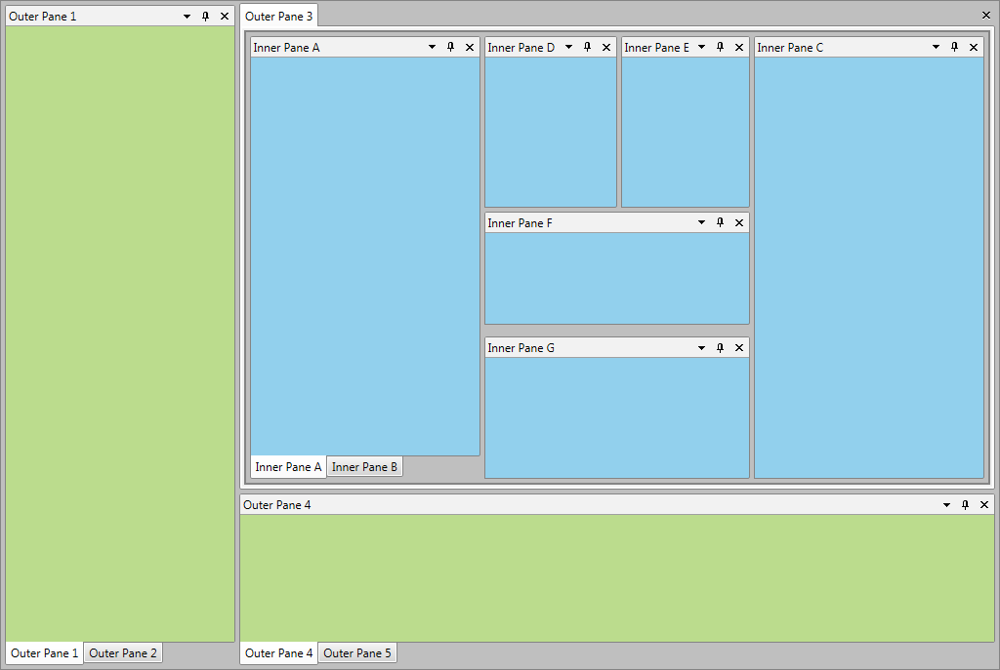
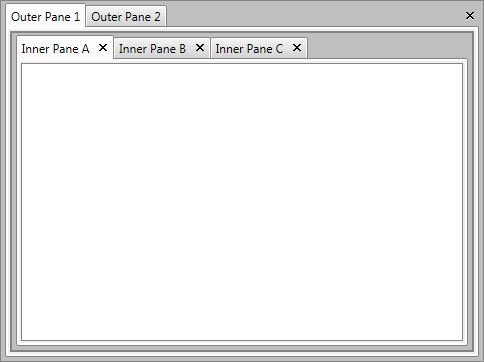
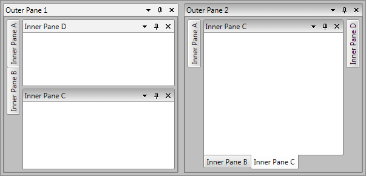
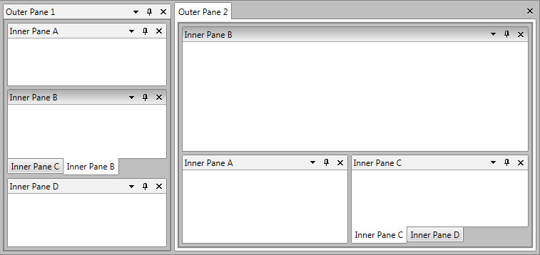
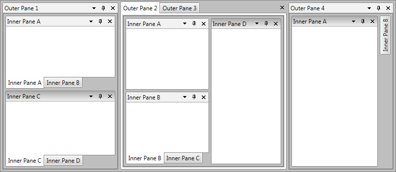

# Nested RadDocking Support

Even though the layout of __RadDocking__ is very agile and could be used to easily achieve many different layouts sometimes a more complex one is desired. In such scenarios it is possible to use nested __RadDocking__ instances which provide multiple __DocumentHosts__, multiple level of docking compass restriction and inner tabs inside __RadPanes__.



## Overview

With the Q1 2014 release of UI for WPF Silverlight __RadDocking__ has been improved in order to support multiple nested __RadDocking__ scenarios. Now you can easily implement more complex layouts by using all of the features of __RadDocking__ inside of a single __RadPane__. For example you can place a new __RadDocking__ instance with __DocumentHost__ inside of the __RadPane__ and easily achieve tabbed navigation using the __RadPanes__ in the __DocumentHost__. Some of the possible to achieve scenarios will be shown in this section as well as a simple *Getting Started* example.

## Getting Started

Implementing nested __RadDockings__ is quite intuitive and straightforward. Let’s start from the scratch here and achieve the already mentioned __RadPane__ with tabs inside. At the beginning you will need a __RadDocking__ control, with __DocumentHost__ and two __RadPanes__ inside:

#### __C#__

```C#
	<telerik:RadDocking x:Name="OuterDocking">
	    <telerik:RadDocking.DocumentHost>
	        <telerik:RadSplitContainer>
	            <telerik:RadPaneGroup>
	                <telerik:RadPane Header="Outer Pane 1" />
	                <telerik:RadPane Header="Outer Pane 2" />
	            </telerik:RadPaneGroup>
	        </telerik:RadSplitContainer>
	    </telerik:RadDocking.DocumentHost>
	</telerik:RadDocking>
```

Afterwards you will only have to add a new instance of __RadDocking__ inside of the first __RadPane__ as shown below:
    
#### __C#__

```C#
	<telerik:RadDocking x:Name="OuterDocking">
	    ...
	    <telerik:RadPane Header="Outer Pane 1">
	        <telerik:RadDocking x:Name="InnerDocking" CloseButtonPosition="InPane">
	            <telerik:RadDocking.DocumentHost>
	                <telerik:RadSplitContainer>
	                    <telerik:RadPaneGroup>
	                        <telerik:RadPane Header="Inner Pane A" />
	                        <telerik:RadPane Header="Inner Pane B" />
	                        <telerik:RadPane Header="Inner Pane C" />
	                    </telerik:RadPaneGroup>
	                </telerik:RadSplitContainer>
	            </telerik:RadDocking.DocumentHost>
	        </telerik:RadDocking>
	    </telerik:RadPane>
	    ...
	</telerik:RadDocking>
```

This will be the final result:

## Specific User Case Scenarios

In this section you can see screenshots of few layouts achieved with nested __RadDockings__:





## Save/Load Nested Docking Layout

The nested __RadDocking__ layouts can be easily saved and loaded using the built-in Save/Load Layout functionality of the control. In order to achieve Save/Load Layout for nested scenarios you will simply need to save each __RadDocking__ separately and load separately each of them afterwards. The direction of the loading operation should be from the inner __RadDockings__ to the outer ones in order to avoid any issues when loading floating __RadPanes/RadPaneGroups__.

>tipFor more details you can check the [Save/Load Layout]() article.

>tip You can download a runnable sample project demonstrating Save/Load Nested Docking Layouts from [the online SDK repository](https://github.com/telerik/xaml-sdk/tree/master/Docking/NestedDockingSaveLoadLayout).

## Not Supported Scenarios

The nested RadDockings have few unsupported scenarios:

* Nested scenarios in the autohide areas – due to dragging issues when __RadDocking__ is placed in an unpinned __RadPane__. In order to avoid that you could either disable the dragging within the inner __RadDocking__ (you just need to set CanFloat=”False” to each __RadPane__) or the __RadPane__ which holds it should be always pinned.

* Deferred DragDropMode is not supported in the nested __RadDockings__.
 
## See Also
 * [Panes]()

 * [Pane Groups]()

 * [Split Container]()

 * [Tool Window]()

 * [Save/Load Layout]()
