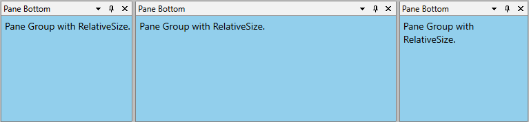
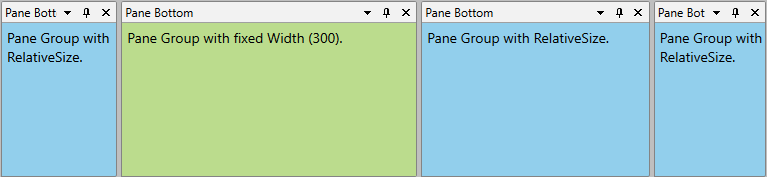

# Pane Groups

Each __RadPane__ provides built-in grouping functionality that allows you to place multiple panes inside a single container by organizing them in separate tab pages, similarly to the __RadTabControl__.

Each __RadPane__ can be grouped along with other __RadPanes__ inside of a single container like it is shown in the snapshot below.

>In order to group your panes, you should use the __Telerik.Windows.Controls.RadPaneGroup__ class.

The following cases will be examined:

* [Grouping panes run-time](#grouping-panes-run-time)

* [Grouping panes programmatically](#grouping-panes-programmatically)

* [Removing panes run-time](#removing-panes-run-time)

* [Removing panes programmatically](#removing-panes-programmatically)

* [Hiding all panes](#hiding-all-panes)

* [Showing all panes](#showing-all-panes)

* [Pinning all panes](#pinning-all-panes)

* [Unpining all panes](#unpining-all-panes)

* [Set relative size to the RadPaneGroup](#set-relative-size-to-the-radpanegroup)

* [Set (Min/Max)Width and (Min/Max)Height](#set-minmaxwidth-and-minmaxheight)

* [Other useful properties and methods exposed by the RadPaneGroup class](#other-properties-and-methods-exposed-by-the-radpanegroup-class)

## Grouping Panes Run-time

You can group panes during run-time by simply [dragging]() the pane to the desired container.

## Grouping Panes Programmatically

In order to group two or more panes, you should add them to the __RadPaneGroup__'s __Items__ collection like in the example below.

#### __[XAML] Example 1: Adding panes to a RadPaneGroup__

{{region xaml-raddocking-features-pane-groups_0}}
	<telerik:RadDocking x:Name="radDocking">
	    <telerik:RadSplitContainer>
	
	        <telerik:RadPaneGroup x:Name="Group1">
	            <telerik:RadPane x:Name="Pane1" Header="Server Explorer"/>
	            <telerik:RadPane x:Name="Pane2" Header="Toolbox"/>
	        </telerik:RadPaneGroup>
	
	    </telerik:RadSplitContainer>
	</telerik:RadDocking>
{{endregion}}

The same operation can be done in the code-behind. You can group panes using the __RadPaneGroup__'s __Items__ collection through procedural code:

#### __[C#] Example 2: Adding panes to a RadPaneGroup__

{{region cs-raddocking-features-pane-groups_1}}
	private void GroupPanes()
	{
	    Telerik.Windows.Controls.RadPane pane3 = new Telerik.Windows.Controls.RadPane();
	    pane3.Header = "Properties";
	    Group1.Items.Add(pane3);
	}
{{endregion}}

#### __[VB.NET] Example 2: Adding panes to a RadPaneGroup__

{{region vb-raddocking-features-pane-groups_2}}
	Private Sub GroupPanes()
		Dim pane3 As New Telerik.Windows.Controls.RadPane()
		pane3.Header = "Properties"
		Group1.Items.Add(pane3)
	End Sub
{{endregion}}

## Removing Panes Run-Time

In order to remove panes run-time you should either close the pane or remove the pane from the group via [drag and drop]().

>tipIf you want to restrict the user not to close panes, take a look at the [How to Disable the Close ("X") Button]() topic.

## Removing Panes Programmatically

You can remove panes using procedural code in two ways:

* Using the __RadPaneGroup__'s __Items__ collection

#### __[C#] Example 3: Removing panes from a RadPaneGroup__

{{region cs-raddocking-features-pane-groups_5}}
	private void RemovePane(RadPane paneToRemove)
	{
	    Group1.Items.Remove(paneToRemove);
	}
{{endregion}}

#### __[VB.NET] Example 3: Removing panes from a RadPaneGroup__

{{region vb-raddocking-features-pane-groups_6}}
	Private Sub RemovePane(ByVal paneToRemove As RadPane)
		Group1.Items.Remove(paneToRemove)
	End Sub
{{endregion}}

* Using the __RemoveFromParent__ method of the __RadPane__ class

#### __[C#] Example 4: Removing panes from a RadPaneGroup through the RemoveFromParent method__

{{region cs-raddocking-features-pane-groups_7}}
	private void RemovePane(RadPane paneToRemove)
	{
	    paneToRemove.RemoveFromParent();
	}
{{endregion}}

#### __[VB.NET] Example 4: Removing panes from a RadPaneGroup through the RemoveFromParent method__

{{region vb-raddocking-features-pane-groups_8}}
	Private Sub RemovePane(ByVal paneToRemove As RadPane)
		paneToRemove.RemoveFromParent()
	End Sub
{{endregion}}

## Hiding All Panes

The __RadPaneGroup__ class exposes __HideAllPanes__ method, which allows you to hide all visible panes belonging to the group.

#### __[C#] Example 5: Hiding all group panes__

{{region cs-raddocking-features-pane-groups_9}}
	private void HideAllPanes()
	{
	    Group1.HideAllPanes();
	}
{{endregion}}

#### __[VB.NET] Example 5: Hiding all group panes__

{{region vb-raddocking-features-pane-groups_10}}
	Private Sub HideAllPanes()
		Group1.HideAllPanes()
	End Sub
{{endregion}}

>__HideAllPanes__ method works only when all of the objects are constructed and added to the object tree. Which means that you should invoke it after the __Loaded__ event of the __RadDocking__ control has been fired.

## Showing All Panes

The __RadPaneGroup__ class exposes __ShowAllPanes__ method, which allows you to show all hidden panes belonging to the group.

#### __[C#] Example 6: Show all group panes__

{{region cs-raddocking-features-pane-groups_11}}
	private void ShowAllPanes()
	{
	    Group1.ShowAllPanes();
	}
{{endregion}}

#### __[VB.NET] Example 6: Show group panes__

{{region vb-raddocking-features-pane-groups_12}}
	Private Sub ShowAllPanes()
		Group1.ShowAllPanes()
	End Sub
{{endregion}}

>__ShowAllPanes__ method works only when all of the objects are constructed and added to the object tree. Which means that you should invoke it after the __Loaded__ event of the __RadDocking__ control has been fired.

>tipIf you need information about the events fired when showing and hiding panes, take a look at the [Events]() topic.

## Pinning All Panes

The __RadPaneGroup__ class exposes __PinAllPanes__ method, which allows you to pin all panes belonging to the group.

#### __[C#] Example 7: Pin all group panes__

{{region cs-raddocking-features-pane-groups_13}}
	private void PinAllPanes()
	{
	    Group1.PinAllPanes();
	}
{{endregion}}

#### __[VB.NET] Example 7: Pin all group panes__

{{region vb-raddocking-features-pane-groups_14}}
	Private Sub PinAllPanes()
		Group1.PinAllPanes()
	End Sub
{{endregion}}

>__PinAllPanes__ method works only when all of the objects are constructed and added to the object tree. Which means that you should invoke it after the __Loaded__ event has been fired.

## Unpining All Panes

The __RadPaneGroup__ class exposes __UnpinAllPanes__ method, which allows you to unpin all panes belonging to the group.

#### __[C#] Example 7: Unpin all group panes__

{{region cs-raddocking-features-pane-groups_15}}
	private void UnpinAllPanes()
	{
	    Group1.UnpinAllPanes();
	}
{{endregion}}

#### __[VB.NET] Example 7: Unpin all group panes__

{{region vb-raddocking-features-pane-groups_16}}
	Private Sub UnpinAllPanes()
		Group1.UnpinAllPanes()
	End Sub
{{endregion}}

>__UnpinAllPanes__ method works only when all of the objects are constructed and added to the object tree. Which means that you should invoke it after the __Loaded__ event of the __RadDocking__ control has been fired.

>tipIf you need information about the events fired when pinning and unpining panes, take a look at the [Events]() topic.

## Set Relative Size to the RadPaneGroup

The sizes of the __RadPaneGroups__ that are not directly set in the __RadDocking__ control, are set relatively. You can set relative size to a __RadPaneGroup__ by setting the __PropertionalStackPanel.RelativeSize__ attached property. By using this property you can proportionally divide the width or the hight occupied by two or more __RadPaneGroups__ docked to the same position. For example, if you have two pane groups docked to the top, the first one should occupy 1/3 of the available width and the second - the remaining 2/3, you have to set this proportion (1:2) in their widths as it is shown in the code snippet below.

#### __[XAML] Example 8: Set relative size__

{{region xaml-raddocking-features-pane-groups_17}}
	<telerik:RadDocking x:Name="radDocking1">
	    <telerik:RadSplitContainer Height="200" InitialPosition="DockedTop" Orientation="Horizontal">
	        <telerik:RadPaneGroup telerik:ProportionalStackPanel.RelativeSize="200, 200">
	            <telerik:RadPane Header="pane" />
	        </telerik:RadPaneGroup>
	        <telerik:RadPaneGroup telerik:ProportionalStackPanel.RelativeSize="400, 200">
	            <telerik:RadPane Header="pane" />
	        </telerik:RadPaneGroup>
	    </telerik:RadSplitContainer>
	</telerik:RadDocking>
{{endregion}}

**Figure 1** illustrates the result.

#### __Figure 1: Pane groups with proportional sizes__

As you can see, the first pane group occupies 1/3 of the available width, while the second occupies the rest 2/3. The height specified is ignored because the groups have the same height as the __RadSplitContainer__ in which they are hosted.

## Set (Min/Max)Width and (Min/Max)Height

Since version **R2 2017**, you can set fixed sizes to a __RadPaneGroup__ by setting the following attached properties of the **ProportionalStackPanel**:

* **ChildWidth**

* **ChildMinWidth**

* **ChildMaxWidth**

* **ChildHeight**

* **ChildMinHeight**

* **ChildMaxHeight**

#### __[XAML] Example 9: Setting ProportionalStackPanel.ChildWidth__

{{region xaml-raddocking-features-pane-groups_18}}
	<telerik:RadSplitContainer>
		<telerik:RadPaneGroup telerik:ProportionalStackPanel.ChildWidth="300">
	        <telerik:RadPane Header="Pane Bottom">
	            <TextBlock Text="Pane Group with RelativeSize" />
	        </telerik:RadPane>
	    </telerik:RadPaneGroup>
		<telerik:RadPaneGroup>
		    <telerik:RadPane Header="Pane Bottom">
		        <TextBlock Text="Pane Group with fixed Width (300)" />
		    </telerik:RadPane>
		</telerik:RadPaneGroup>
		<telerik:RadPaneGroup>
		    <telerik:RadPane Header="Pane Bottom">
		        <TextBlock Text="Pane Group with RelativeSize" />
		    </telerik:RadPane>
		</telerik:RadPaneGroup>
	</telerik:RadSplitContainer>
{{endregion}}

As can be seen on **Figure 2**, even when pane groups with fixed sizes are present, the remaining groups with proportional sizes will still resize accordingly.

#### __Figure 2: Pane group with fixed size among groups with proportional sizes__

>When both fixed and proportional sizes are set for a given group, the fixed size will take precedence.

## Other Properties and Methods Exposed by the RadPaneGroup class

* __IsInDocumentHost__ - read-only boolean property. Returns whether the current __RadPaneGroup__ is placed in [DocumentHost]().

* __IsInToolWindow__- read-only boolean property. Returns whether the current __RadPaneGroup__ is in [Tool Window]().

* __IsPaneHeaderVisible__- read-only boolean property. Returns whether the pane's header is visible.

* __SelectedPane__- returns the currently selected pane within the group.

* __EnumeratePanes()__- returns __IEnumeratble__ of __RadPane__ objects. These are all the panes that currently belonging to the group.

## Styling the RadPaneGroup

To learn how to style the __RadPaneGroup__ in your applications take a look at the [Styling the RadPaneGroup]() topic.

## See Also

 * [Split Container]()

 * [Tool Window]()

 * [Compass]()

 * [Document Host]()

 * [Styling the RadPaneGroup]()
