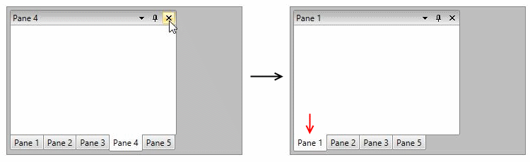
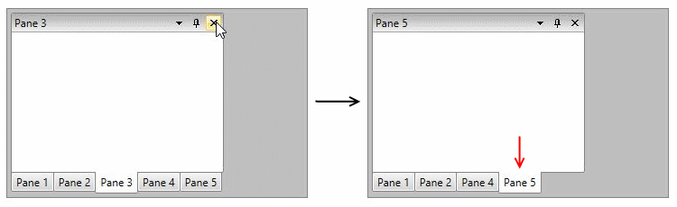
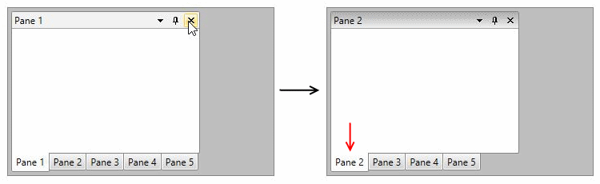
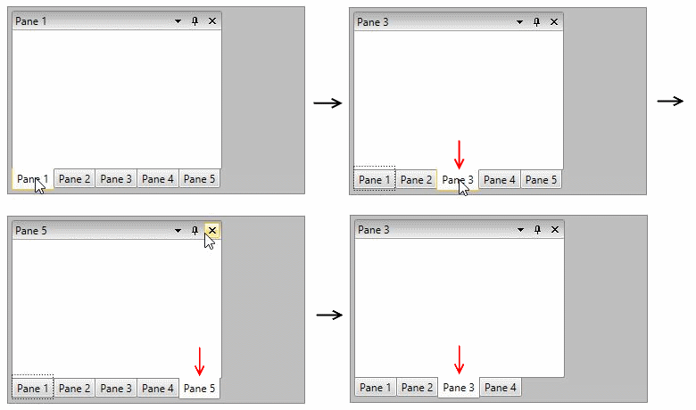

# RadPane Activation
			  
There are two possible approaches for activating/deactivating a pane - using the __ActivePane__ property of the **RadDocking** control or using the __IsActive__ property of the **RadPane**. Both approaches will lead to the same final result but could be used in different scenarios. Using the IsActive property of the RadPane is useful when you want to activate a pane but do not have a reference to the RadDocking control itself.
        
**Examples 1 and 2** show how to activate panes through the IsActive property.
        
__Example 1: Activate panes__

```XAML
	<Grid>
	    <Grid.RowDefinitions>
	        <RowDefinition Height="Auto"/>
	        <RowDefinition Height="*"/>
	    </Grid.RowDefinitions>
	    <Button Content="Set IsActive" Click="Button_Click"/>
	    <telerik:RadDocking Grid.Row="1" >
	        <telerik:RadSplitContainer>
	            <telerik:RadPaneGroup>
	                <telerik:RadPane Header="Pane 1" IsActive="True"/>
	                <telerik:RadPane Header="Pane 2"/>
	                <telerik:RadPane Header="Pane 3" x:Name="Pane3"/>
	            </telerik:RadPaneGroup>
	        </telerik:RadSplitContainer>
	    </telerik:RadDocking>
	</Grid>
```

__Example 2: Activate panes__

```C#
	private void Button_Click(object sender, RoutedEventArgs e)
	{
	    this.Pane3.IsActive = true;
	}
```
```VB.NET
	Private Sub Button_Click(ByVal sender As Object, ByVal e As RoutedEventArgs)
		Me.Pane3.IsActive = True
	End Sub
```

## PaneActivationMode

By default the next non-disabled and visible __RadPane__ in the PaneGroup is activated when the current active one is closed.

 RadDocking's **PaneActivationMode** property controls which RadPane should be focused/activated after another RadPane in its PaneGroup is closed. It is of type **ActivationMode** and can be set to the following values: 

* __First__: Activates the first non-disabled and visible __RadPane__ in the Items collection of the PaneGroup and if there isn't one - the first non-disabled and visible __RadPane__ in the Items collection of __RadDocking__ is activated.

* __Last__: Activates the last non-disabled and visible __RadPane__ in the Items collection of the PaneGroup and if there isn't one - the first non-disabled and visible __RadPane__ in the Items collection of __RadDocking__ is activated.

* __Previous__: Activates the previous non-disabled and visible __RadPane__ in the Items collection of the PaneGroup and if there isn't one - the first non-disabled and visible __RadPane__ in the Items collection of __RadDocking__ is activated.

* __Next__: *This is the default mode*. Activates the next non-disabled and visible __RadPane__ in the Items collection of the PaneGroup and if there isn't one - the first non-disabled and visible __RadPane__ in the Items collection of __RadDocking__ is activated.
            
* __LastActivated__: Activates the previous activated __RadPane__ in the Items collection of the PaneGroup and if there isn't one - the first non-disabled and visible __RadPane__ in the Items collection of __RadDocking__ is activated.

> If no pane can be activated no action is performed and the value of the **ActivePane** property is set to **null**.

Figures 1 through 4 will demonstrate the expected behaviors when using the above modes

#### Figure 1: Pane 1 is activated after closing Pane 4 with ActivationMode.First



#### Figure 2: Pane 5 is activated after closing Pane 3 with ActivationMode.Last



#### Figure 3: Pane 2 is activated after closing Pane 1 with ActivationMode.Next



#### Figure 4. Pane 3 is activated after closing Pane 5 with ActivationMode.LastActivated



> Notice that Pane 3 was the last active pane before closing Pane 5
