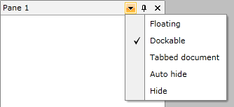
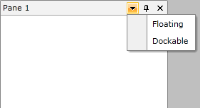

# Pane's Menu

Each __RadPane__ has a menu, which allow you to perform certain actions against the __RadPane__. By default the __RadMenu__ has the following items:

* __Floating__ - makes the __RadPane__ floating.

* __Dockable__ - docks the __RadPane__.

* __Tabbed Document__- places the __RadPane__ in the __DocumentHost__.

* __Auto Hide__- pins/unpins the __RadPane__, when it is docked.

* __Hide__ - hides the __RadPane__.



You can modify the menu by using the __ContextMenuTemplate__ property of the __RadPane__. It is of type __DataTemplate__ and is expected to contain a __RadContextMenu__. Here is an example:


```XAML
	<telerik:RadPane x:Name="radPane"
	             Header="Pane 1">
	    <telerik:RadPane.ContextMenuTemplate>
	        <DataTemplate>
	            <telerik:RadContextMenu>
	                <telerik:RadMenuItem Header="Floating" />
	                <telerik:RadMenuItem Header="Dockable" />
	            </telerik:RadContextMenu>
	        </DataTemplate>
	    </telerik:RadPane.ContextMenuTemplate>
	</telerik:RadPane>
```

To make the menu items functional you can use the predefined __RadDocking__ commands, which are located in the __RadDockingCommands__ class:

* __Close__

* __ContextMenuOpen__

* __Dockable__

* __Floating__

* __PaneHeaderMenuOpen__

* __Pin__

* __TabbedDocument__

>tipYou can also create your own custom commands and use them with the RadPane's menu. To learn how read [this topic]().

Here is the final code:

>The __RadDockingCommands__ class is located in the __Telerik.Windows.Controls__ namespace of the __Telerik.Windows.Controls__ assembly. To use it in XAML you have to declare the following namespace:


```XAML
	xmlns:telerik="http://schemas.telerik.com/2008/xaml/presentation"
```


```XAML
	<telerik:RadPane x:Name="radPane1"
	             Header="Pane 1">
	    <telerik:RadPane.ContextMenuTemplate>
	        <DataTemplate>
	            <telerik:RadContextMenu>
	                <telerik:RadMenuItem Header="Floating"
	                                       Command="telerik:RadDockingCommands.Floating" />
	                <telerik:RadMenuItem Header="Dockable"
	                                       Command="telerik:RadDockingCommands.Dockable" />
	            </telerik:RadContextMenu>
	        </DataTemplate>
	    </telerik:RadPane.ContextMenuTemplate>
	    <TextBlock Text="Some simple text here" />
	</telerik:RadPane>
```


