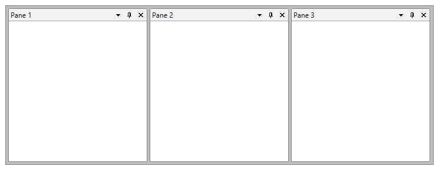
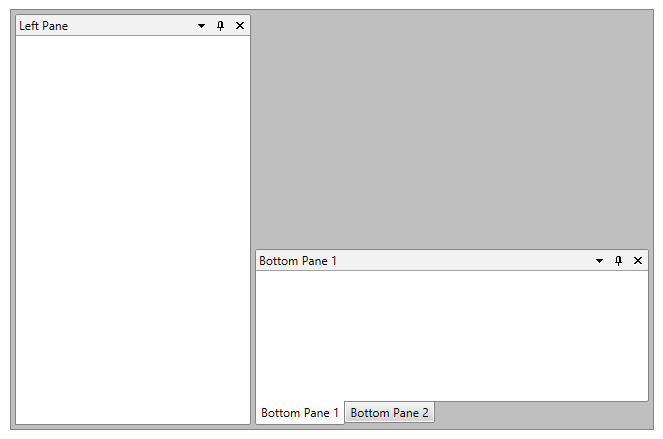

# PanesSource - MVVM Support

With our Q3 2013 SP release of UI for SilverlightWPF we are introducing a brand new mechanism in the __RadDocking__ control, the ability to bind a collection of objects to the RadDocking control. The __PanesSource__ property implementation is very similar to the __ItemsSource__ one in any ItemsControl control and it can be even bound to RadPane instances as well.

The __PanesSource__ property can be set/bound to any collection of objects. Because you could set this property to a collection of for example strings, ViewModels etc. the __RadDocking__ control needs a mechanism that tells it how to represent those objects in the control. This mechanism is the brand new __DockingPanesFactory__.

This help article demonstrates the basic uses of the __PanesSource__ and DockingPanesFactory with some commonly faced scenarios when using the __RadDocking__ control.

## Setting PanesSource

The __PanesSource__ can be set to collection of any type of objects. The most common scenario that you would face is where you would like to bind a collection of RadPane objects to the control. In that scenario you will need to simply create a collection of RadPanes and set it to the PanesSource property.

The next example demonstrates the described approach:

1. Create a ViewModel and add a collection of RadPane object property to it:

	```C#
		public class ViewModel : ViewModelBase
		{
		    private ObservableCollection<RadPane> panes;
		
		    public ViewModel()
		    {
		
		    }
		
		    public ObservableCollection<RadPane> Panes
		    {
		        get
		        {
		            return this.panes;
		        }
		
		        set
		        {
		            if (this.panes != value)
		            {
		                this.panes = value;
		                this.OnPropertyChanged(() => this.Panes);
		            }
		        }
		    }
		}
	```

1. Populate the collection with some sample data:

	```C#
		public class ViewModel : ViewModelBase
		{
		    private ObservableCollection<RadPane> panes;
		
		    public ViewModel()
		    {
		        this.Panes = new ObservableCollection<RadPane>()
		        {
		            new RadPane() { Header = "Pane 1" },
		            new RadPane() { Header = "Pane 2" },
		            new RadPane() { Header = "Pane 3" }
		        };
		    }
		
		    public ObservableCollection<RadPane> Panes
		    {
		        get
		        {
		            return this.panes;
		        }
		
		        set
		        {
		            if (this.panes != value)
		            {
		                this.panes = value;
		                this.OnPropertyChanged(() => this.Panes);
		            }
		        }
		    }
		}
	```

1. Finally bind the Panes collection to the __PanesSource__ property of the RadDocking control:

	```XAML
		<telerik:RadDocking PanesSource="{Binding Panes}">
		    <telerik:RadDocking.DockingPanesFactory>
		        <telerik:DockingPanesFactory/>
		    </telerik:RadDocking.DockingPanesFactory>
		</telerik:RadDocking>
	```

The final result is shown in the next figure:

 Figure 1. Each of the Objects from the Panes collection is added to a new RadSplitContainer and RadPaneGroup
 
 

>If the bound collection to the __PanesSource__ contains objects of RadPane type the Panes will be added to new RadPaneGroups that are docked to the left. If that collection contains objects of RadDocumentPane type those Panes will be added to the currently active RadPaneGroup of a RadDocument or if such doesn’t exists to a new RadPaneGroup that is added to DocumentHost of the control.

## Using DockingPanesFactory

As you noticed from the above example when you bind a collection to the PanesSource of the __RadDocking__ control the control itself knows how to render those objects in the context of the Docking control. That behavior is determined by the DockingPanesFactory of the control. The above behavior is the default behavior of this factory. In order to achieve a different behavior for example to be able to add multiple Panes from the bound collection to a specific PaneGroup you can create a custom DockingPanesFactory and override its methods.

The methods of the factory that could be overridden are the following:

Method Name	|	Description
---	|	---
AddPane	|	Adds the Pane to the RadDocking layout. If there is no available containers to generate the new content please use the RadDocking's GeneratedItemsFactory to create additional RadSplitContainers and RadPaneGroups.
CreatePaneForItem	|	Creates a new RadPane instance for item from the PanesSource collection. Make sure to apply set any properties, styles and templates so that the generated RadPane may look properly in the RadDocking.
GetPaneFromItem	|	Gets the RadPane from the item parameter.
IsItemItsOwnPaneContainer	|	Determines if the specified item is (or is eligible to be) its own RadPane container.
RemovePane	|	Removes the Pane from the RadDocking layout. By default clears the Header, Content, DataContext and call RemoveFromParent method.

>With R2 2016 of UI for WPFSilverlight an override for the __CreatePaneForItem__ method that accepts __RadDocking__ instance has been created. Using it you could easily access the instance of __RadDocking__ inside which the Pane has been added to.

The next example demonstrates a common scenario when using the PaneSource property of the control. When populating a docking manager control with collection of panes you would have a predefined layout of PaneGroups which should be populated with the Panes from that collection. In order to achieve the desired behavior you can take advantage of the DockingPanesFactory:

1. Create a Collection of RadPanes in the ViewModel and populate it with some sample data (the “__Tag__” will be used to determine in which predefined RadPaneGroup the Pane should be added):

	```C#
		public class ViewModel : ViewModelBase
		{
		    private ObservableCollection<RadPane> panes;
		
		    public ViewModel()
		    {
		        this.Panes = new ObservableCollection<RadPane>()
		        {
		            new RadPane() { Header = "Bottom Pane 1", Tag = "Bottom" },
		            new RadPane() { Header = "Bottom Pane 2", Tag = "Bottom" },
		            new RadPane() { Header = "Left Pane", Tag = "Left" }
		        };
		    }
		
		    public ObservableCollection<RadPane> Panes
		    {
		        get
		        {
		            return this.panes;
		        }
		
		        set
		        {
		            if (this.panes != value)
		            {
		                this.panes = value;
		                this.OnPropertyChanged(() => this.Panes);
		            }
		        }
		    }
		}
	```

1. Set the basic layout of the RadDocking by adding empty RadPaneGroups. Make sure to set their Names to as they will be used to determine if a Pane should be added to that group:

	```XAML
		<telerik:RadDocking PanesSource="{Binding Panes}">
		    <telerik:RadSplitContainer InitialPosition="DockedLeft">
		        <telerik:RadPaneGroup  x:Name="LeftPaneGroup">
		        </telerik:RadPaneGroup>
		    </telerik:RadSplitContainer>
		    <telerik:RadSplitContainer InitialPosition="DockedBottom">
		        <telerik:RadPaneGroup x:Name="BottomPaneGroup">
		        </telerik:RadPaneGroup>
		    </telerik:RadSplitContainer>
		</telerik:RadDocking>
	```

1. Create a class that inherits DockingPanesFactory:

	```C#
		public class CustomDockingPanesFactory : DockingPanesFactory
		{
		
		}
	```

1. Override the AddPane method of the factory and add a custom logic that will add the pane to the correct PaneGroup. You can use the SplitItems property of the RadDocking control to get all of the RadSplitcontainers and RadPAneGroups:

	```C#
		public class CustomDockingPanesFactory : DockingPanesFactory
		{
		    protected override void AddPane(Telerik.Windows.Controls.RadDocking radDocking, Telerik.Windows.Controls.RadPane pane)
		    {
		        var tag = pane.Tag.ToString();
		        var paneGroup = radDocking.SplitItems.ToList().FirstOrDefault(i => i.Control.Name.Contains(tag)) as RadPaneGroup;
		
		        if (paneGroup != null)
		        {
		            paneGroup.Items.Add(pane);
		        }
		        else
		        {
		            base.AddPane(radDocking, pane);
		        }
		    }
		}
	```

1. Set newly created DockingPanesFactory to the RadDocking control:

	```XAML
		<telerik:RadDocking PanesSource="{Binding Panes}">
		    <telerik:RadSplitContainer InitialPosition="DockedLeft">
		        <telerik:RadPaneGroup  x:Name="LeftPaneGroup1">
		        </telerik:RadPaneGroup>
		    </telerik:RadSplitContainer>
		    <telerik:RadSplitContainer InitialPosition="DockedBottom">
		        <telerik:RadPaneGroup x:Name="BottomPaneGroup1">
		        </telerik:RadPaneGroup>
		    </telerik:RadSplitContainer>
		    <telerik:RadDocking.DockingPanesFactory>
		        <local:CustomDockingPanesFactory />
		    </telerik:RadDocking.DockingPanesFactory>
		</telerik:RadDocking>
	```

The next figure shows the final result:

Figure 2. As expected two of the RadPanes are added to the “bottom” RadPaneGroup and one to the “left” one



>tip Find a runnable project of the previous example in the [WPF Samples GitHub repository](https://github.com/telerik/xaml-sdk/tree/master/Docking/CustomDockingPanesFactory).