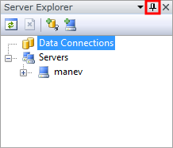
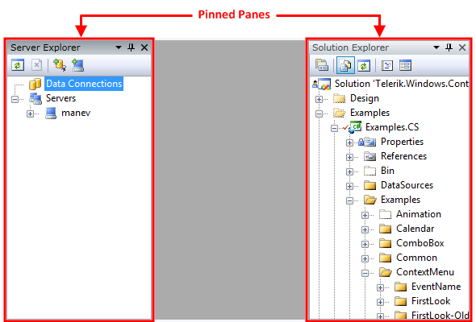
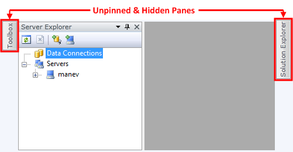
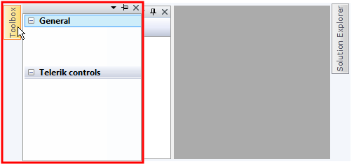
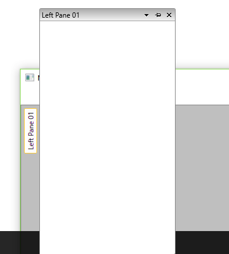
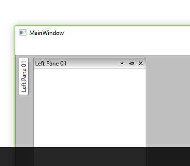
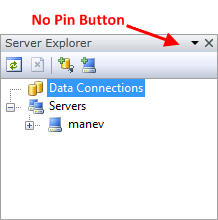

# Pinned/Unpinned Panes

Each __RadPane__ provides built-in pin/unpin functionality that allows you to control the behavior and the visualization of the docked __RadPanes__ during run-time.

By default this functionality is enabled and when a __RadPane__ is docked, pin/unpin toggle button is created and placed at its upper right corner. To toggle the pinned state of a certain __RadPane__ just click the button, highlighted on **Figure 1**.

#### Figure 1: Pin button on a docked pane



You can also change the pin state of a __RadPane__ programmatically using the __RadPane__'s boolean property __IsPinned__.

__Example 1: Set the IsPinned property on a pane__

```XAML
	<telerik:RadPane x:Name="radPane" IsPinned="True"/>
```


```C#
	radPane.IsPinned = true;
```
```VB.NET
	radPane.IsPinned = True
```

You can also [pin](#Pinning_All_Panes)/[unpin](#Unpining_All_Panes) all of the panes inside of a [RadPaneGroup]() using the methods __group.PinAllPanes()__/__group.UnpinAllPanes()__.

## Pinned Panes

You can recognize that a docked __RadPane__ is pinned if it is visible all the time, even if your mouse cursor is not over it. On the snapshot below you can see two pinned __RadPanes__ docked to the left and to the right side of the docking container. __Note that the pin icon of the toggle button is pointing downwards.__



## Unpinned Panes

The unpinned __RadPane__ is shown only when the mouse cursor is over it and is hidden when the cursor leaves its area. When it is hidden you can only see its tab header placed in the auto-hide area, while when shown, it is slided on the top of all the other controls without affecting the overall layout.

On the snapshot below you can see two unpinned __RadPanes__; the first is a "Toolbox" docked to the left, the second is a "Solution Explorer" docked respectively to the right. You can see that all their content is hidden, except their tab headers placed in the auto-hide area.



If you hover your mouse over the tab of the "Toolbox" pane, it will slide automatically overlapping the other content. __Note that the pin icon of the toggle button is pointing sideways.__



>tipIf you want to control the auto-hide area's width and hight of your unpinned panes use the respective __RadPane__'s properties __AutoHideHeight__ and __AutoHideWidth__. The size of the auto-hide area is also affected by the __FlyoutMinLength__ property of RadDocking.

## Let Auto-Hide Area Content Exceed Screen

As the element hosting the content of the pane when you hover over the auto-hide area is a popup, it will try to position itself optimally so that all of it's content is displayed. An example of this behavior when such a popup is opened near the edge of the screen is illustrated in **Figure 2**.

#### Figure 2: Default unpinned pane near the edge of the screen



If, however, you want to force the panes to go outside of the screen, you can set the **CanAutoHideAreaExceedScreen** property of the RadDocking control to **True**. The result in such a scenario can be observed in **Figure 3**.

#### Figure 3: Unpinned pane near the edge of the screen with CanAutoHideAreaExceedScreen set to True



## Disabling Pin

If you don't want your __RadPanes__ to be pinnable just set the __CanUserPin__ property to __False__. Once disabled the user will not be able to change the pin state of a __RadPane__ run-time because the toggle button will be hidden. This has been illustrated in **Figure 4**.

#### Figure 4: Docked pane with no pin button



__Example 2: Disable pinning of panes via the CanUserPin property__

```XAML
	<telerik:RadPane x:Name="radPane1" CanUserPin="False"/>
```


```C#
	radPane.CanUserPin = false;
```
```VB.NET
	radPane.CanUserPin = False
```

## See Also

 * [RadPane]()

 * [RadDocumentPane]()

 * [Docked/Floating Panes]()
