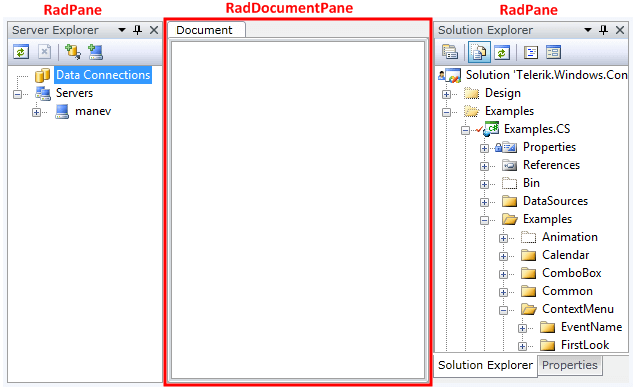

# RadDocumentPane

Since RadDocumentPane is a direct inheritor of __RadPane__, it shares the same code base as its parent - the [RadPane]() class. There aren't any functional or visual differences between the RadDocumentPane and the RadPane. The RadDocumentPane exists to simplify the distinguishing between document panes and tool panes for the developer.

To learn more about __RadDocumentPane__ take a look at the __RadPane__'s [Overview]() topic, since all of the characteristics and functionalities of the __RadPane__ are also valid for the RadDocumentPane.

>tip Use __RadDocumentPane__ to host any kind of documents that are editable by your application, while the utility panels can be hosted in the standard __RadPane__ control.

## See Also

 * [RadPane]()

 * [Docked/Floating Panes]()

 * [Pinned/Unpinned Panes]()