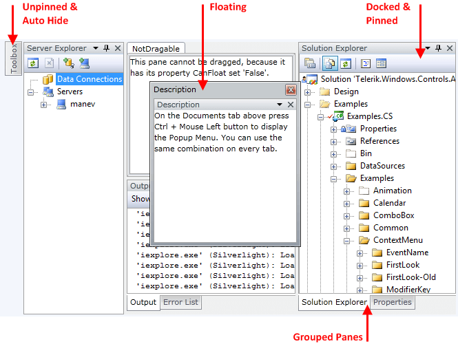
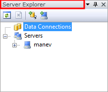
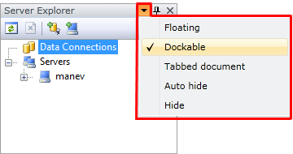
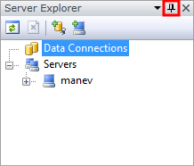
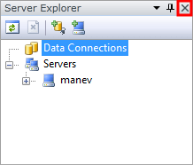
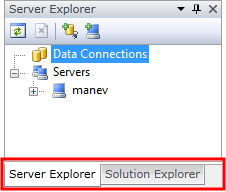

# RadPane

__RadPane__ is the main content unit of the __RadDocking__ control. Its main purpose is to act as a host of your content. That's why in order to have functional __RadDocking__ you need to have at least one RadPane placed inside it.
      

This help article covers the following topics:
      

* [RadPane States](#radpane-states)

* [Visual Elements](#visual-elements)

* [Closing RadPane instances](#closing-radpane-instances)

* [Styling and Appearance of the RadPane](#styling-and-appearance-of-the-radpane)

* [Conditional Docking](#conditional-docking)

* [RadPane Activation](#radpane-activation)

__RadPane__ cannot exist separately, it always has to be placed inside of a [RadPaneGroup]().The reason for this is because __RadPane__ is a container for the __RadPaneGroup__ which inherits ItemsControl.
      

>__A RadPane should be always placed inside of a RadPaneGroup.__

Here is a sample XAML code, showing you how to add two __RadPane__ instances to a __RadDocking__ control:
      

#### __XAML__

{{region raddocking-panes-radpane_0}}
	<telerik:RadDocking x:Name="radDocking">
	        <telerik:RadSplitContainer x:Name="radSplitContainer">
	            <telerik:RadPaneGroup x:Name="radPaneGroup">
	                <telerik:RadPane x:Name="radPane1" Header="Document 1">
	                    <TextBlock Text="Some simple text here"></TextBlock>
	                </telerik:RadPane>
	                <telerik:RadPane x:Name="radPane2" Header="Document 2">
	                    <TextBlock Text="Some simple text here"></TextBlock>
	                </telerik:RadPane>
	            </telerik:RadPaneGroup>
	        </telerik:RadSplitContainer>
	</telerik:RadDocking>
	{{endregion}}

#### __C#__

{{region raddocking-panes-radpane_1}}
	RadPane radPane1 = new RadPane();
	radPane1.Header = "Document 1";
	radPane1.Content = new TextBlock() { Text = "Some simple text here" };
	
	RadPane radPane2 = new RadPane();
	radPane2.Header = "Document 2";
	radPane2.Content = new TextBlock() { Text = "Some simple text here" };
	
	radPaneGroup.Items.Add( radPane1 );
	radPaneGroup.Items.Add( radPane2 );
	{{endregion}}

#### __VB.NET__

{{region raddocking-panes-radpane_2}}
	Dim radPane1 As New RadPane()
	radPane1.Header = "Document 1"
	Dim textBlock As New TextBlock()
	textBlock.Text = "Some simple text here"
	radPane1.Content = textBlock
	
	Dim radPane2 As New RadPane()
	radPane2.Header = "Document 2"
	textBlock = New TextBlock()
	textBlock.Text = "Some simple text here"
	radPane2.Content = textBlock
	
	radPaneGroup.Items.Add(radPane1)
	radPaneGroup.Items.Add(radPane2)
	{{endregion}}

And here is the result:

The control structure defined in the above example is (from the root container to the top one):

* __RadDocking__

* __RadSplitContainer__

* __RadPaneGroup__

* __RadPane__

__Keep in mind that in order to have functional docking you should stick to this structure without skipping any of its elements.__

## RadPane States

The standard RadPane can be [docked/floating](), [pinned/unpinned]() or [grouped]().  On the snapshot below you can see the appearance of the RadPane in each one of these states.
        

* __Docked__ - __RadPane__ is [docked](#Docking_Panes) to a __RadDocking__ container.
            

* __Floating__ - all not docked __RadPane__ instances are [floating](#Floating_Panes) and are hosted inside of a floatable [ToolWindow]() that appears on the top of the other controls.
            

* __Pinned__ - the [pinned](#Pinned_Panes) __RadPane__ is always visible and does not auto hide.
            

* __Unpinned__ - the [unpinned](#Unpinned_Panes) __RadPane__ is shown only when the mouse cursor is over it and hidden when the cursor leaves its area.
            

* __Grouped Panes__ - when multiple __RadPane__ instances are docked inside one and the same container, a separate tab page is created for each one of them. To learn more take a look at the [Grouped Panes]() topic.
            

>tipGet notified about the pane's state changes via the __RadDocking's__ event __PaneStateChanged__. Find out more about the __RadDocking__[events]().
          

## Visual Elements

The major control elements of a the standard __RadPane__ are:
        

* __Content Area__ - this is the area inside of a __RadPane__ where your content will be hosted. To set it or get it just use the __RadPane__'s property __Content__.
            

* __Header__ - this is the header control of a RadPane. In most cases it displays textual information. To learn how to customize the header take a look at: [Styling the Pane Header]() or [How to Add Buttons to the Pane Header]().
            

* __Menu__ - this menu is created automatically for you and contains the __RadPane__'s most common commands. It allows you to make it floating, dockable, part of a tabbed document or just hide it. The menu commands are programmatically accessible via the __RadPane__'s property __MenuCommands__. To learn how to customize this menu take a look at [How to Customize or Remove the RadPane's Menu]() or [RadDocking Localization]().
            

* __Pin/Unpin Button__ - this button allows you to [pin](#Pinned_Panes)/[unpin](#Unpinned_Panes) the RadPane in case it is docked inside of the __RadSplitContainer__. It is visible by default but if you want to hide it, and prevent the user from changing the pin state of your pane, just set the property __CanUserPin__ to __False__ and the button will be hidden. If you need to add more buttons take a look at the [How to Add Buttons to the Pane Header]() topic.
            

* __Close button__ - this button allows you to close the __RadPane__. It is visible by default but if you want to hide it, and prevent the user from closing your pane, just set the __RadPane__'s property __CanUserClose__ to __False__ and the button will be hidden. To learn more take a look at the [How to Disable the Close Button]() topic.
            

* __Tab__ - the tab is visible only when a __RadPane__ is docked inside of a container that hosts more than one panes. In that case each RadPane is placed as a separate tab item. To learn more take a look at the [Grouped Panes]() topic.
            

## Closing RadPane instances

Each __RadPane__ is closable by default via the Close button or the "Hide" menu shown on the snapshots above.
        

You can also hide/show your __RadPane__ instances programmatically using the boolean __RadPane__'s property __IsHidden.__When a __RadPane__ is closed it is actually hidden and you can always make it visible again when needed.
        

#### __XAML__

{{region raddocking-panes-radpane_3}}
	<telerik:RadPane x:Name="radPane" IsHidden="True"/>
	{{endregion}}

#### __C#__

{{region raddocking-panes-radpane_4}}
	radPane.IsHidden = true;
	{{endregion}}

#### __VB.NET__

{{region raddocking-panes-radpane_5}}
	radPane.IsHidden = true
	{{endregion}}

To learn how to disable the close button or how to handle the __RadDocking__'s __PreviewClose__ event take a look at the [How to Disable the Close Button]() topic.
        

## Styling and Appearance of the RadPane

If you need to customize or style your __RadPane__ instances  take a look at the following topics:
        

* [Controlling Appearance]()

* [Styling the RadPane]()

* [How to Customize or Remove the RadPane's Menu]()

* [How to Add Buttons to the Pane Header]()

* [How to Add Icon to the RadPane's Header]()

* [How to Freeze the Layout]()

## Conditional Docking

Thanks to the events exposed by the __RadDocking__and its elements you are able to control the docking process at run-time. For more information take a look at the [How to Implement Conditional Docking]() topic.
        

## RadPane Activation

With our Q3 2013 SP release of RadDocking we are introducing a public __IsActive__ Boolean property and a corresponding OnIsActiveChanged event that is triggered when that property changes its value.
        
<table> <th><tr><td>

Property/Event
                </td><td>

Description
                </td></tr></th><tr><td>

public bool <b>IsActive</b></td><td>

Gets or sets a value indicating whether this pane is active. This is a DependencyProperty.
              </td></tr><tr><td>

protected virtual void <b>OnIsActiveChanged()</b></td><td>

Occurs when IsActive property is changed.
              </td></tr></table>

There are two possible approaches when activating/deactivating a Pane. Using the __ActivePane__ property of the RadDocking control or using the newly added __IsActive__ property of the RadPane. Both approaches will lead to the same final result but could be used in different scenarios. Using the IsActive property of the RadPane is useful when you want to set a Pane active and do not have a reference to the RadDocking control itself.
        

The next example will demonstrate how you could activate (focus) a RadPane without the need to have a reference to the RadDocking control itself. You simply set the IsActive property of any RadPane to True.
        

#### __XAML__

{{region raddocking-panes-radpane_4}}
	<Grid>
	    <Grid.RowDefinitions>
	        <RowDefinition Height="Auto"/>
	        <RowDefinition Height="*"/>
	    </Grid.RowDefinitions>
	    <Button Content="Set IsActive" Click="Button_Click"/>
	    <telerik:RadDocking Grid.Row="1" >
	        <telerik:RadSplitContainer>
	            <telerik:RadPaneGroup>
	                <telerik:RadPane Header="Pane 1" IsActive="True"/>
	                <telerik:RadPane Header="Pane 2"/>
	                <telerik:RadPane Header="Pane 3" x:Name="Pane3"/>
	            </telerik:RadPaneGroup>
	        </telerik:RadSplitContainer>
	    </telerik:RadDocking>
	</Grid>
	{{endregion}}

#### __C#__

{{region raddocking-panes-radpane_5}}
	private void Button_Click(object sender, RoutedEventArgs e)
	{
	    this.Pane3.IsActive = true;
	}
	{{endregion}}

>tipYou can also check the article about the [PaneActivationMode]() property of 
            __RadDocking__ - it indicates which __RadPane__ should be activated when the current active one is closed. By
            default the next non-disabled and visible __RadPane__ in the PaneGroup is activated.
          

# See Also

 * [RadDocumentPane]()

 * [Docked/Floating Panes]()

 * [Pinned/Unpinned Panes]()

 * [Styling the RadPane]()

 * [Styling the Pane Header]()
