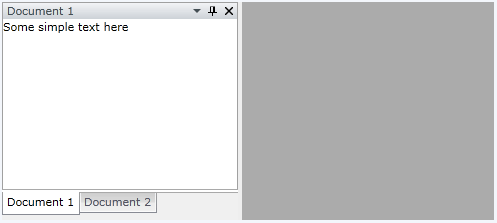

# RadPane

The __RadPane__ is the main content unit of the __RadDocking__ control. Its main purpose is to act as a host for your content. That's why in order to have a functional RadDocking control, you need to have at least one RadPane placed inside it.

>important RadPanes cannot exist separately and should always be placed inside of a [RadPaneGroup]().

## Define RadPanes

**Example 1** demonstrates how to add two __RadPane__ instances to a __RadDocking__ control.

__Example 1: Add RadPanes to RadDocking__

```XAML
	<telerik:RadDocking x:Name="radDocking">
	    <telerik:RadSplitContainer x:Name="radSplitContainer">
	        <telerik:RadPaneGroup x:Name="radPaneGroup">
	            <telerik:RadPane x:Name="radPane1" Header="Document 1">
	                <TextBlock Text="Some simple text here"></TextBlock>
	            </telerik:RadPane>
	            <telerik:RadPane x:Name="radPane2" Header="Document 2">
	                <TextBlock Text="Some simple text here"></TextBlock>
	            </telerik:RadPane>
	        </telerik:RadPaneGroup>
	    </telerik:RadSplitContainer>
	</telerik:RadDocking>
```

__Example 1: Add RadPanes to RadDocking__

```C#
	RadPane radPane1 = new RadPane();
	radPane1.Header = "Document 1";
	radPane1.Content = new TextBlock() { Text = "Some simple text here" };

	RadPane radPane2 = new RadPane();
	radPane2.Header = "Document 2";
	radPane2.Content = new TextBlock() { Text = "Some simple text here" };

	var radPaneGroup = new RadPaneGroup();
	radPaneGroup.Items.Add(radPane1);
	radPaneGroup.Items.Add(radPane2);
	var radSplitContainer = new RadSplitContainer();
	radSplitContainer.Items.Add(radPaneGroup);
	radDocking.Items.Add(radSplitContainer);
```
```VB.NET
	Dim radPane1 As New RadPane()
	radPane1.Header = "Document 1"
	radPane1.Content = New TextBlock() With {.Text = "Some simple text here"}

	Dim radPane2 As New RadPane()
	radPane2.Header = "Document 2"
	radPane2.Content = New TextBlock() With {.Text = "Some simple text here"}

	Dim radPaneGroup = New RadPaneGroup()
	radPaneGroup.Items.Add(radPane1)
	radPaneGroup.Items.Add(radPane2)
	Dim radSplitContainer = New RadSplitContainer()
	radSplitContainer.Items.Add(radPaneGroup)
	radDocking.Items.Add(radSplitContainer)
```

**Figure 1** displays the resulting RadDocking control.

#### Figure 1: RadDocking control with two panes



The control structure defined in the above example is (from the root container to the top one):

__RadDocking__ -> __RadSplitContainer__ -> __RadPaneGroup__ -> __RadPane__

>important In order to have a functional control you should stick to this structure without skipping any of its elements.
        
## Styling and Appearance of the RadPane

If you need to customize or style your __RadPane__ instances  take a look at the following topics:
       

* [Styling the RadPane]()
* [How to Customize or Remove the RadPane's Menu]()
* [How to Add Buttons to the Pane Header]()
* [How to Add Icon to the RadPane's Header]()
* [How to Freeze the Layout]()
          
## See Also

 * [Visual Structure]()
 * [Pane States]()
 * [RadDocumentPane]()
 * [Docked/Floating Panes]()
 * [Pinned/Unpinned Panes]()
 * [Pane Activation]()
 * [How to Implement Conditional Docking]()