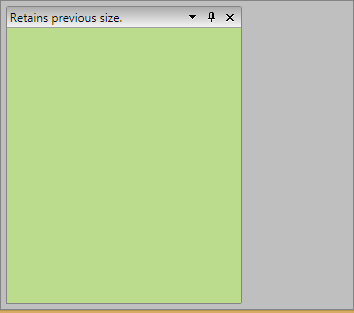

# Retain Pane Size

With the official Q2 2015 release version of UI for WPF, __RadDocking__ introduced a brand new feature which provides the ability to easily retain the size of the Panes.

Using the __RetainPaneSizeMode__ property you could choose between the following three modes that provide different behaviours for retaining the size:

* [__None__](#none) – this is the default value of the property and uses the default behaviour of __RadDocking__.

* [__Floating__](#floating) – retains the floating size of all Panes.

* [__DockingAndFloating__](#dockingandfloating) – when the Pane is floated it keeps its current docked size, while when it is docked it will keep the size of the __ToolWindow__. This mode provides you a behaviour identical to the one observed in Visual Studio.

The following snippets show how the __RetainPaneSizeMode__ property could be set in XAML and in code behind:

#### __XAML__

{{region raddocking-features-retain-pane-size_0}}
	<telerik:RadDocking RetainPaneSizeMode="Floating">
		... 
	</telerik:RadDocking>
{{endregion}}

#### __C#__

{{region raddocking-features-retain-pane-size_1}}
	this.radDocking.RetainPaneSizeMode = RetainSizeMode.Floating;
{{endregion}}

## None

When the __RetainPaneSizeMode__ property is set to __None__ if there is a Pane or Panes with a set __FloatingSize__ that size will always be kept when the Pane is docked/undocked. However, if a whole __PaneGroup__ (with multiple panes inside) is floated the __FloatingSize__ of the currently __SelectedPane__ of the __PaneGroup__ will be used.

#### __XAML__

{{region raddocking-features-retain-pane-size_2}}
	<telerik:RadPane telerik:RadDocking.FloatingSize="500 500">
		...	
	</telerik:RadPane> 
{{endregion}}

__Figure 1:__ Floating Pane with a set __FloatingSize__:

__Figure 2:__ The Pane is docked:

__Figure 3:__ The pane retains its __FloatingSize__ when it becomes floating again:

>Please, notice that in this mode only the __FloatingSize__ set to __RadPane__ is considered when it is docked/undocked.

## Floating

If the __RetainPaneSizeMode__ is set to __Floating__ the last floating size of each Pane will be always preserved. 

In scenarios where the Pane has __FloatingSize__ initially set that size will be applied only with the first undocking. Afterwards if the user changes the size of the Pane and docks it again the last floating size will be set when undocked again.

If Panes with different sizes are docked in same __PaneGroup__ and the group is made floating the size the __PaneGroup__ will receive is the last floating size of the current __SelectedPane__ of the group.

When there are several Panes docked in same __ToolWindow__ the size they will take when we drag them out is the size of that __ToolWindow__.

__Figure 1:__ The floating Pane is resized:

__Figure 2:__ The Pane is docked:

__Figure 3:__ The last floating size is kept when the Pane becomes floating again:

## DockingAndFloating

If you’re looking for a behavior identical to the one observed in Visual Studio the third mode of the __RetainPaneSizeMode__ provides it.

When RetainPaneSizeMode is set to __DockingAndFloating__ if a __Pane__ or __PaneGroup__ is undocked the size that will be kept is the current docked size. On the other hand if the __Pane__ or __PaneGroup__ is being docked the current __ToolWindow__ size will be kept if possible:

* If the __Pane/PaneGroup__ is docked left or right the __Width__ of the __ToolWindow__ will be kept unless the __ToolWindow__ has Width larger than the half of the Docking’s __Width__. If so the half of the Docking’s __Width__ will be taken. Please, notice that if the Docking has __DocumentHost__ there will be same space preserved for it.

* If the __Pane/PaneGroup__ is docked top or bottom the __Height__ of the __ToolWindow__ will be kept unless the __ToolWindow__ has a __Height__ larger that the half of the Docking’s __Height__. If so the half of the Docking’s __Height__ will be taken. Again, please notice that if the Docking has __DocumentHost__ there will be some space preserved for it.

__Figure 1:__ The Pane is docked:

__Figure 2:__ The last docked size is preserved when the Pane becomes floating:

>tipYou can download a runnable project that demonstrates all described above modes from our online SDK repository [here](https://github.com/telerik/xaml-sdk), the example is listed as Docking/RetainPaneSize.

# See Also

 * [RadPane]()

 * [Pane Groups]()

 * [Split Container]()

 * [Tool Window]()