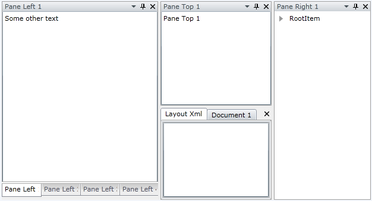

# Save/Load Layout

When building complex layout with __RadDocking,__ the users will often expect to persist the layout from one session to another. This can be easily achieved with the advanced Save/Load layout mechanism of the __RadDocking__.
      

The purpose of this tutorial is to show how to use the Save/Load layout mechanism of the __RadDocking__. The following cases will be examined:
      

* Saving layout
          

* Loading layout
          

* Using events to manage the save/load process
          

Create a new application and add the following initial __RadDocking__ declaration.
      

#### __XAML__

{{region raddocking-features-save-load-layout_0}}
	<telerik:RadDocking x:Name="radDocking">
	    <telerik:RadDocking.DocumentHost>
	
	        <telerik:RadSplitContainer>
	            <telerik:RadPaneGroup x:Name="DocumentGroup">
	                <telerik:RadPane x:Name="LayoutXml" Header="Layout Xml"
	      telerik:RadDocking.FloatingSize="450, 400">
	                    <TextBox TextWrapping="Wrap" x:Name="XmlTextBox"
	       VerticalScrollBarVisibility="Auto"
	       Text="{Binding Xml, Mode=TwoWay}" />
	                </telerik:RadPane>
	                <telerik:RadDocumentPane Header="Document 1" Title="Document 1">
	                    <TextBox x:Name="DocumentTextBox" Text="Some text" />
	                </telerik:RadDocumentPane>
	            </telerik:RadPaneGroup>
	        </telerik:RadSplitContainer>
	
	    </telerik:RadDocking.DocumentHost>
	
	    <telerik:RadSplitContainer InitialPosition="DockedLeft">
	        <telerik:RadPaneGroup>
	            <telerik:RadPane Header="Pane Left 1">
	                <TextBox x:Name="TextBox" Text="Some other text" />
	            </telerik:RadPane>
	            <telerik:RadPane Header="Pane Left 2">
	                <TextBox Text="Pane Left 2" />
	            </telerik:RadPane>
	            <telerik:RadPane Header="Pane Left 3">
	                <TextBox Text="Pane Left 3" />
	            </telerik:RadPane>
	            <telerik:RadPane Header="Pane Left 4">
	                <TextBox Text="Pane Left 4" />
	            </telerik:RadPane>
	        </telerik:RadPaneGroup>
	    </telerik:RadSplitContainer>
	
	    <telerik:RadSplitContainer InitialPosition="DockedRight">
	        <telerik:RadPaneGroup>
	            <telerik:RadPane Header="Pane Right 1">
	                <telerik:RadTreeView>
	                    <telerik:RadTreeViewItem Header="RootItem">
	                        <telerik:RadTreeViewItem Header="Item1" />
	                        <telerik:RadTreeViewItem Header="Item2">
	                            <telerik:RadTreeViewItem Header="Item21" />
	                            <telerik:RadTreeViewItem Header="Item22" />
	                            <telerik:RadTreeViewItem Header="Item23">
	                                <telerik:RadTreeViewItem Header="Item231" />
	                            </telerik:RadTreeViewItem>
	                        </telerik:RadTreeViewItem>
	                        <telerik:RadTreeViewItem Header="Item3" />
	                    </telerik:RadTreeViewItem>
	                </telerik:RadTreeView>
	            </telerik:RadPane>
	        </telerik:RadPaneGroup>
	    </telerik:RadSplitContainer>
	
	    <telerik:RadSplitContainer InitialPosition="DockedTop">
	        <telerik:RadPaneGroup>
	            <telerik:RadPane Header="Pane Top 1">
	                <TextBox Text="Pane Top 1" />
	            </telerik:RadPane>
	        </telerik:RadPaneGroup>
	    </telerik:RadSplitContainer>
	</telerik:RadDocking>
	{{endregion}}

## Saving Layout

__RadDocking__gives you the ability to store the entire layout in a stream containing XML. In order to do that you need to use the __SaveLayout__method of an instance of the __RadDocking__ control. Additionally, you can choose to save the stream elsewhere, in a textbox, or directly in the file system.
        

Perform the following steps:

Set the __RadDocking.SerializationTag__attached property for each one of the panes in your xaml declaration.
        

#### __XAML__

{{region raddocking-features-save-load-layout_1}}
	...
	<telerik:RadPane x:Name="LayoutXml" Header="Layout Xml"
	                                telerik:RadDocking.SerializationTag="LayoutXml"
	        telerik:RadDocking.FloatingSize="450, 400">
	...
	<telerik:RadDocumentPane Header="Document 1" Title="Document 1"
	                            telerik:RadDocking.SerializationTag="DocumentPane">
	...
	<telerik:RadPane Header="Pane Left 1"
	                        telerik:RadDocking.SerializationTag="PaneLeft1">
	...
	<telerik:RadPane Header="Pane Left 2"
	                        telerik:RadDocking.SerializationTag="PaneLeft2">
	...
	<telerik:RadPane Header="Pane Left 3"
	                        telerik:RadDocking.SerializationTag="PaneLeft3">
	...
	<telerik:RadPane Header="Pane Left 4"
	                        telerik:RadDocking.SerializationTag="PaneLeft4">
	...
	<telerik:RadPane Header="Pane Right 1"
	                        telerik:RadDocking.SerializationTag="PaneRight1">
	...
	<telerik:RadPane Header="Pane Top 1"
	                        telerik:RadDocking.SerializationTag="PaneTop1">
	{{endregion}}

Use the __SaveLayout__method of the __RadDocking__ class. The following example demonstrates how to save the __RadDocking__ layout in the IsolatedStorage. The generated XML is returned as well.
        

#### __C#__

{{region raddocking-features-save-load-layout_2}}
	private string SaveLayout()
	{
	    string xml;
	    // Save your layout for example in the isolated storage.
	    using ( IsolatedStorageFile storage = IsolatedStorageFile.GetUserStoreForApplication() )
	    {
	        using ( var isoStream = storage.OpenFile( "RadDocking_Layout.xml", FileMode.Create ) )
	        {
	            this.radDocking.SaveLayout( isoStream );
	            isoStream.Seek( 0, SeekOrigin.Begin );
	            StreamReader reader = new StreamReader( isoStream );
	            xml = reader.ReadToEnd();
	        }
	    }
	    // Return the generated XML
	    return xml;
	}
	{{endregion}}

#### __VB.NET__

{{region raddocking-features-save-load-layout_3}}
	Private Function SaveLayout() As String
	 Dim xml As String
	 ' Save your layout for example in the isolated storage.
	 Using storage As IsolatedStorageFile = IsolatedStorageFile.GetUserStoreForApplication()
	  Using isoStream = storage.OpenFile("RadDocking_Layout.xml", FileMode.Create)
	   Me.radDocking.SaveLayout(isoStream)
	   isoStream.Seek(0, SeekOrigin.Begin)
	   Dim reader As New StreamReader(isoStream)
	   xml = reader.ReadToEnd()
	  End Using
	 End Using
	 ' Return the generated XML
	 Return xml
	End Function
	{{endregion}}



#### __C#__

{{region raddocking-features-save-load-layout_2_1}}
	private string SaveLayout()
	{
	    string xml;
	    // Save your layout for example in the isolated storage.
	    using ( IsolatedStorageFile storage = IsolatedStorageFile.GetUserStoreForAssembly() )
	    {
	        using ( var isoStream = storage.OpenFile( "RadDocking_Layout.xml", FileMode.Create ) )
	        {
	            this.radDocking.SaveLayout( isoStream );
	            isoStream.Seek( 0, SeekOrigin.Begin );
	            StreamReader reader = new StreamReader( isoStream );
	            xml = reader.ReadToEnd();
	        }
	    }
	    // Return the generated XML
	    return xml;
	}
	{{endregion}}

#### __VB.NET__

{{region raddocking-features-save-load-layout_3_1}}
	Private Function SaveLayout() As String
	 Dim xml As String
	 ' Save your layout for example in the isolated storage.
	 Using storage As IsolatedStorageFile = IsolatedStorageFile.GetUserStoreForAssembly()
	  Using isoStream = storage.OpenFile("RadDocking_Layout.xml", FileMode.Create)
	   Me.radDocking.SaveLayout(isoStream)
	   isoStream.Seek(0, SeekOrigin.Begin)
	   Dim reader As New StreamReader(isoStream)
	   xml = reader.ReadToEnd()
	  End Using
	 End Using
	 ' Return the generated XML
	 Return xml
	End Function
	{{endregion}}



Here is how the result XML will look like for the above example:

#### __XAML__

{{region raddocking-features-save-load-layout_4}}
	<?xml version="1.0" encoding="utf-8"?>
	<RadDocking>
	    <DocumentHost>
	        <RadSplitContainer Dock="DockedLeft">
	            <Items>
	                <RadPaneGroup SelectedIndex="-1">
	                    <Items>
	                        <RadPane SerializationTag="LayoutXml" IsDockable="True" Header="Layout Xml" />
	                        <RadDocumentPane SerializationTag="DocumentPane" IsDockable="True" Title="Document 1" Header="Document 1" />
	                    </Items>
	                </RadPaneGroup>
	            </Items>
	        </RadSplitContainer>
	    </DocumentHost>
	    <SplitContainers>
	        <RadSplitContainer Dock="DockedLeft">
	            <Items>
	                <RadPaneGroup SelectedIndex="-1">
	                    <Items>
	                        <RadPane SerializationTag="PaneLeft1" IsDockable="True" Header="Pane Left 1" />
	                        <RadPane SerializationTag="PaneLeft2" IsDockable="True" Header="Pane Left 2" />
	                        <RadPane SerializationTag="PaneLeft3" IsDockable="True" Header="Pane Left 3" />
	                        <RadPane SerializationTag="PaneLeft4" IsDockable="True" Header="Pane Left 4" />
	                    </Items>
	                </RadPaneGroup>
	            </Items>
	        </RadSplitContainer>
	        <RadSplitContainer Dock="DockedRight">
	            <Items>
	                <RadPaneGroup SelectedIndex="-1">
	                    <Items>
	                        <RadPane SerializationTag="PaneRight1" IsDockable="True" Header="Pane Right 1" />
	                    </Items>
	                </RadPaneGroup>
	            </Items>
	        </RadSplitContainer>
	        <RadSplitContainer Dock="DockedTop">
	            <Items>
	                <RadPaneGroup SelectedIndex="-1">
	                    <Items>
	                        <RadPane SerializationTag="PaneTop1" IsDockable="True" Header="Pane Top 1" />
	                    </Items>
	                </RadPaneGroup>
	            </Items>
	        </RadSplitContainer>
	    </SplitContainers>
	</RadDocking>
	{{endregion}}

>tipThere are two steps you should perform in order to save your layout (and one more that is optional):

1. 
              Mark all __RadPanes__ with the __RadDocking.SerializationTag__.
            

1. 
              Use the __SaveLayout__method of the __RadDocking__to save your layout in a stream.
            

1. (Optional) Save the stream in the isolated storage.

>When you load the layout, all the elements that are not marked with __SerializationTag__ property are removed and new components are created instead. That is the reason why you should mark your panes with the __SerializationTag__ attribute.
          

## Load Layout

In order to load the docking layout you need to do absolutely the same things but in reverse order.

* First, load the stream (e.g. from the isolated storage).
            

* Second, use the __LoadLayout__method of the __RadDocking__ control.
            

#### __C#__

{{region raddocking-features-save-load-layout_5}}
	private void LoadLayout()
	{
	    // Load your layot from the isolated storage.
	    using ( IsolatedStorageFile storage = IsolatedStorageFile.GetUserStoreForApplication() )
	    {
	        using ( var isoStream = storage.OpenFile( "RadDocking_Layout.xml", FileMode.Open ) )
	        {
	            this.radDocking.LoadLayout( isoStream );
	        }
	    }
	}
	{{endregion}}

#### __VB.NET__

{{region raddocking-features-save-load-layout_6}}
	Private Sub LoadLayout()
	 ' Load your layot from the isolated storage.
	 Using storage As IsolatedStorageFile = IsolatedStorageFile.GetUserStoreForApplication()
	  Using isoStream = storage.OpenFile("RadDocking_Layout.xml", FileMode.Open)
	   Me.radDocking.LoadLayout(isoStream)
	  End Using
	 End Using
	End Sub
	{{endregion}}



#### __C#__

{{region raddocking-features-save-load-layout_5_1}}
	private void LoadLayout()
	{
	    // Load your layot from the isolated storage.
	    using ( IsolatedStorageFile storage = IsolatedStorageFile.GetUserStoreForAssembly() )
	    {
	        using ( var isoStream = storage.OpenFile( "RadDocking_Layout.xml", FileMode.Open ) )
	        {
	            this.radDocking.LoadLayout( isoStream );
	        }
	    }
	}
	{{endregion}}

#### __VB.NET__

{{region raddocking-features-save-load-layout_6_1}}
	Private Sub LoadLayout()
	 ' Load your layot from the isolated storage.
	 Using storage As IsolatedStorageFile = IsolatedStorageFile.GetUserStoreForAssembly()
	  Using isoStream = storage.OpenFile("RadDocking_Layout.xml", FileMode.Open)
	   Me.radDocking.LoadLayout(isoStream)
	  End Using
	 End Using
	End Sub
	{{endregion}}



## Events

The __RadDocking__API offers you six events for managing the save/load layout behavior:
        

* __ElementLoading__ - raised when a docking element (__Pane__, __PaneGroup__or __SplitContainer__) is about to be loaded.
            

* __ElementLoaded__- raised after a docking element (__Pane__, __PaneGroup__or __SplitContainer__) is loaded.
            

* __ElementSaving__ - raised when a docking element (__Pane__, __PaneGroup__or __SplitContainer__) is about to be saved.
            

* __ElementSaved__ - raised after a docking element (__Pane__, __PaneGroup__or __SplitContainer__) is saved.
            

* __ElementCleaning__- raised when a docking element (__Pane__, __PaneGroup__or __SplitContainer__) is about to be cleaned.
            

* __ElementCleaned__- raised after a docking element (__Pane__, __PaneGroup__or __SplitContainer__) is cleaned.
            

The type of the event arguments for the __ElementLoading__event is __Telerik.Windows.Controls.LayoutSerializationLoadingEventArgs__. The type of the event arguments for the other five events is: __Telerik.Windows.Controls.LayoutSerializationEventArgs.__Via both of the event arguments you get access to the following properties:
        

* __AffectedElement__- this is the currently loaded\saved pane.
            

* __AffectedElementSerializationTag__- this is the currently loaded\save serialization tag. In the previous example if you attach to any of the events, then the first time when the __AffectedElementSerializationTag__ is fired, it will have the value "LayoutXml".
            

>tipThe __Telerik.Windows.Controls.LayoutSerializationLoadingEventArgs__ allows you to point out an instance to be used as a newly loaded control. This could be useful if you need to create the instances yourself.
          

>You have the ability to "say" whether these event to be fired or not, when the __SerializationTag__ is __not specified__. You should use the second overload of the __LoadLayout__ and __SaveLayout__ methods.
          

#### __C#__

{{region raddocking-features-save-load-layout_7}}
	public void SaveLayout( Stream destination, bool raiseEventsIfNoSerializationTag );
	{{endregion}}

#### __VB.NET__

{{region raddocking-features-save-load-layout_8}}
	Public Sub SaveLayout(ByVal destination As Stream, ByVal raiseEventsIfNoSerializationTag As Boolean)
	End Sub
	{{endregion}}

>By default when you use the __SaveLayout__ method only the layout (without the content) will be saved. That's why the most common use of the fourth events is to save (respectively load) the pane's content. In order to see how to do that take a look at the [Save/Load the Content of the Panes]() topic.
          

# See Also

 * [Pane Groups]()

 * [Split Container]()

 * [Tool Window]()

 * [Save/Load the Content of the Panes]()
