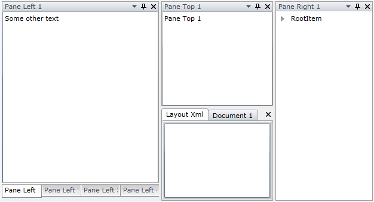

# Overview

When building complex layout with __RadDocking,__ the users will often expect to persist the layout from one session to another. This can be easily achieved with the advanced Save/Load layout mechanism of the __RadDocking__.

The purpose of this tutorial is to show how to use the Save/Load layout mechanism of the __RadDocking__. The following cases will be examined:

* [Saving layout](#saving-layout)

* [Loading layout](#load-layout)

* [Using events to manage the save/load process](#events)

Create a new application and add the following initial __RadDocking__ declaration.

#### __XAML__

```XAML
	<telerik:RadDocking x:Name="radDocking">
	    <telerik:RadDocking.DocumentHost>
	
	        <telerik:RadSplitContainer>
	            <telerik:RadPaneGroup x:Name="DocumentGroup">
	                <telerik:RadPane x:Name="LayoutXml" Header="Layout Xml"
	telerik:RadDocking.FloatingSize="450, 400">
	                    <TextBox TextWrapping="Wrap" x:Name="XmlTextBox"
	VerticalScrollBarVisibility="Auto"
	Text="{Binding Xml, Mode=TwoWay}" />
	                </telerik:RadPane>
	                <telerik:RadDocumentPane Header="Document 1" Title="Document 1">
	                    <TextBox x:Name="DocumentTextBox" Text="Some text" />
	                </telerik:RadDocumentPane>
	            </telerik:RadPaneGroup>
	        </telerik:RadSplitContainer>
	
	    </telerik:RadDocking.DocumentHost>
	
	    <telerik:RadSplitContainer InitialPosition="DockedLeft">
	        <telerik:RadPaneGroup>
	            <telerik:RadPane Header="Pane Left 1">
	                <TextBox x:Name="TextBox" Text="Some other text" />
	            </telerik:RadPane>
	            <telerik:RadPane Header="Pane Left 2">
	                <TextBox Text="Pane Left 2" />
	            </telerik:RadPane>
	            <telerik:RadPane Header="Pane Left 3">
	                <TextBox Text="Pane Left 3" />
	            </telerik:RadPane>
	            <telerik:RadPane Header="Pane Left 4">
	                <TextBox Text="Pane Left 4" />
	            </telerik:RadPane>
	        </telerik:RadPaneGroup>
	    </telerik:RadSplitContainer>
	
	    <telerik:RadSplitContainer InitialPosition="DockedRight">
	        <telerik:RadPaneGroup>
	            <telerik:RadPane Header="Pane Right 1">
	                <telerik:RadTreeView>
	                    <telerik:RadTreeViewItem Header="RootItem">
	                        <telerik:RadTreeViewItem Header="Item1" />
	                        <telerik:RadTreeViewItem Header="Item2">
	                            <telerik:RadTreeViewItem Header="Item21" />
	                            <telerik:RadTreeViewItem Header="Item22" />
	                            <telerik:RadTreeViewItem Header="Item23">
	                                <telerik:RadTreeViewItem Header="Item231" />
	                            </telerik:RadTreeViewItem>
	                        </telerik:RadTreeViewItem>
	                        <telerik:RadTreeViewItem Header="Item3" />
	                    </telerik:RadTreeViewItem>
	                </telerik:RadTreeView>
	            </telerik:RadPane>
	        </telerik:RadPaneGroup>
	    </telerik:RadSplitContainer>
	
	    <telerik:RadSplitContainer InitialPosition="DockedTop">
	        <telerik:RadPaneGroup>
	            <telerik:RadPane Header="Pane Top 1">
	                <TextBox Text="Pane Top 1" />
	            </telerik:RadPane>
	        </telerik:RadPaneGroup>
	    </telerik:RadSplitContainer>
	</telerik:RadDocking>
```



## Saving Layout

__RadDocking__ gives you the ability to store the entire layout in a stream containing XML. In order to do that you need to use the __SaveLayout__ method of an instance of the __RadDocking__ control. Additionally, you can choose to save the stream elsewhere, in a textbox, or directly in the file system.

Perform the following steps:

Set the __RadDocking.SerializationTag__ attached property for each one of the panes in your xaml declaration. If the SerializationTag is not set the Panes will be removed and new components will be created when the layout is loaded. If you want to preserve not only the Panes and load the same instances when the layout is loading you need to set the SerializationTag to all other components of RadDocking you want to preserve as well (RadPaneGroups, RadSplitContainers, RadPanes).

#### __XAML__

```XAML
	<telerik:RadPane x:Name="LayoutXml1" Header="Layout Xml"
	                 telerik:RadDocking.SerializationTag="LayoutXml"
	                 telerik:RadDocking.FloatingSize="450, 400"/>
	<telerik:RadDocumentPane Header="Document 1" Title="Document 1"
	                         telerik:RadDocking.SerializationTag="DocumentPane"/>
	<telerik:RadPane Header="Pane Left 1"
	                telerik:RadDocking.SerializationTag="PaneLeft1"/>
	<telerik:RadPane Header="Pane Left 2"
	                telerik:RadDocking.SerializationTag="PaneLeft2"/>
	<telerik:RadPane Header="Pane Left 3"
	                telerik:RadDocking.SerializationTag="PaneLeft3"/>
	<telerik:RadPane Header="Pane Left 4"
	                telerik:RadDocking.SerializationTag="PaneLeft4"/>
	<telerik:RadPane Header="Pane Right 1"
	                telerik:RadDocking.SerializationTag="PaneRight1"/>
	<telerik:RadPane Header="Pane Top 1"
	                telerik:RadDocking.SerializationTag="PaneTop1"/>
```

Use the __SaveLayout__ method of the __RadDocking__ class. The following example demonstrates how to save the __RadDocking__ layout in the IsolatedStorage. The generated XML is returned as well.


		
#### __C#__

```C#
	private string SaveLayout()
	{
	    string xml;
	    // Save your layout for example in the isolated storage.
	    using (IsolatedStorageFile storage = IsolatedStorageFile.GetUserStoreForApplication())
	    {
	        using (var isoStream = storage.OpenFile("RadDocking_Layout.xml", FileMode.Create))
	        {
	            this.radDocking.SaveLayout(isoStream);
	            isoStream.Seek(0, SeekOrigin.Begin);
	            StreamReader reader = new StreamReader(isoStream);
	            xml = reader.ReadToEnd();
	        }
	    }
	    // Return the generated XML
	    return xml;
	}
```

#### __VB.NET__

```VB.NET
	Private Function SaveLayout() As String
		Dim xml As String
		' Save your layout for example in the isolated storage.
		Using storage As IsolatedStorageFile = IsolatedStorageFile.GetUserStoreForAssembly()
			Using isoStream = storage.OpenFile("RadDocking_Layout.xml", FileMode.Create)
				Me.radDocking.SaveLayout(isoStream)
				isoStream.Seek(0, SeekOrigin.Begin)
				Dim reader As New StreamReader(isoStream)
				xml = reader.ReadToEnd()
			End Using
		End Using
		' Return the generated XML
		Return xml
	End Function
```



#### __C#__

```C#
	private string SaveLayout()
	{
	    string xml;
	    // Save your layout for example in the isolated storage.
	    using (IsolatedStorageFile storage = IsolatedStorageFile.GetUserStoreForAssembly())
	    {
	        using (var isoStream = storage.OpenFile("RadDocking_Layout.xml", FileMode.Create))
	        {
	            this.radDocking.SaveLayout(isoStream);
	            isoStream.Seek(0, SeekOrigin.Begin);
	            StreamReader reader = new StreamReader(isoStream);
	            xml = reader.ReadToEnd();
	        }
	    }
	    // Return the generated XML
	    return xml;
	}
```

#### __VB.NET__

```VB.NET
	Private Function SaveLayout() As String
		Dim xml As String
		' Save your layout for example in the isolated storage.
		Using storage As IsolatedStorageFile = IsolatedStorageFile.GetUserStoreForAssembly()
			Using isoStream = storage.OpenFile("RadDocking_Layout.xml", FileMode.Create)
				Me.radDocking.SaveLayout(isoStream)
				isoStream.Seek(0, SeekOrigin.Begin)
				Dim reader As New StreamReader(isoStream)
				xml = reader.ReadToEnd()
			End Using
		End Using
		' Return the generated XML
		Return xml
	End Function
```



Here is how the result XML will look like for the above example:

#### __XML__

```XML
	<RadDocking>
	    <DocumentHost>
	        <RadSplitContainer Dock="DockedLeft">
	            <Items>
	                <RadPaneGroup SelectedIndex="-1">
	                    <Items>
	                        <RadPane SerializationTag="LayoutXml" IsDockable="True" Header="Layout Xml" />
	                        <RadDocumentPane SerializationTag="DocumentPane" IsDockable="True" Title="Document 1" Header="Document 1" />
	                    </Items>
	                </RadPaneGroup>
	            </Items>
	        </RadSplitContainer>
	    </DocumentHost>
	    <SplitContainers>
	        <RadSplitContainer Dock="DockedLeft">
	            <Items>
	                <RadPaneGroup SelectedIndex="-1">
	                    <Items>
	                        <RadPane SerializationTag="PaneLeft1" IsDockable="True" Header="Pane Left 1" />
	                        <RadPane SerializationTag="PaneLeft2" IsDockable="True" Header="Pane Left 2" />
	                        <RadPane SerializationTag="PaneLeft3" IsDockable="True" Header="Pane Left 3" />
	                        <RadPane SerializationTag="PaneLeft4" IsDockable="True" Header="Pane Left 4" />
	                    </Items>
	                </RadPaneGroup>
	            </Items>
	        </RadSplitContainer>
	        <RadSplitContainer Dock="DockedRight">
	            <Items>
	                <RadPaneGroup SelectedIndex="-1">
	                    <Items>
	                        <RadPane SerializationTag="PaneRight1" IsDockable="True" Header="Pane Right 1" />
	                    </Items>
	                </RadPaneGroup>
	            </Items>
	        </RadSplitContainer>
	        <RadSplitContainer Dock="DockedTop">
	            <Items>
	                <RadPaneGroup SelectedIndex="-1">
	                    <Items>
	                        <RadPane SerializationTag="PaneTop1" IsDockable="True" Header="Pane Top 1" />
	                    </Items>
	                </RadPaneGroup>
	            </Items>
	        </RadSplitContainer>
	    </SplitContainers>
	</RadDocking>
```

>There are two steps you should perform in order to save your layout (and one more that is optional):
>	1. Mark all __RadPanes__ with the __RadDocking.SerializationTag__.
>	1. Use the __SaveLayout__ method of the __RadDocking__ to save your layout in a stream.
>	1. (Optional) Save the stream in the isolated storage.

>When you load the layout, all the elements that are not marked with __SerializationTag__ property are removed and new components are created instead. That is the reason why you should mark your panes with the __SerializationTag__ attribute.

## Load Layout

In order to load the docking layout you need to do absolutely the same things but in reverse order.

* First, load the stream (e.g. from the isolated storage).

* Second, use the __LoadLayout__ method of the __RadDocking__ control.



#### __C#__

```C#
	private void LoadLayout()
	{
	    // Load your layout from the isolated storage.
	    using (IsolatedStorageFile storage = IsolatedStorageFile.GetUserStoreForApplication())
	    {
	        using (var isoStream = storage.OpenFile("RadDocking_Layout.xml", FileMode.Open))
	        {
	            this.radDocking.LoadLayout(isoStream);
	        }
	    }
	}
```

#### __VB.NET__

```VB.NET
	Private Sub LoadLayout()
		' Load your layout from the isolated storage.
		Using storage As IsolatedStorageFile = IsolatedStorageFile.GetUserStoreForAssembly()
			Using isoStream = storage.OpenFile("RadDocking_Layout.xml", FileMode.Open)
				Me.radDocking.LoadLayout(isoStream)
			End Using
		End Using
	End Sub
```



#### __C#__

```C#
	private void LoadLayout()
	{
	    // Load your layout from the isolated storage.
	    using (IsolatedStorageFile storage = IsolatedStorageFile.GetUserStoreForAssembly())
	    {
	        using (var isoStream = storage.OpenFile("RadDocking_Layout.xml", FileMode.Open))
	        {
	            this.radDocking.LoadLayout(isoStream);
	        }
	    }
	}
```

#### __VB.NET__

```VB.NET
	Private Sub LoadLayout()
		' Load your layout from the isolated storage.
		Using storage As IsolatedStorageFile = IsolatedStorageFile.GetUserStoreForAssembly()
			Using isoStream = storage.OpenFile("RadDocking_Layout.xml", FileMode.Open)
				Me.radDocking.LoadLayout(isoStream)
			End Using
		End Using
	End Sub
```



## Events

The __RadDocking__ API offers you six events for managing the save/load layout behavior:

* __ElementLoading__ - raised when a docking element (__Pane__, __PaneGroup__ or __SplitContainer__) is about to be loaded. The type of the passed event arguments is __LayoutSerializationLoadingEventArgs__.

	* __LayoutSerializationLoadingEventArgs__ - provides access to the __AffectedElement__, __AffectedElementSerializationTag__, __ElementProperties__ properties and the __Cancel__ property that determines whether the AffectedElement will be loaded.

* __ElementLoaded__- raised after a docking element (__Pane__, __PaneGroup__ or __SplitContainer__) is loaded. The type of the passed event arguments is __LayoutSerializationEventArgs__.

* __ElementLayoutSaving__ (introduced with R2 2016 of UI for WPFSilverlight) - raised when a docking element (__Pane__, __PaneGroup__ or __SplitContainer__) is about to be saved. The type of the passed event arguments is __LayoutSerializationSavingEventArgs__.

	* __LayoutSerializationSavingEventArgs__ - provides access to the __AffectedElement__, __AffectedElementSerializationTag__, __ElementProperties__ properties and the __Cancel__ property that determines whether the AffectedElement will be serialized.

* __ElementSaved__ - raised after a docking element (__Pane__, __PaneGroup__ or __SplitContainer__) is saved. The type of the passed event arguments is __LayoutSerializationEventArgs__.

* __ElementLayoutCleaning__ (introduced with R2 2016 of UI for WPFSilverlight) - raised when a docking element (__Pane__, __PaneGroup__ or __SplitContainer__) is about to be cleaned. The type of the passed event arguments is __LayoutSerializationCleaningEventArgs__.

	* __LayoutSerializationCleaningEventArgs__ - provides access to the __AffectedElement__, __AffectedElementSerializationTag__ properties and the __Cancel__ property that determines whether the AffectedElement will be removed from the layout.

* __ElementCleaned__- raised after a docking element (__Pane__, __PaneGroup__ or __SplitContainer__) is cleaned. The type of the passed event arguments is __LayoutSerializationEventArgs__.

* __CustomElementLoading__- raised when a custom docking element (that derives from __RadPane__, __RadPaneGroup__ or __RadSplitContainer__) is about to be loaded.  The type of the passed event arguments is __LayoutSerializationCustomLoadingEventArgs__.

The type of the event arguments for the __ElementLoaded__, __ElementSaved__, and __ElementCleaned__ is: __Telerik.Windows.Controls.LayoutSerializationEventArgs.__ Via both of the event arguments you get access to the following properties:

* __AffectedElement__- this is the currently loaded\saved pane.

* __AffectedElementSerializationTag__- this is the currently loaded\save serialization tag. In the previous example if you attach to any of the events, then the first time when the __AffectedElementSerializationTag__ is fired, it will have the value "LayoutXml".

* __ElementProperties__ - this is a Dictionary that contains the string representations of the DependencyPropertys of the AffectedElement that will be saved to the layout Xml of the RadDocking.

The event argument of the __CustomElementLoading__ event is of type __LayoutSerializationCustomLoadingEventArgs__ that derives from the __LayoutSerializationLoadingEventArgs__ and adds the following additional properties:

* __CustomElementTypeName__ - it gets the type name of the custom affected element.

* __Cancel__ - determines whether the custom AffectedElement will be loaded.

>tipThe __Telerik.Windows.Controls.LayoutSerializationLoadingEventArgs__ allows you to point out an instance to be used as a newly loaded control. This could be useful if you need to create the instances yourself.

>You have the ability to "say" whether these event to be fired or not, when the __SerializationTag__ is __not specified__. You should use the second overload of the __LoadLayout__ and __SaveLayout__ methods.

#### __C#__

```C#
	public void SaveLayout(Stream destination, bool raiseEventsIfNoSerializationTag)
	{
	
	}
```

#### __VB.NET__

```VB.NET
	Public Sub SaveLayout(ByVal destination As Stream, ByVal raiseEventsIfNoSerializationTag As Boolean)
	End Sub
```

>By default when you use the __SaveLayout__ method only the layout (without the content) will be saved. That's why the most common use of the fourth events is to save (respectively load) the pane's content. In order to see how to do that take a look at the [Save/Load the Content of the Panes]() topic.

## See Also

 * [Pane Groups]()

 * [Split Container]()

 * [Tool Window]()

 * [Save/Load the Content of the Panes]()
