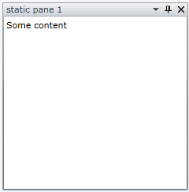

# Save/Load the Content of the Panes

This tutorial will walk you through the common tasks of saving the content of the panes.

__RadDocking__ cannot save the __Content__ of the panes itself. It only remembers the properties of the panes, the groups and the split containers and the way they are changed.

Tha Save/Load layout mechanism matches the __SerializationTag__ of the saved pane with the __SerializationTag__ of the pane that is already created. It works for the static panes, because when your application loads, the XAML parser creates correctly all the static panes and their contents. The dynamic panes are created by the __RadDocking__ control and it doesn't know what content to put in them. 

When a ToolWindow, PaneGroup or SplitContainer instance is auto-generated by the RadDocking in order to set the __SerializationTag__ for these elements the ToolWindowCreated, PaneGroupCreated and SplitContainerCreated could be handled. Inside them the newly created instance could be found and SerializationTag could be set to them as demonstrated in __Example 1__:

__Example 1: Setting SerializationTag__

<snippet id='raddocking-features-save-load-layout-save-load-the-content-of-the-panes-example_1_setting_serializationtag-cs' />

For the purpose of this tutorial the following __RadDocking__ declaration will be used:

__Example 2: RadDocking declaration__

<snippet id='raddocking-features-save-load-layout-save-load-the-content-of-the-panes-example_2_raddocking_declaration-xaml' />

You can save the panes' content by handling the __ElementLoaded__ event of the __RadDocking__ control and setting the content of the newly created pane yourself.

Attach to the __ElementLoaded__ event of the __RadDocking__ element.

__Example 3: Attaching to the ElementLoaded event__

<snippet id='raddocking-features-save-load-layout-save-load-the-content-of-the-panes-example_3_attaching_to_the_elementloaded_event-xaml' />

__Example 4: Get Content of Pane__

<snippet id='raddocking-features-save-load-layout-save-load-the-content-of-the-panes-example_4_get_content_of_pane-cs' />

<snippet id='raddocking-features-save-load-layout-save-load-the-content-of-the-panes-example_4_get_content_of_pane-vb' />

>important The __GetPaneContent()__ method needs to be implemented with the specific user custom logic.

## See Also

 * [Save/Load Layout]()

 * [Drag and Drop]()

 * [Compass]()
