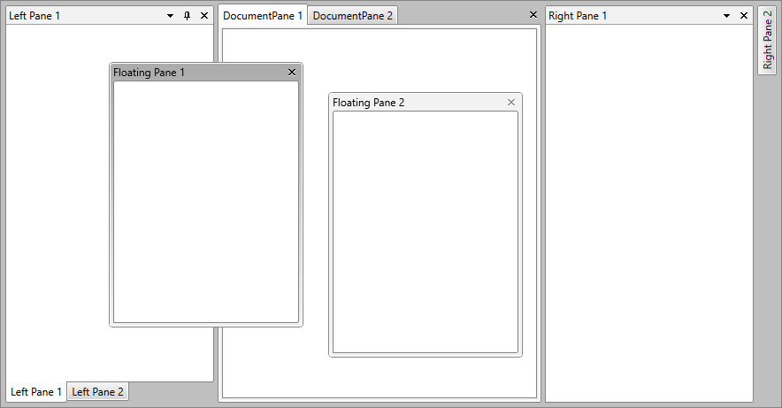

# Tool Window

`ToolWindow` is the container control that hosts all panes that are in a floating state. Every time you drag a pane and undock it, a new instance of the class `Telerik.Windows.Controls.Docking.ToolWindow` is created to host that pane for you.

>The implementation of the `RadDocking` never requires you to work with ToolWindows directly, but with the Pane hosted inside it. For example, to make a ToolWindow not closable, just set the property `CanUserClose` of the hosted RadPane to __False__.

In the figure below you can see two ToolWindows with a floating pane inside of each one.



You can learn how to declare such a floating structure in the [Floating Panes](#Floating_Panes) help article.

## Setting FloatingSize and FloatingLocation

RadDocking provides the ability to easily set the initial floating size and location of the ToolWindows. To do that, use the `RadDocking.FloatingSize` and `RadDocking.FloatingLocation` attached properties, as shown in the following example:

__Setting RadDocking.FloatingSize and RadDocking.FloatingLocation__
```XAML
	<telerik:RadDocking>
	    <telerik:RadSplitContainer InitialPosition="FloatingOnly">
	        <telerik:RadPaneGroup>
	            <telerik:RadPane telerik:RadDocking.FloatingSize="500, 500" telerik:RadDocking.FloatingLocation="400, 400"/>
	        </telerik:RadPaneGroup>
	    </telerik:RadSplitContainer>
	</telerik:RadDocking>
```

## Setting the Draggable Area

The ToolWindow element allows you to change the threshold of its titlebar's draggable area. To do that, set the `CaptionHeight` property. 

__Setting the CaptionHeight property via a Style__
```XAML
	<!--Set BasedOn property if NoXaml assemblies are used: BasedOn="{StaticResource ToolWindowStyle}"-->
	<Style TargetType="telerik:ToolWindow">
	    <Setter Property="CaptionHeight" Value="50"/>
	</Style>
```

>important Changing the height of the titlebar will not automatically update the CaptionHeight property's value. 

## Styling ToolWindow

To learn how to style the tool windows of your applications, read the [Styling the ToolWindow]() topic.

## See Also

 * [Docked/Floating Panes]()

 * [Pane Groups]()

 * [Split Container]()

 * [Compass]()

 * [Drag and Drop]()

 * [Document Host]()

 * [Styling the ToolWindow]()
