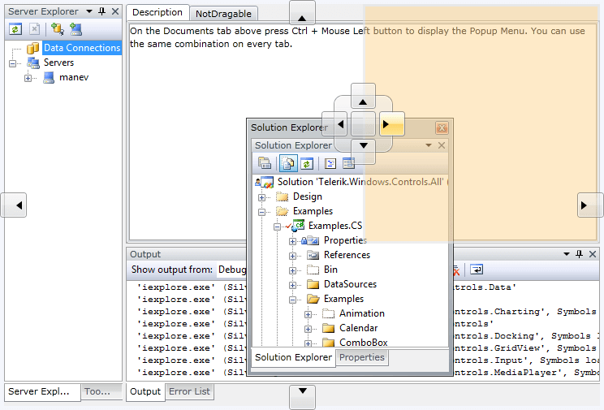

# Key Features
 

This is a list with short descriptions of the top-of-the line features of Telerik's __RadDocking__ control.

* __Save/Load Layout__ - when building complex layouts with __RadDocking__ the users will often expect to persist the layout from one session to another. This can be easily achieved with the advanced Save\Load layout mechanism of the __RadDocking__ control. __RadDocking__ provides a method that stores the entire layout in a stream containing XML. Then, you can simply restore the layout from its previous state. In addition, you can choose to save the stream elsewhere, in a text box, or directly in the isolated storage. [Read more]()

* __Split Containers__ - the __RadSplitContainer__ allows you to use movable bars to divide the displayed area into resizable parts. With __RadDocking__'s __RadSplitContainers__ you can build complex layouts that can even include nested split areas. Some immediate examples of such layouts are Explorer-like and outlook-like interfaces. The __RadDocking__'s __RadSplitContainers__ allow you to define the __Orientation__ and the __InitialPosition__ of the container. [Read more]()

* __Tabbed Documents__ - __RadDocking__ supports tabbed documents for document-oriented applications. It allows you to view documents by splitting them into multiple panes. [Read more]()

* __Pin/Unpin and Hide Panes__ - to display content on demand, a docked window can be pinned, unpinned or hidden.  The pane is in an unpinned state by default.  When unpinned, the pane collapses down to a tab.  To pin, unpin or hide a given window you can use either the icons on the top of the window, the navigation menu or the context menu. The context menu is set to open on CTRL+MouseLeftButtonClick. [Read more]() 

* __Dockable Windows__ - __RadDocking__ has a full drag-and-drop support including the docking compass and the docking hints for visual feedback. You are free to drag the dockable windows anywhere in the container to create customized layouts. You have a full control of which window can be docked and to which sides of the container. 
Hierarchies of arbitrary complexity can be created, and once windows are docked together they can be resized independently with the splitters between them. [Read more]()

* __Floating Windows__ - once you start dragging __Pane__ or  __Group__ it moves to __Floating Window__ almost immediately. The hints of the __RadDocking__ for visual feedback show the user where the object will be placed. You can combine multiple windows in the floating group and have a full control of which window can be floating. [Read more]()

* __WPF/Silverlight Code Compatibility__ - the SilverlightWPF __RadDocking__ shares a common code-base and API with its SilverlightWPF counterpart. That means that you can achieve close to 100% code reuse for your grid logic if you have parallel Silverlight/WPF development.

* __Expression Blend support__ -  all __UI for SilverlightWPF__ can be easily customized using Expression Blend.

* __Enhanced Routed Events Framework__ - to help your code become even more elegant and concise, Enhanced Routed Events Framework for the controls from the UI for SilverlightWPF suite is implemented. This gives you more freedom when you design your applications, since you can write instance handlers as well as class handlers for the routed events of your controls. 

* __Codeless Test Automation for Docking__ - Now you can record, execute and debug functional tests for Docking without leaving the familiar Visual Studio environment. Telerik [WebUI Test Studio](http://www.telerik.com/products/web-testing-tools/webui-test-studio-features.aspx) is an advanced click and play web application testing tool specialized for automating both AJAX and Silverlight applications. The Studio ships with special translators for Telerik controls from the UI for SilverlightWPF suite for ASP.NET AJAX and Silverlight.

# See Also

 * [Visual Structure]()

 * [Getting Started]()
